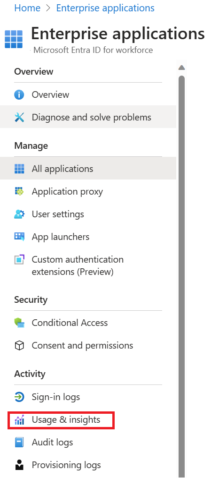
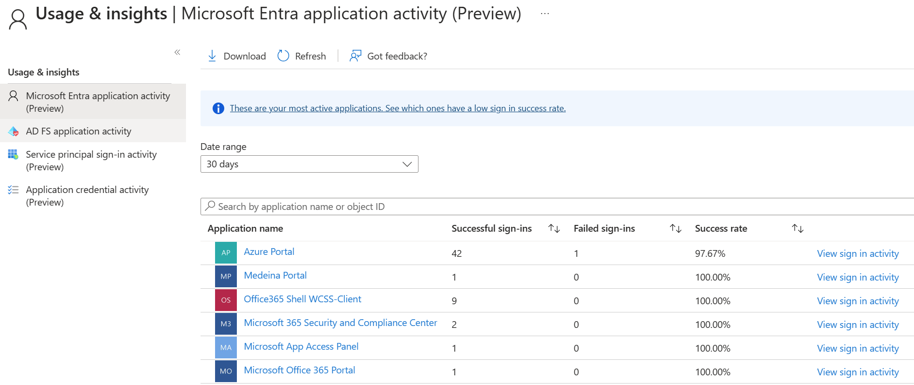
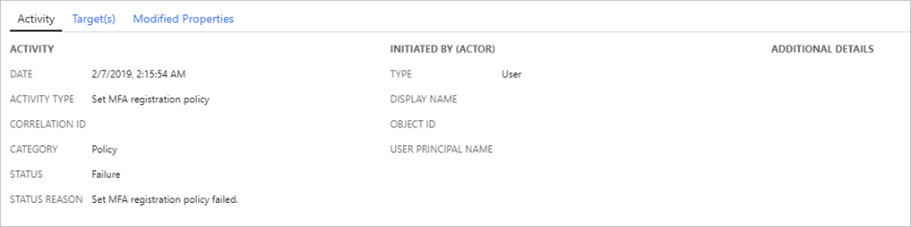

With Azure AD reports, you can get the information needed to determine how your environment is doing.  With the usage and insights report, you can get an application-centric view of your sign-in data and find answers to the following questions:

- What are the top used applications in the organization?

- What applications have the most failed sign-ins?

- What are the top sign-in errors for each application?

## Access the usage and insights report

1. Navigate to the [Azure portal](https://portal.azure.com/).

1. Select the correct directory, then select **Azure Active Directory **and choose **Enterprise applications**.

1. From the **Activity** section, select **Usage & insights** to open the report.

> [!div class="mx-imgBorder"]
>

## Use the report

The usage and insights report shows the list of applications with one or more sign in attempts and allows you to sort by the number of successful sign-ins, failed sign-ins, and the success rate.

Selecting **load more** at the bottom of the list allows you to view additional applications on the page. You can select the date range to view all applications that have been used within the range.

You can also set the focus on a specific application. Select **view sign-in activity** to see the sign in activity over time for the application as well as the top errors.

When you select a day in the application usage graph, you get a detailed list of the sign-in activities for the application.

> [!div class="mx-imgBorder"]
>

## Audit logs

The Azure AD audit logs provide records of system activities for compliance. Users in the Security Administrator, Security Reader, Report Reader, Global Reader or Global Administrator roles can access their data.  To access the audit report, select **Audit logs** in the **Monitoring** section of **Azure Active Directory**.

An audit log has a default list view that shows:

- the date and time of the occurrence

- the service that logged the occurrence

- the category and name of the activity (what)

- the status of the activity (success or failure)

- the target

- the initiator/actor (who) of an activity

You can customize the list view by clicking **Columns** in the toolbar.

This enables you to display additional fields or remove fields that are already displayed.

Select an item in the list view to get more detailed information.

## Enterprise applications audit logs

With application-based audit reports, you can get answers to questions such as:

- What applications have been added or updated?

- What applications have been removed?

- Has a service principal for an application changed?

- Have the names of applications been changed?

- Who gave consent to an application?

If you want to review audit data related to your applications, you can find a filtered view under **Audit logs** in the **Activity** section of the **Enterprise applications** blade. This entry point has **Enterprise applications** preselected as the **Application Type**.

