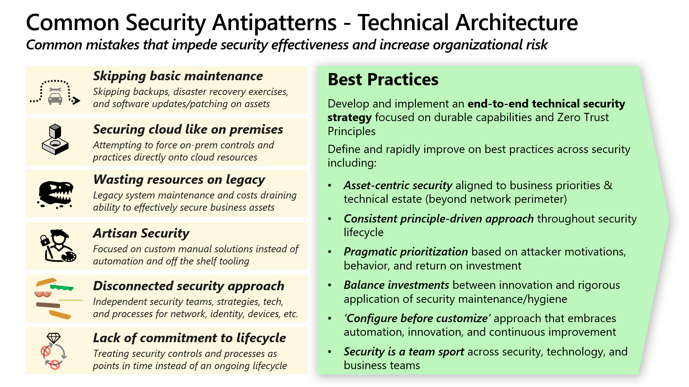

Best practices and antipatterns form two sides of the same coin. Understanding both helps you make better decisions as a cybersecurity architect and avoid common mistakes that weaken your organization's security posture.

## What are best practices?

**Best practices** are recommended approaches that have been found to be most effective or efficient. They help you avoid mistakes and ensure that your resources and effort aren't wasted.

Best practices come in many forms:

- Exact instructions on what to do, why to do it, who should do it, and how to do it.
- High-level principles to guide different types of decisions and actions.
- Guidelines that are part of a reference architecture, describing components that should be included in a solution and how to integrate them together.

Microsoft embeds security best practices in various forms of guidance, including the Microsoft Cybersecurity Reference Architectures (MCRA), the Microsoft cloud security benchmark (MCSB), the Cloud Adoption Framework (CAF), and the Azure Well-Architected Framework (WAF).

## What are antipatterns?

An **antipattern** is a common mistake that leads to negative outcomes. It's the opposite of a best practice. Many best practices are designed specifically to help you avoid antipatterns.

Consider the best practice of applying security patches regularly. Microsoft has observed multiple antipatterns that get in the way of this basic and critically important security practice:

- **Not patching unless it's critical:** This antipattern avoids patch installation based on an implicit assumption that patches aren't important, or a belief that unpatched vulnerabilities won't be exploited.
- **Waiting for patch perfection instead of building resilience:** This antipattern avoids patching because of a fear that something could go wrong. It also increases the likelihood of downtime from attackers.
- **Broken accountability model:** This antipattern holds security teams accountable for the negative outcomes of patches. This leads other teams to deprioritize security maintenance.
- **Over-customizing patch selection:** This antipattern uses unique criteria for patching instead of applying all manufacturer-recommended patches. This effectively creates custom builds that have never been tested in that exact configuration.
- **Focusing only on operating systems:** This antipattern patches only servers and workstations without also addressing containers, applications, firmware, and IoT/OT devices.

The following diagram summarizes common antipatterns and important best practices.

## How cybersecurity architects use best practices

Security best practices must be integrated into people's skills and habits, organizational processes, and technology architecture and implementation.

As a cybersecurity architect, you help integrate security best practices by:

- Integrating best practices into security architecture and policy.
- Advising security leaders on how to incorporate best practices into business processes, technical processes, and culture.
- Advising technical teams on implementing best practices and identifying which technology capabilities make them easier to implement.
- Advising others in the organization, such as enterprise architects, IT architects, application owners, and developers, on how to integrate security best practices in their areas of ownership.

**Follow best practices unless you have a specific reason to avoid them.** Best practices aren't perfectly applicable to all situations, but they've been proven to work. You shouldn't ignore or alter them without good reason.

**Adapt, but don't over-customize.** You might need to adapt best practices to your organization's unique circumstances. Be careful not to customize them to the point where the original value is lost. For example, you might adopt passwordless and multifactor authentication but then make exceptions for the highest-impact accounts that attackers most value, which would undermine the purpose.

Adopting best practices reduces common mistakes and improves overall security effectiveness and efficiency.
