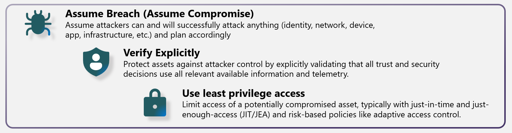

Traditional security models assumed that everything inside the corporate network was safe. That assumption no longer holds. Organizations now operate with mobile workforces, cloud applications, and distributed data that extend far beyond the network perimeter. A Zero Trust approach to security addresses this reality.

## What is Zero Trust?

Zero Trust is a security strategy. It isn't a product or a service, but an approach to designing and implementing security. Instead of assuming that everything behind the corporate firewall is safe, Zero Trust assumes breach and verifies each request as though it originated from an uncontrolled network. Regardless of where a request originates or what resource it accesses, Zero Trust teaches you to "never trust, always verify."

Zero Trust is designed to adapt to the complexities of the modern environment. It protects user accounts, devices, applications, and data wherever they're located. A Zero Trust approach should extend throughout your entire organization and serve as an integrated security philosophy and end-to-end strategy.

## Three guiding principles

Zero Trust is based on three principles:

- **Verify explicitly:** Always authenticate and authorize based on all available data points, including user identity, location, device health, service or workload, data classification, and anomalies.
- **Use least privilege access:** Limit user access with just-in-time and just-enough-access (JIT/JEA), risk-based adaptive policies, and data protection. This limits the blast radius of a potential breach so that if an account is compromised, the possible damage is contained.
- **Assume breach:** Minimize blast radius and segment access. Verify end-to-end encryption and use analytics to get visibility, drive threat detection, and improve defenses. This principle assumes that an attacker will gain access to an account, endpoint, application, or other asset, and protects accordingly.

## Six technology pillars

You implement Zero Trust controls and technologies across six foundational elements. Each element is a source of signal, a control plane for enforcement, and a critical resource to be defended.

| Technology pillar | Description |
|---|---|
| **Identities** | Identities—whether they represent people, services, or IoT devices—define the Zero Trust control plane. When an identity attempts to access a resource, verify that identity with strong authentication and ensure access is compliant and typical. Follow least privilege access principles. |
| **Endpoints** | Once an identity has been granted access, data can flow to different endpoints (devices), from IoT devices to smartphones, bring your own device (BYOD) to partner-managed devices, and on-premises workloads to cloud-hosted servers. This diversity creates a large attack surface. Monitor and enforce device health and compliance for secure access. |
| **Data** | Security teams are ultimately protecting data. Where possible, data should remain safe even if it leaves the devices, apps, infrastructure, and networks the organization controls. Classify, label, and encrypt data, and restrict access based on those attributes. |
| **Applications** | Applications and APIs provide the interface by which data is consumed. Apply controls and technologies to discover shadow IT, ensure appropriate in-app permissions, gate access based on real-time analytics, monitor for abnormal behavior, and validate secure configuration options. |
| **Infrastructure** | Infrastructure—whether on-premises servers, cloud-based VMs, containers, or microservices—represents a critical threat vector. Assess for version, configuration, and JIT access to harden defense. Use telemetry to detect attacks and anomalies, and automatically block and flag risky behavior. |
| **Network** | All data is ultimately accessed over network infrastructure. Networking controls can provide critical visibility and help prevent attackers from moving laterally. Segment networks, deploy real-time threat protection, end-to-end encryption, monitoring, and analytics. |

Beyond these six pillars, **visibility, automation, and orchestration** ties them together. With each pillar generating its own signals and alerts, you need an integrated capability to manage the resulting influx of data, better defend against threats, and validate trust in each transaction.

Different organizational requirements, existing technology implementations, and security stages all affect how you plan and implement a Zero Trust security model. These principles are usually applied through a series of modernization initiatives or technology-pillar deployment guidance.
