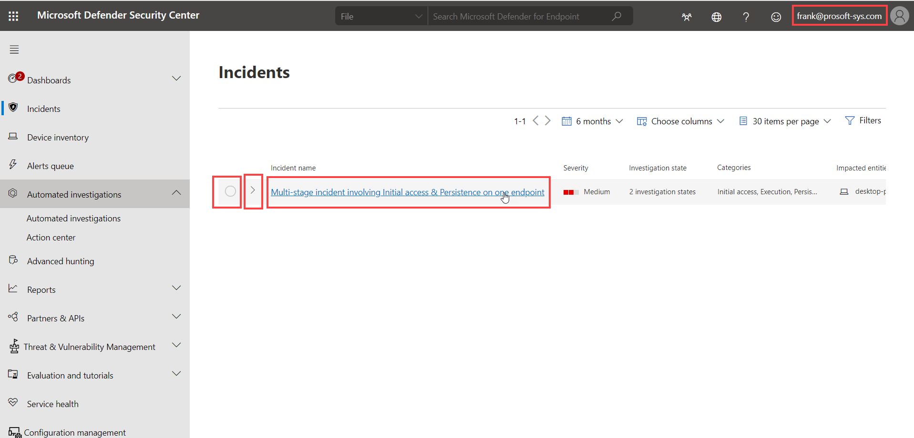
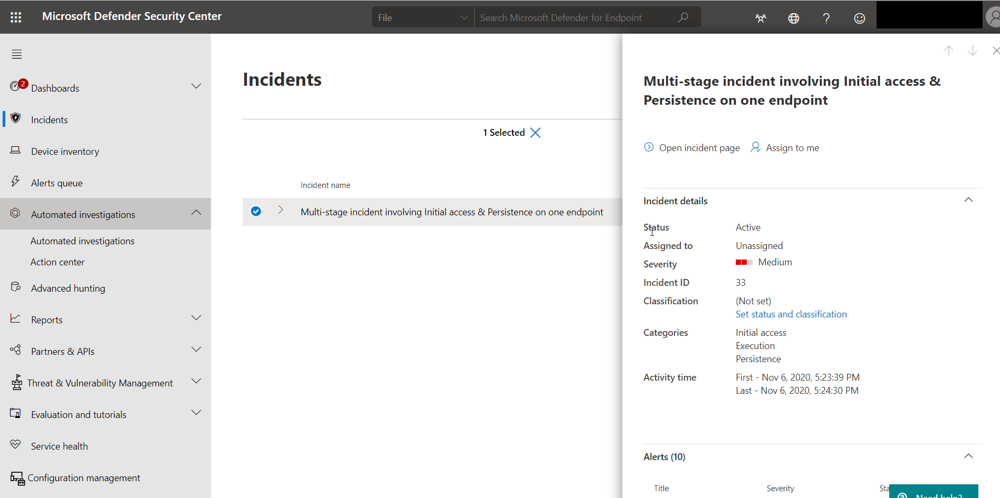
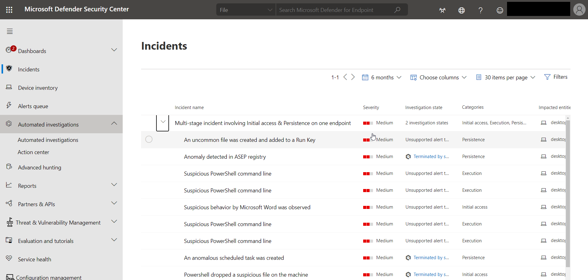

Defender for Endpoint detection and response capabilities provide advanced attack detections that are near real-time and actionable. Security analysts can prioritize alerts effectively, gain visibility into the full scope of a breach, and take response actions to remediate threats.

When a threat is detected, alerts are created in the system for an analyst to investigate. Alerts with the same attack techniques or attributed to the same attacker are aggregated into an entity called an incident. Aggregating alerts in this manner makes it easy for analysts to investigate and respond to threats collectively.

Inspired by the "assume breach" mindset, Defender for Endpoint continuously collects behavioral cyber telemetry. This includes process information, network activities, deep optics into the kernel and memory manager, user sign in activities, registry and file system changes, and others. The information is stored for six months, enabling an analyst to travel back in time to the start of an attack. The analyst can then pivot in various views and approach an investigation through multiple vectors.

The response capabilities give you the power to promptly remediate threats by acting on the affected entities.

>[!VIDEO https://www.microsoft.com/videoplayer/embed/RE4qLUV?rel=0]

## Defender for Endpoint Terminology

It is important for you to understand the different components and how they work together.

### Device

To start with, each endpoint is considered a Device.

### Evidence

Microsoft Defender for Endpoint collects forensics information on artifacts, including accounts, processes, network information, and others.

### Alert

Defender for Endpoint uses detection rules based on Microsoft expertise and that are continually updated, looks for suspicious activities.  If found, then will generate an Alert.

### Incident

Based on the Alerts generated, Defender for Endpoint groups the Alerts into Incidents.  An Incident displays a rollup of Alerts, Evidence, and Investigations.

### Investigation

Automated Investigation performed by Defender for Endpoint

## Security Operations Dashboard

The Security operations dashboard provides a high-level overview of where detections were seen and highlights where response actions are needed.

The dashboard displays a snapshot of:

- Active alerts

- Devices at risk

- Sensor health

- Service health

- Daily devices reporting

- Active automated investigations

- Automated investigations statistics

- Users at risk

- Suspicious activities

## Preview information from Lists

The Defender for Endpoint portal pages provides preview information for most list-related data.

In this screenshot, the three highlighted areas are the circle, the greater than symbol, and the actual link.

### Circle

Selecting the circle will open a blade on the right side of the page with a preview of the line item with an option to open the full page of information.

### Greater than symbol

If related records can be displayed, selecting the greater than sign will display them below the current record.

### Link

The link will navigate you to the full page for the line item.

