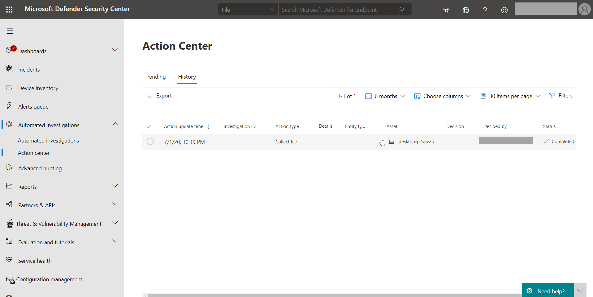

The action center consists of two main tabs: Pending actions and History.

- **Pending actions** displays a list of ongoing investigations that require attention. Recommended actions are presented that your security operations team can approve or reject. The Pending tab appears only if there are pending actions to be approved (or rejected).

- **History Acts** as an audit log for all of the following items:

  - Remediation actions that were taken as a result of an automated investigation

  - Remediation actions that were approved by your security operations team (some actions, such as sending a file to quarantine, can be undone)

  - Commands that were run and remediation actions that were applied in Live Response sessions (some actions can be undone)

  - Remediation actions that were applied by Microsoft Defender Antivirus (some actions can be undone)

Select Automated Investigations, then Action center.

When an automated investigation runs, a verdict is generated for each piece of evidence investigated. Verdicts can be Malicious, Suspicious, or No threats found depending on:

- Type of threat

- Resulting verdict

- How your organization's device groups are configured

Remediation actions can occur automatically or only upon approval by your organization’s security operations team.

### Review pending actions

To approve or reject a pending action:

- Select any item on the Pending tab.

- Select an investigation from any of the categories to open a panel where you can approve or reject remediation actions.

Other details, such as file or service details, investigation details, and alert details are displayed. From the panel, you can select the Open investigation page link to see the investigation details. You can also select multiple investigations to approve or reject actions on multiple investigations.

### Review completed actions

To review completed actions:

- Select the History tab. (If need be, expand the time period to display more data.)

- Select an item to view more details about that remediation action.

### Undo completed actions

If you’ve determined that a device or a file is not a threat, you can undo remediation actions that were taken, whether those actions were taken automatically or manually. You can undo any of the following actions:

- Source

  - Automated investigation

  - Microsoft Defender Antivirus

  - Manual response actions

- Supported Actions

  - Isolate device

  - Restrict code execution

  - Quarantine a file

  - Remove a registry key

  - Stop a service

  - Disable a driver

  - Remove a scheduled task

### Remove a file from quarantine across multiple devices

To remove a file from quartile across multiple devices:

- On the History tab, select a file that has the Action type Quarantine file.

- In the pane on the right side of the screen, select Apply to X more instances of this file, and then select Undo.

