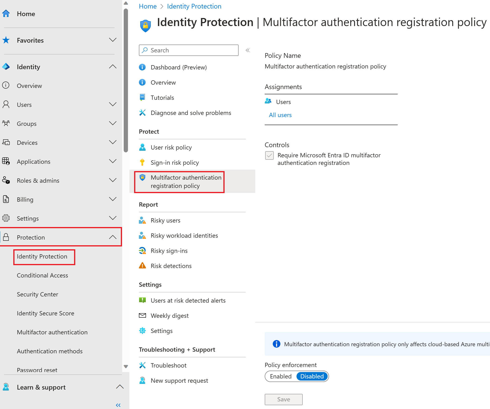

## Policy configuration

Azure AD Multi-Factor Authentication provides a means to verify who you are using more than just a username and password. It provides a second layer of security to user sign-ins. For users to be able to respond to MFA prompts, they must first register for Azure AD Multi-Factor Authentication.

1. Sign in to the [Azure portal](https://portal.azure.com/) using a Global administrator account.

2. Open the portal menu and then select **Azure Active Directory**.

3. On the Azure Active Directory blade, under **Manage**, select **Security**.

4. On the Security blade, in the left navigation, select **Identity protection**.

5. In the Identity protection blade, in the left navigation, select **MFA registration policy**.

   > [!div class="mx-imgBorder"]
   > 

6. Under **Assignments**, select **All users** and review the available options.

   You can select from **All users** or **Select individuals and groups** if limiting your rollout.

   Additionally, you can choose to exclude users from the policy.

7. Under **Controls**, notice that the **Require Azure AD MFA registration** is selected and cannot be changed.

8. Under **Enforce Policy**, select **On** and then select **Save**.

