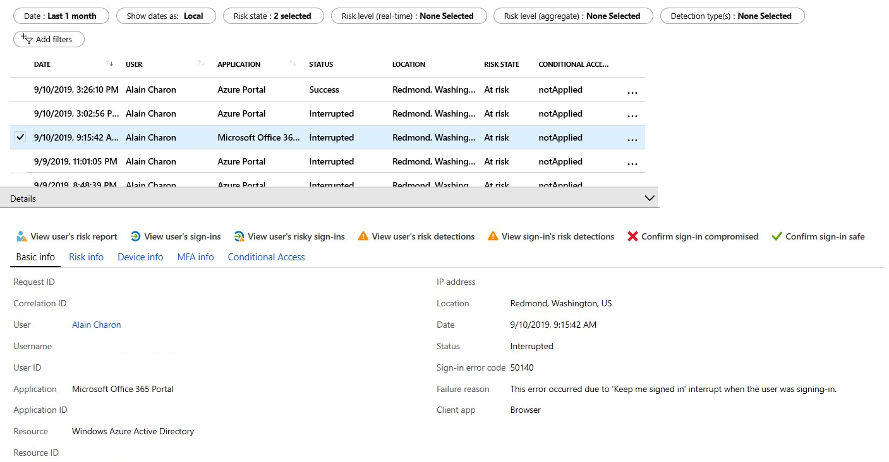

## Investigate risk

Identity Protection provides organizations with three reports they can use to investigate identity risks in their environment: **risky users**, **risky sign-ins**, and **risk detections**. Investigating events is key to better understanding and identifying any weak points in your security strategy.

All three reports allow for downloading of events in .CSV format for further analysis outside of the Azure portal. The risky users and risky sign-ins reports allow for downloading the most recent 2,500 entries, while the risk detections report allows for downloading the most recent 5,000 records.

Organizations can take advantage of the Microsoft Graph API integrations to aggregate data with other sources they may have access to as an organization.

You can find the three reports in the **Azure portal** > **Azure Active Directory** > **Security**.

### Navigating the reports

Each report launches with a list of all detections for the period shown at the top of the report. Each report allows for the addition or removal of columns based on administrator preference. Administrators can choose to download the data in .CSV or .JSON format. Reports can be filtered using the filters across the top of the report.

Selecting individual entries may enable additional entries at the top of the report, such as the ability to confirm a sign-in as compromised or safe, confirm a user as compromised, or dismiss user risk.

Selecting individual entries expands a details window below the detections. The details view allows administrators to investigate and perform actions on each detection.

> [!div class="mx-imgBorder"]
> 

### Risky users

With the information provided by the risky users report, administrators can find:

- Which users are at risk, have had risk remediated, or have had risk dismissed?

- Details about detections.

- History of all risky sign-ins.

- Risk history.

Administrators can then choose to take action on these events. They can choose to:

- Reset the user password.

- Confirm user compromise.

- Dismiss user risk.

- Block user from signing in.

- Investigate further using Azure ATP.

### Risky sign-ins

The risky sign-ins report contains filterable data for up to the past 30 days (one month).

With the information provided by the risky sign-ins report, administrators can find:

- Which sign-ins are classified as at risk, confirmed compromised, confirmed safe, dismissed, or remediated.

- Real-time and aggregate risk levels associated with sign-in attempts.

- Detection types triggered.

- Conditional Access policies applied.

- MFA details.

- Device information.

- Application information.

- Location information.

Administrators can then choose to take action on these events. Administrators can choose to:

- Confirm sign-in compromise.

- Confirm sign-in safe.

> [!NOTE]
> Identity Protection evaluates risk for all authentication flows, whether it be interactive or non-interactive. However, the sign-in report shows only the interactive sign-ins. You may see risky sign-ins that occurred on non-interactive sign-ins, but the sign-in will not show up in the Azure AD sign-ins report.

### Risk detections

The risk detections report contains filterable data for up to the past 90 days (three months).

With the information provided by the risk detections report, administrators can find:

- Information about each risk detection including type.

- Other risks triggered at the same time.

- Sign-in attempt location.

Administrators can then choose to return to the user's risk or sign-ins report to take actions based on information gathered.

The risk detection report also provides a clickable link to the detection in the Microsoft Cloud App Security (MCAS) portal where you can view additional logs and alerts.

> [!NOTE]
> Our system may detect that the risk event that contributed to the risk user risk score was a false positive or that the user risk was remediated with policy enforcement such as completing an MFA prompt or secure password change. Therefore, our system will dismiss the risk state, and a risk detail of “AI confirmed sign-in safe” will surface and no longer contribute to the user’s risk.

## Remediate risks and unblock users

After completing your investigation, you will want to take action to remediate the risk or unblock users. Organizations also have the option to enable automated remediation using their risk policies. Organizations should try to close all risk detections that they are presented with in a time period your organization is comfortable with. Microsoft recommends closing events as soon as possible because time matters when working with risk.

### Remediation

All active risk detections contribute to the calculation of a value called *user risk level*. The user risk level is an indicator (low, medium, high) for the probability that an account has been compromised. As an administrator, you want to get all risk detections closed, so that the affected users are no longer at risk.

Some risk detections may be marked by Identity Protection as "Closed (system)" because the events were no longer determined to be risky.

Administrators have the following options to remediate:

- Self-remediation with risk policy.

- Manual password reset.

- Dismiss user risk.

- Close individual risk detections manually.

### Self-remediation with risk policy

If you allow users to self-remediate, with Azure AD Multi-Factor Authentication (MFA) and self-service password reset (SSPR) in your risk policies, they can unblock themselves when risk is detected. These detections are then considered closed. Users must have previously registered for Azure AD MFA and SSPR in order to use when risk is detected.

Some detections may not raise risk to the level where a user self-remediation would be required, but administrators should still evaluate these detections. Administrators may determine that additional measures are necessary, such as blocking access from locations or lowering the acceptable risk in their policies.

### Manual password reset

If requiring a password reset using a user risk policy is not an option, administrators can close all risk detections for a user with a manual password reset.

Administrators are given two options when resetting a password for their users:

**Generate a temporary password** - By generating a temporary password, you can immediately bring an identity back into a safe state. This method requires contacting the affected users since they need to know what the temporary password is. Because the password is temporary, the user is prompted to change the password to something new during the next sign-in.

**Require the user to reset password** - Requiring the users to reset passwords enables self-recovery without contacting help desk or an administrator. This method only applies to users who are registered for Azure AD MFA and SSPR. For users who have not been registered, this option isn't available.

### Dismiss user risk

If a password reset is not an option for you because, for example, the user has been deleted, you can choose to dismiss user risk detections.

When you click **Dismiss user risk**, all events are closed and the affected user is no longer at risk. However, because this method doesn't have an impact on the existing password, it doesn't bring the related identity back into a safe state.

### Close individual risk detections manually

By closing individual risk detections manually, you can lower the user risk level. Typically, risk detections are closed manually in response to a related investigation, such as when talking to a user reveals that an active risk detection is not required anymore.

When closing risk detections manually, you can choose to take any of the following actions to change the status of a risk detection:

- Confirm user compromised.

- Dismiss user risk.

- Confirm sign-in safe.

- Confirm sign-in compromised.

### Unblocking users

An administrator may choose to block a sign-in based on their risk policy or investigations. A block may occur based on either sign-in or user risk.

### Unblocking based on user risk

To unblock an account blocked due to user risk, administrators have the following options:

- **Reset password** - You can reset the user's password.

- **Dismiss user risk** - The user risk policy blocks a user if the configured user risk level for blocking access has been reached. You can reduce a user's risk level by dismissing user risk or manually closing reported risk detections.

- **Exclude the user from policy** - If you think that the current configuration of your sign-in policy is causing issues for specific users, you can exclude the users from it.

- **Disable policy** - If you think that your policy configuration is causing issues for all your users, you can disable the policy.

### Unblocking based on sign-in risk

To unblock an account based on sign-in risk, administrators have the following options:

- **Sign in from a familiar location or device** - A common reason for blocked suspicious sign-ins are sign-in attempts from unfamiliar locations or devices. Your users can quickly determine whether this reason is the blocking reason by trying to sign in from a familiar location or device.

- **Exclude the user from policy** - If you think that the current configuration of your sign-in policy is causing issues for specific users, you can exclude the users from it.

- **Disable policy** - If you think that your policy configuration is causing issues for all your users, you can disable the policy.

### PowerShell preview

Using the Microsoft Graph PowerShell SDK Preview module, organizations can manage risk using PowerShell. The preview modules and sample code are located in the Azure AD GitHub repo (https://github.com/AzureAD/IdentityProtectionTools).

## Use the Microsoft Graph API

Microsoft Graph is the Microsoft unified API endpoint and the home of Azure Active Directory Identity Protection APIs. There are three APIs that expose information about risky users and sign-ins: riskDetection, riskyUsers, and signIn.

**riskDetection** allows you to query Microsoft Graph for a list of both user and sign-in linked risk detections and associated information about the detection.

**riskyUsers** allows you to query Microsoft Graph for information about users  that Identity Protection detected as being risky.

**signIn** allows you to query Microsoft Graph for information on Azure AD sign-ins with specific properties related to risk state, detail, and level.

This section gets you started with connecting to the Microsoft Graph and querying these APIs. For an in-depth introduction, full documentation, and access to the Graph Explorer, see the Microsoft Graph site (https://graph.microsoft.io/) or the specific reference documentation for the riskDetection, riskyUsers, and signIn APIs.

### Connect to Microsoft Graph

There are four steps to accessing Identity Protection data through Microsoft Graph: retrieve your domain name, create a new app registration, configure API permissions, and configure a valid credential.

### Retrieve your domain name

1. Sign in to the Azure portal.

1. Browse to **Azure Active Directory** > **Custom domain names**.

1. Take note of the .onmicrosoft.com domain. You will need this information in a later step.

### Create a new app registration

1. In the Azure portal, browse to **Azure Active Directory** > **App registrations**.

1. Select **New registration**.

1. On the **Create** page, perform the following steps:

   1. In the **Name** textbox, type a name for your application (for example: Azure AD Risk Detection API).

   1. Under **Supported account types**, select the type of accounts that will use the APIs.

   1. Select **Register**.

1. Copy the **Application ID**.

### Configure API permissions

1. From the **Application** you created, select **API permissions**.

1. On the **Configured permissions** page, in the toolbar on the top, click **Add a permission**.

1. On the **Add API access** page, click **Select an API**.

1. On the **Select an API** page, select **Microsoft Graph**, and then click **Select**.

1. On the **Request API permissions** page:

   1. Select **Application permissions**.

   1. Select the checkboxes next to IdentityRiskEvent.Read.All and IdentityRiskyUser.Read.All.

   1. Select **Add permissions**.

1. Select **Grant admin consent for domain.**

### Configure a valid credential

1. From the **Application** you created, select **Certificates & secrets**.

1. Under **Client secrets**, select **New client secret**.

   1. Give the client secret a **Description** and set the expiration time period according to your organizational policies.

   1. Select **Add**.

> [!NOTE]
> If you lose this key, you will have to return to this section and create a new key. Keep this key a secret: Anyone who has it can access your data.

### Authenticate to Microsoft Graph and query the Identity Protection risk detections API

At this point, you should have:

- The name of your tenant's domain

- The Application (client) ID

- The client secret or certificate

To authenticate, send a post request to `https://login.microsoft.com` with the following parameters in the body:

- grant_type: “**client_credentials**”

- resource: `https://graph.microsoft.com`

- client_id: <your client ID>

- client_secret: <your key>

If successful, this request returns an authentication token.To call the API, create a header with the following parameter:

```http
`Authorization`="<token_type> <access_token>"

```

When authenticating, you can find the token type and access token in the returned token.

Send this header as a request to the following API URL: https://graph.microsoft.com/v1.0/identityProtection/riskDetections

The response, if successful, is a collection of identity risk detections and associated data in the OData JSON format, which can be parsed and handled as you see fit.

### Sample

This sample shows the use of a shared secret to authenticate. In a production environment, storing secrets in code is generally frowned upon. Organizations can use managed identities for Azure resources to secure these credentials.

Here’s sample code for authenticating and calling the API using PowerShell.Just add your client ID, the secret key, and the tenant domain.

```powershell
$ClientID       = "<your client ID here>"        # Should be a ~36 hex character string; insert your info here

    $ClientSecret   = "<your client secret here>"    # Should be a ~44 character string; insert your info here

    $tenantdomain   = "<your tenant domain here>"    # For example, contoso.onmicrosoft.com

    $loginURL       = "https://login.microsoft.com"

    $resource       = "https://graph.microsoft.com"

    $body       = @{grant_type="client_credentials";resource=$resource;client_id=$ClientID;client_secret=$ClientSecret}

    $oauth      = Invoke-RestMethod -Method Post -Uri $loginURL/$tenantdomain/oauth2/token?api-version=1.0 -Body $body

    Write-Output $oauth

    if ($oauth.access_token -ne $null) {

        $headerParams = @{'Authorization'="$($oauth.token_type) $($oauth.access_token)"}

        $url = "https://graph.microsoft.com/v1.0/identityProtection/riskDetections"

        Write-Output $url

        $myReport = (Invoke-WebRequest -UseBasicParsing -Headers $headerParams -Uri $url)

        foreach ($event in ($myReport.Content | ConvertFrom-Json).value) {

            Write-Output $event

        }

    } else {

        Write-Host "ERROR: No Access Token"

    }

```

### Get all of the offline risk detections (riskDetection API)

With Identity Protection sign-in risk policies, you can apply conditions when risk is detected in real time. But what about detections that are discovered offline? To understand what detections occurred offline and, thus, would not have triggered the sign-in risk policy, you can query the riskDetection API.

```http
GET https://graph.microsoft.com/v1.0/identityProtection/riskDetections?$filter=detectionTimingType eq 'offline'

```

### Get all of the users who successfully passed an MFA challenge triggered by risky sign-ins policy (riskyUsers API)

To understand the impact Identity Protection risk-based policies have on your organization, you can query all of the users who successfully passed an MFA challenge triggered by a risky sign-ins policy. This information can help you understand which users Identity Protection may have falsely detected as a risk and which of your legitimate users may be performing actions that the AI deems risky.

```http
GET https://graph.microsoft.com/v1.0/identityProtection/riskyUsers?$filter=riskDetail eq 'userPassedMFADrivenByRiskBasedPolicy'

```

