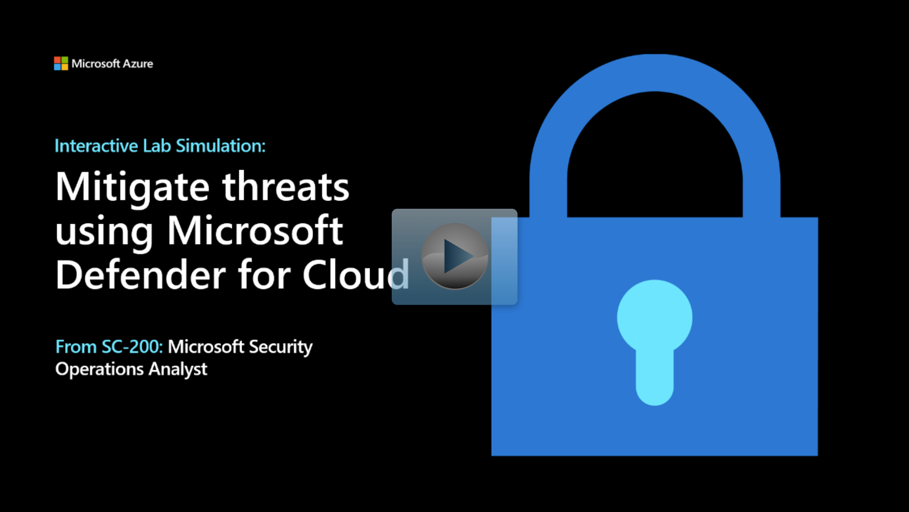

Microsoft Defender for Cloud continually compares the configuration of your resources with requirements in industry standards, regulations, and benchmarks.

To understand how Security Posture Management evaluates your environment, it's important to understand security policies and initiatives.

## What are security policies and initiatives

Microsoft Defender for Cloud applies security initiatives to your subscriptions. These initiatives contain one or more security policies. Each of those policies results in a security recommendation for improving your security posture. 

### What is a security policy?
An Azure Policy definition, created in Azure Policy, is a rule about specific security conditions that you want controlled. Built in definitions include things like controlling what type of resources can be deployed or enforcing the use of tags on all resources. You can also create your own custom policy definitions.

To implement these policy definitions (whether built-in or custom), you need to assign them. You can assign any of these policies through the Azure portal, PowerShell, or Azure CLI. Policies can be disabled or enabled from Azure Policy.

There are different types of policies in Azure Policy. Defender for Cloud mainly uses 'Audit' policies that check specific conditions and configurations then report on compliance. There are also "Enforce' policies that can be used to apply secure settings.

### What is a security initiative?
An Azure Policy initiative is a collection of Azure Policy definitions, or rules that are grouped together towards a specific goal or purpose. Azure initiatives simplify management of your policies by grouping a set of policies together, logically, as a single item.

A security initiative defines the desired configuration of your workloads and helps ensure you're complying with the security requirements of your company or regulators.

Like security policies, Defender for Cloud initiatives are also created in Azure Policy. You can use Azure Policy to manage your policies, build initiatives, and assign initiatives to multiple subscriptions or for entire management groups.

The default initiative automatically assigned to every subscription in Microsoft Defender for Cloud is Azure Security Benchmark. This benchmark is the Microsoft-authored, Azure-specific set of guidelines for security and compliance best practices based on common compliance frameworks. This widely respected benchmark builds on the controls from the Center for Internet Security (CIS) and the National Institute of Standards and Technology (NIST) with a focus on cloud-centric security. 

Defender for Cloud offers the following options for working with security initiatives and policies:

- View and edit the built-in default initiative - When you enable Defender for Cloud, the initiative named 'Azure Security Benchmark' is automatically assigned to all Defender for Cloud registered subscriptions. To customize this initiative, you can enable or disable individual policies within it by editing a policy's parameters. See the list of built-in security policies to understand the options available out-of-the-box.

- Add your own custom initiatives - If you want to customize the security initiatives applied to your subscription, you can do so within Defender for Cloud. You'll receive recommendations if your machines don't follow the policies you create. For instructions on building and assigning custom policies, see Using custom security initiatives and policies.

- Add regulatory compliance standards as initiatives - Defender for Cloud's regulatory compliance dashboard shows the status of all the assessments within your environment, in the context of a particular standard or regulation (such as Azure CIS, NIST SP 800-53 R4, SWIFT CSP CSCF-v2020). 

### What is a security recommendation?
Defender for Cloud uses the policies to periodically analyze the compliance status of your resources to identify potential security misconfigurations and weaknesses. It then provides you with recommendations on how to remediate those issues. Recommendations are the result of assessing your resources against the relevant policies and identifying resources that aren't meeting your defined requirements.

Defender for Cloud makes its security recommendations based on your chosen initiatives. When a policy from your initiative is compared against your resources and finds one or more that aren't compliant, it's presented as a recommendation in Defender for Cloud.

Recommendations are actions for you to take to secure and harden your resources. Each recommendation provides you with the following information:

- A short description of the issue
- The remediation steps to carry out in order to implement the recommendation
- The affected resources

Azure Security Benchmark is an initiative that contains requirements.

For example, Azure Storage accounts must restrict network access to reduce their attack surface.

The initiative includes multiple policies, each with a requirement of a specific resource type. These policies enforce the requirements in the initiative.

To continue the example, the storage requirement is enforced with the policy "Storage accounts should restrict network access using virtual network rules".

Microsoft Defender for Cloud continually assesses your connected subscriptions. If it finds a resource that doesn't satisfy a policy, it displays a recommendation to fix that situation and harden the security of resources that aren't meeting your security requirements.

So, for example, if an Azure Storage account on any of your protected subscriptions isn't protected with virtual network rules, you'll see the recommendation to harden those resources.

So, (1) an initiative includes (2) policies that generate (3) environment-specific recommendations.

You're a Security Operations Analyst working at a company that uses Microsoft Defender for Cloud. You're responsible for regulatory compliance of your hybrid-cloud resources.

You need to improve the number of controls that pass the Azure Security Benchmark as displayed in Microsoft Defender for Cloud.

Now that you have an understanding of Microsoft Defender for Cloud security policies, initiatives and recommendations see it in action.

> [!NOTE]
> Select the thumbnail image to start the lab simulation. When you're done, be sure to return to this page so you can continue learning.

