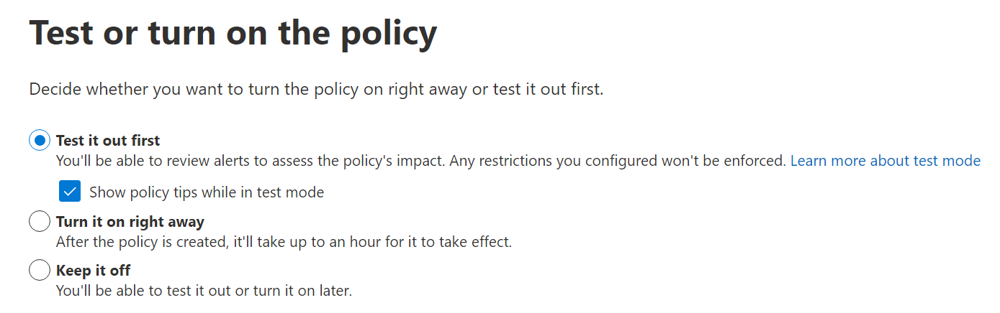
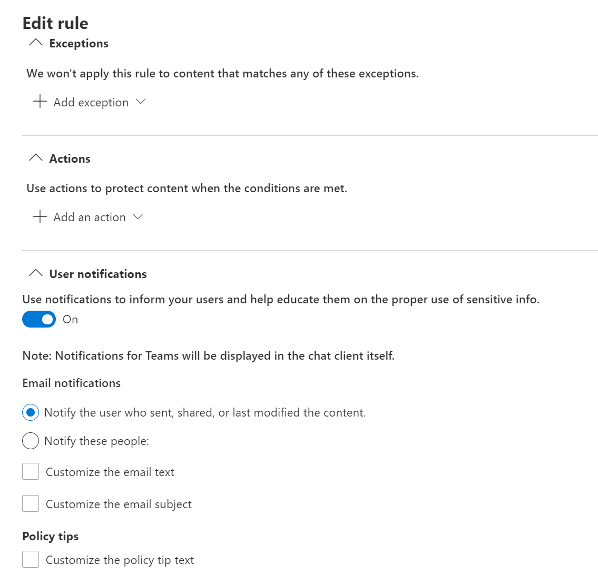
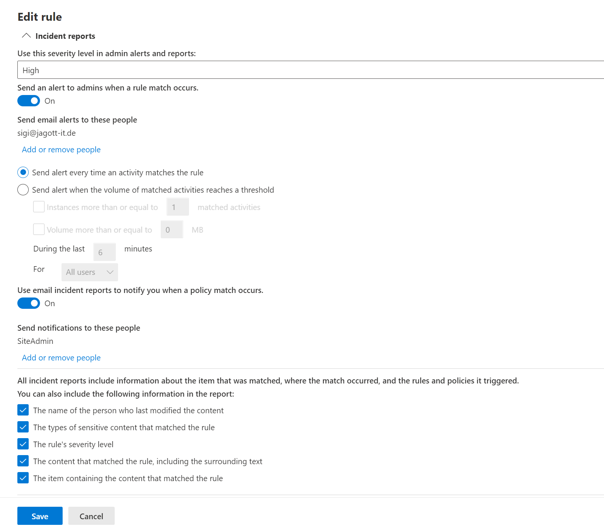

When implementing DLP Policies, it can be difficult to determine their full impact on the users of your environment. Test mode exists so administrators can create new DLP Policies and monitor the impact and effectiveness of the policy to end users. The results are delivered to you in the form of emails containing incident reports whenever a rule inside the policy matches content in the defined locations. Analyzing these reports help you determine if the policy is functioning as intended or if you need to adjust the policy before activating it.

For example, you created a policy that protects German driver's license numbers from being shared. When checking the data classification specifications, you notice your company's internal product numbers resemble the pattern of the license numbers you want to protect. Before activating the policy, you want to test the impact it would have on user experience. To create the policy in test mode, you first need to start the usual creation process for a policy.

Next, determine if you want to inform users that they're about to share sensitive information. Test mode can be configured to be invisible or to display policy tips and send mails to end users. If the users are informed of the match, they can also review their content for sensitive information.  This enables users to report false positives if they arise. False positives can occur when content matches a pattern it isn't supposed to match. This active user feedback can be useful to increase the effectiveness of a DLP policy.

For example, a driver's license number and a phone number might have different patterns but there can still be a string of numbers that matches both patterns. DLP Policies not only match those patterns but also require other parameters to identify if the number is a driver's license or a phone number. A user might want to send their phone number to a customer, but the policy recognizes the driver's license pattern in proximity to a driver's license identifier, which would result in the user seeing a policy tip for your driver's license policy.

To enable test mode for your DLP policy, you need to edit the DLP policy and go to the **Policy mode** page, then follow these steps:

1. Select **Test it out first**.

1. If you want to show policy tips to your users, you can check **Show policy tips while in test mode**, otherwise uncheck it.

1. Select **Next** and review the policy.

1. Select **Submit** after reviewing the policy.

    

1. Next you can review the content your policy matches by utilizing the Activity explorer.

1. In the Microsoft Purview compliance portal, expand **Data loss prevention** then select **Activity explorer**.

1. On the Activity explorer page, expand **Built-in filters** and review the **DLP policies that detected activities** and **DLP policy rules that detected activities** filters.

> [!TIP]
>DLP Policy reports might take up to 24 hours to show up in your display!

Once you've seen the impact of a policy in the Activity explorer, you can modify the policy to adjust its sensitivity and add exceptions if you identify any words that consistently trigger false positives. For example, the frequent use of the word product number would indicate people are discussing a product number not a license number.

While a policy is implemented in test mode the actions aren't executed. You can use exceptions to limit the number of false positives.

After you've monitored the alerts for some time and adjusted the sensitivity of your policy, you should keep the policy in test mode and activate the policy tips for some time.  This allows your users' time to help refine the policy further by reporting false positives.

## Data loss prevention rule: user notifications

User notifications inform users that a policy was triggered. Enabling these notifications should get users' to report false positives so you can adjust policy sensitivity. You can enable User notification on DLP rules using the following steps:

1. Edit the DLP policy and go to the **Customize advanced DLP rules** pane.

1. Select **Edit** on the DLP rule you want to configure.

1. In **Edit rule** pane, go down to the **User notifications** section, in **Use notifications to inform your users and help educate them on the proper use of sensitive info**, select **On**.

    

## Data loss prevention rule: incident reports

When tuning policies in test mode, you need to be informed about matches so you can adjust the sensitivity if matches are triggering a high number of false positives. In this case, we're monitoring each rule inside the policy for itself and not a general policy match.

The following steps describe how to configure Incident reports in your DLP rules:

1. When creating the DLP rules for a policy, on the **Edit rule** pane, in **Incident reports** section, in **Use this severity level in admin alerts and reports**, select **Low/Medium/High** as your severity level.

1. If you want to get a notification email, select **Send an alert to admins when a rule match occurs** and select your email address, and select **Send an alert every time an activity matches the rule**.

1. Decide on the various other parameters available to fine-tune your incident reports.

    
