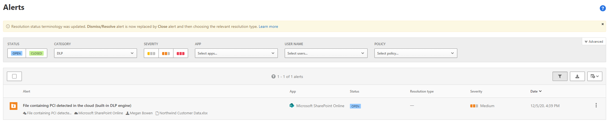

After you create data loss prevention policies, administrators need to verify and monitor the performance of their DLP policies in production. This is an important recurring task for an organization to ensure they stay compliant with policies while minimizing impact on user productivity. 

## DLP Activity Explorer and reports

The Activity explorer tab on the DLP page has multiple filters you can use to view DLP events. Use this tool to review activity related to content that contains sensitive info or has labels applied, such as what labels were changed, files were modified, and matched a rule.

You can view the last 30 days of DLP information in [Activity Explorer](/microsoft-365/compliance/data-classification-activity-explorer?azure-portal=true) using these preconfigured filters:

- Endpoint DLP activities
- Files containing sensitive info types
- Egress activities
- DLP policies that detected activities
- DLP policy rules that detected activities

|To see this information |Select this activity |
|---------|---------|
|User overrides|**DLP rule undo**|
|Items that match a DLP rule|**DLP rule matched**|

To access the DLP report, you can use PowerShell and the Security & Compliance PowerShell module.

1. Connect to the Security & Compliance PowerShell module:

    ```powershell
    Connect-IPPSSession
    ```

1. Use the **Export-ActivityExplorerData** cmdlet to export activities from Data classification > Activity Explorer in the Microsoft 365 Purview compliance portal. Specify the desired time range using the **-StartTime** and **-EndTime** parameters. Choose the output format, such as JSON or CSV, by setting the **-OutputFormat** parameter. Here's an example:

    ```powershell
    Export-ActivityExplorerData -StartTime "06/24/2023 00:00 AM" -EndTime "06/25/2023 00:00 AM" -OutputFormat JSON
    ```

To learn more about the **Export-ActivityExplorerData** cmdlet see:
- [Export-ActivityExplorerData](/powershell/module/exchange/export-activityexplorerdata?azure-portal=true)

### Contextual summary

You can see the text that surrounds the matched content, like a credit card number in a **DLPRuleMatch** event in Activity explorer. To do this you must first enable [Advanced classification scanning and protection](/microsoft-365/compliance/dlp-configure-endpoint-settings?azure-portal=true#advanced-classification-scanning-and-protection).

**DLPRuleMatch** events are paired with the user activity event. They should be right next to (or at least very close to) each other in Activity explorer.  You'll want to look at both because the **user activity event** contains details about the matched policy and the **DLPRuleMatch** event contains the details about the text that surrounds the matched content.

For endpoint, be sure that you have applied KB5016688 for Windows 10 devices and KB5016691 for Windows 11 devices or above

For more information, see [Get started with activity explorer](/microsoft-365/compliance/data-classification-activity-explorer?azure-portal=true)

## Data loss prevention alerts in the Microsoft Defender for Cloud Apps dashboard

You can also view a report for DLP alerts in the Defender for Cloud Apps Dashboard. This report shows the alerts and matches of all your Defender for Cloud Apps policies that are part of the DLP category. You can select each alert or match to gain information about:

- The type of sensitive information
- Location of the sensitive information
- The policy creating the alert
- The user triggering the policy match
- The actions that have been taken to secure the matched file

[](../media/alerts-report-microsoft-cloud-app-security.png#lightbox)

Use the Defender for Cloud Apps DLP alerts report to view an overview of Defender for Cloud Apps policy alerts. Since policies created on the Defender for Cloud Apps side have different options and scopes compared to Defender for Cloud Apps policies created in the Microsoft Purview compliance portal, it's prudent to be aware of alerts in both dashboards.
