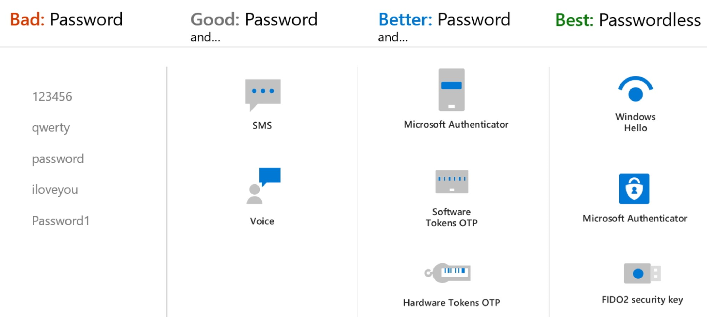
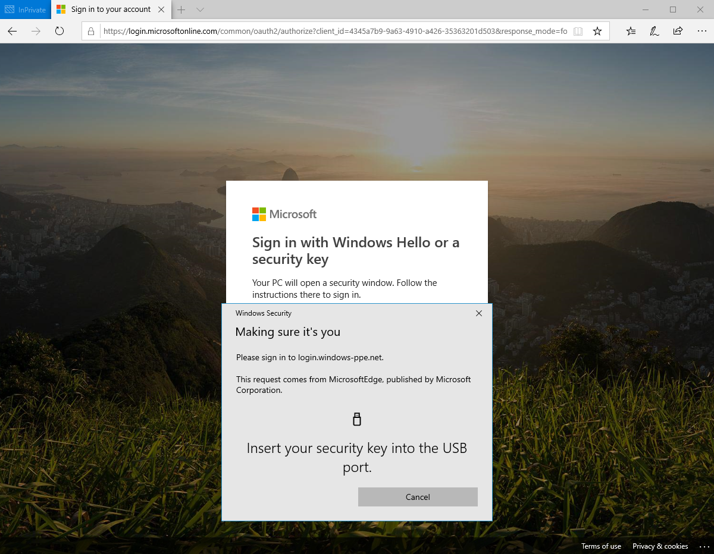

As part of the sign-in experience for accounts in Azure AD, there are different ways that users can authenticate themselves. Historically, a username and password is the most common way a user would provide credentials. With modern authentication and security features in Azure AD, that basic password should be supplemented or replaced with more secure authentication methods.

Passwordless authentication methods such as Windows Hello, FIDO2 security keys, and the Microsoft Authenticator app provide the most secure sign-in events.

Azure AD Multi-Factor Authentication (MFA) adds additional security over only using a password when a user signs in. The user can be prompted for additional forms of authentication, such as to respond to a push notification, enter a code from a software or hardware token, or respond to an SMS or phone call.

To simplify the user on-boarding experience and register for both MFA and self-service password reset (SSPR), we recommend that you enable combined security information registration. For resiliency, we recommend that you require users to register multiple authentication methods. When one method isn't available for a user during sign-in or SSPR, they can choose to authenticate with another method.

### Authentication method strength and security

When you deploy features like Azure AD Multi-Factor Authentication in your organization, review the available authentication methods. Choose the methods that meet or exceed your requirements in terms of security, usability, and availability. Where possible, use authentication methods with the highest level of security.

The following table outlines the security considerations for the available authentication methods. Availability is an indication of the user being able to use the authentication method, not of the service availability in Azure AD:

:::row:::
:::column:::

Authentication method

:::column-end:::
:::column:::

Security

:::column-end:::
:::column:::

Usability

:::column-end:::
:::column:::

Availability

:::column-end:::
:::row-end:::
:::row:::
:::column:::

Windows Hello for Business

:::column-end:::
:::column:::

High

:::column-end:::
:::column:::

High

:::column-end:::
:::column:::

High

:::column-end:::
:::row-end:::
:::row:::
:::column:::

Microsoft Authenticator app

:::column-end:::
:::column:::

High

:::column-end:::
:::column:::

High

:::column-end:::
:::column:::

High

:::column-end:::
:::row-end:::
:::row:::
:::column:::

FIDO2 security key (preview)

:::column-end:::
:::column:::

High

:::column-end:::
:::column:::

High

:::column-end:::
:::column:::

High

:::column-end:::
:::row-end:::
:::row:::
:::column:::

OATH hardware tokens (preview)

:::column-end:::
:::column:::

Medium

:::column-end:::
:::column:::

Medium

:::column-end:::
:::column:::

High

:::column-end:::
:::row-end:::
:::row:::
:::column:::

OATH software tokens

:::column-end:::
:::column:::

Medium

:::column-end:::
:::column:::

Medium

:::column-end:::
:::column:::

High

:::column-end:::
:::row-end:::
:::row:::
:::column:::

SMS

:::column-end:::
:::column:::

Medium

:::column-end:::
:::column:::

High

:::column-end:::
:::column:::

Medium

:::column-end:::
:::row-end:::
:::row:::
:::column:::

Voice

:::column-end:::
:::column:::

Medium

:::column-end:::
:::column:::

Medium

:::column-end:::
:::column:::

Medium

:::column-end:::
:::row-end:::
:::row:::
:::column:::

Password

:::column-end:::
:::column:::

Low

:::column-end:::
:::column:::

High

:::column-end:::
:::column:::

High

:::column-end:::
:::row-end:::

> [!TIP]
> For flexibility and usability, we recommend that you use the Microsoft Authenticator app. This authentication method provides the best user experience and multiple modes, such as passwordless, MFA push notifications, and OATH codes.

### How each authentication method works

Some authentication methods can be used as the primary factor when you sign-in to an application or device, such as using a FIDO2 security key or a password. Other authentication methods are only available as a secondary factor when you use Azure AD Multi-Factor Authentication or SSPR.

The following table outlines when an authentication method can be used during a sign-in event:

:::row:::
:::column:::

Method

:::column-end:::
:::column:::

Primary authentication

:::column-end:::
:::column:::

Secondary authentication

:::column-end:::
:::row-end:::
:::row:::
:::column:::

Windows Hello for Business

:::column-end:::
:::column:::

Yes

:::column-end:::
:::column:::

MFA

:::column-end:::
:::row-end:::
:::row:::
:::column:::

Microsoft Authenticator app

:::column-end:::
:::column:::

Yes (preview)

:::column-end:::
:::column:::

MFA and SSPR

:::column-end:::
:::row-end:::
:::row:::
:::column:::

FIDO2 security key (preview)

:::column-end:::
:::column:::

Yes

:::column-end:::
:::column:::

MFA

:::column-end:::
:::row-end:::
:::row:::
:::column:::

OATH hardware tokens (preview)

:::column-end:::
:::column:::

No

:::column-end:::
:::column:::

MFA

:::column-end:::
:::row-end:::
:::row:::
:::column:::

OATH software tokens

:::column-end:::
:::column:::

No

:::column-end:::
:::column:::

MFA

:::column-end:::
:::row-end:::
:::row:::
:::column:::

SMS

:::column-end:::
:::column:::

Yes (preview)

:::column-end:::
:::column:::

MFA and SSPR

:::column-end:::
:::row-end:::
:::row:::
:::column:::

Voice call

:::column-end:::
:::column:::

No

:::column-end:::
:::column:::

MFA and SSPR

:::column-end:::
:::row-end:::
:::row:::
:::column:::

Password

:::column-end:::
:::column:::

Yes

:::column-end:::
:::column:::

:::column-end:::
:::row-end:::

All of these authentication methods can be configured in the Azure portal and increasingly using the Microsoft Graph REST API beta.

> [!NOTE]
> In Azure AD, a password is often one of the primary authentication methods. You can't disable the password authentication method. If you use a password as the primary authentication factor, increase the security of sign-in events using Azure AD Multi-Factor Authentication.

The following additional verification methods can be used in certain scenarios:

- App passwords - used for old applications that don't support modern authentication and can be configured for per-user Azure AD Multi-Factor Authentication.

- Security questions - only used for SSPR.

- Email address - only used for SSPR.

## Enable FIDO2 security key method

1. Sign in to the Azure portal.

2. Browse to **Azure Active Directory** > **Security** > **Authentication methods** > **Authentication method policy (Preview)**.

3. Under the method **FIDO2 Security Key**, choose the following options:

    - **Enable** - Yes or No

    - **Target** - All users or Select users

4. **Save** the configuration.

### Manage user registration and FIDO2 security keys

1. Browse to **https://myprofile.microsoft.com**.

1. Sign in if you haven't already.

1. Click **Security Info**.

1. If the user already has at least one Azure AD Multi-Factor Authentication method registered, they can immediately register a FIDO2 security key.

1. If they don't have at least one Azure AD Multi-Factor Authentication method registered, they must add one.

1. Add a FIDO2 security key by clicking **Add method** and choosing **Security key**.

1. Choose **USB device** or **NFC device**.

1. Have your key ready and choose **Next**.

1. A box will appear and ask the user to create/enter a PIN for your security key and then perform the required gesture for the key, either biometric or touch.

1. The user will be returned to the combined registration experience and asked to provide a meaningful name for the key so the user can identify which one if they have multiple. Click **Next**.

1. Click **Done** to complete the process.

### Sign in with passwordless credential

In the example below a user has already provisioned their FIDO2 security key. The user can choose to sign in on the web with their FIDO2 security key inside of a supported browser on Windows 10 version 1903 or higher.

> [!div class="mx-imgBorder"]
> 

## Prerequisites for cloud-only deployment

- Windows 10, version 1511 or later

- Microsoft Azure account

- Azure AD

- Azure AD Multi-Factor Authentication

- Modern Management - *optional,* Intune or supported third-party mobile-device management (MDM)

- Azure AD Premium subscription - *optional*, needed for automatic MDM enrollment when the device joins Azure AD

