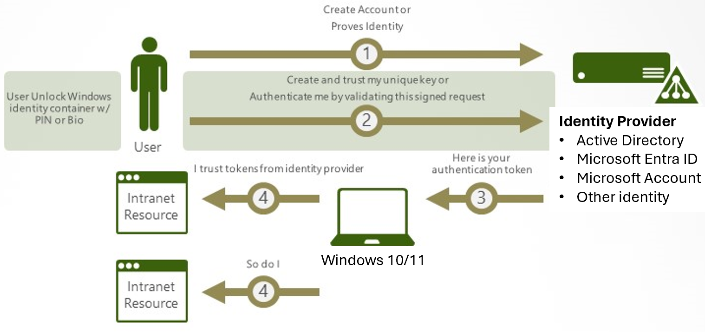

In Windows 10, Windows Hello for Business replaces passwords with strong two-factor authentication on PCs and mobile devices. This authentication consists of a new type of user credential that is tied to a device and uses a biometric or PIN. Windows Hello for Business lets user authenticate to an Active Directory or Azure AD account.

Windows Hello addresses the following problems with passwords:

- Strong passwords can be difficult to remember, and users often reuse passwords on multiple sites.

- Server breaches can expose symmetric network credentials (passwords).

- Passwords are subject to replay attacks.

- Users can inadvertently expose their passwords due to phishing attacks.

   > [!div class="mx-imgBorder"]
   > 

## How Windows Hello for Business works: key points

- Windows Hello credentials are based on certificate or asymmetrical key pair. Windows Hello credentials can be bound to the device, and the token that is obtained using the credential is also bound to the device.

- Identity provider (such as Active Directory, Azure AD, or a Microsoft account) validates user identity and maps the Windows Hello public key to a user account during the registration step.

- Keys can be generated in hardware (TPM 1.2 or 2.0 for enterprises, and TPM 2.0 for consumers) or software, based on the policy.

- Authentication is the two-factor authentication with the combination of a key or certificate tied to a device and something that the person knows (a PIN) or something that the person is (biometrics). The Windows Hello gesture does not roam between devices and is not shared with the server. Biometrics templates are stored locally on a device. The PIN is never stored or shared.

- The private key never leaves a device when using TPM. The authenticating server has a public key that is mapped to the user account during the registration process.

- PIN entry and biometric gesture both trigger Windows 10 to use the private key to cryptographically sign data that is sent to the identity provider. The identity provider verifies the user's identity and authenticates the user.

- Personal (Microsoft account) and corporate (Active Directory or Azure AD) accounts use a single container for keys. All keys are separated by identity providers' domains to help ensure user privacy.

- Certificate private keys can be protected by the Windows Hello container and the Windows Hello gesture.

## Creating security groups

Windows Hello for Business uses several security groups to simplify the deployment and management.

> [!IMPORTANT]
> If your environment has one or more Windows Server 2016 domain controllers in the domain to which you are deploying Windows Hello for Business, then skip the Create the KeyCredentials Admins Security Group. Domains that include Windows Server 2016 domain controllers use the KeyAdmins group, which is created during the installation of the first Windows Server 2016 domain controller.

### Create the KeyCredential Admins security group

Azure Active Directory Connect synchronizes the public key on the user object created during provisioning. You assign write and read permission to this group to the Active Directory attribute to ensure the Azure AD Connect service can add and remove keys as part of its normal workflow.

1. Sign in a domain controller or management workstation with *Domain Admin* equivalent credentials.

1. Open **Active Directory Users and Computers**.

1. Click **View** and click **Advance Features**.

1. Expand the domain node from the navigation pane.

1. Right-click the **Users** container. Click **New**. Click **Group**.

1. Type **KeyCredential Admins** in the **Group Name** text box.

1. Click **OK**.

### Create the Windows Hello for Business Users security group

The Windows Hello for Business Users group is used to make it easy to deploy Windows Hello for Business in phases. You assign Group Policy and Certificate template permissions to this group to simplify the deployment by adding the users to the group. This provides users with the proper permissions to provision Windows Hello for Business and to enroll in the Windows Hello for Business authentication certificate.

1. Sign in a domain controller or management workstation with *Domain Admin* equivalent credentials.

1. Open **Active Directory Users and Computers**.

1. Click **View** and click **Advanced Features**.

1. Expand the domain node from the navigation pane.

1. Right-click the **Users** container. Click **New**. Click **Group**.

1. Type **Windows Hello for Business Users** in the **Group Name** text box.

1. Click **OK**.

