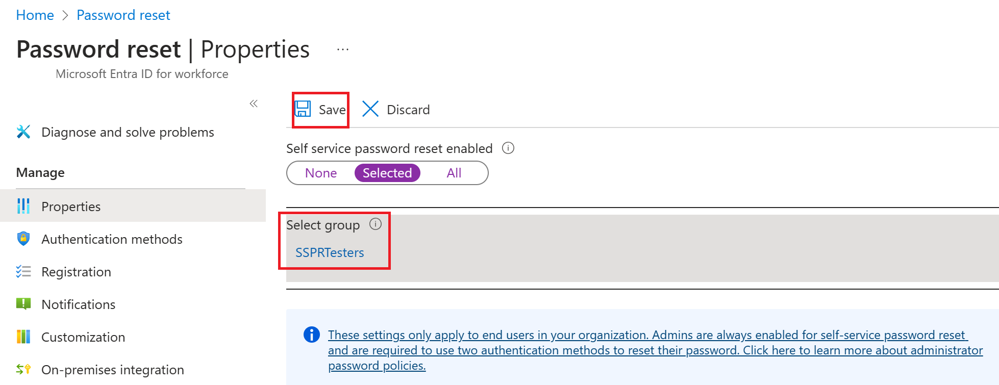
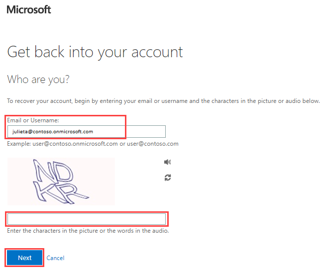

Azure Active Directory (Azure AD) self-service password reset (SSPR) gives users the ability to change or reset their password, with no administrator or help desk involvement. If a user's account is locked or they forget their password, they can follow prompts to unblock themselves and get back to work. This ability reduces help desk calls and loss of productivity when a user can't sign in to their device or an application.

## Add a new user

Create a user account that will be added to a security group.

1. In the Azure AD organization you created, under **Manage**, select **Users** > **New User**.

2. The User pane now appears. Enter the following values:

    - User name: Utu

    - Name: Utu  Linna

3. Select **Show Password** and then copy it somewhere to reference it later.

4. Select **Create**.

## Create a group

You want to roll out SSPR to a limited set of users first to make sure your SSPR configuration works as expected. Let's create a security group for the limited rollout and add a user to the group.

1. Sign in to the [Azure portal](https://portal.azure.com/) using a Global administrator account.

2. Open the portal menu and then select **Azure Active Directory**.

3. On the Azure Active Directory blade, under **Manage**, select **+ New Group**.

4. Create a new group using the following information:

   | **Setting**| **Value**|
   | :--- | :--- |
   | Group type| Security|
   | Group name| SSPRTesters|
   | Group description| Testers of SSPR rollout|
   | Membership type| Assigned|
   | Members| Utu  Linna|

5. Select **Create**.

> [!div class="mx-imgBorder"]
> 

## Enable self-service password reset

Enable SSPR for the group.

1. Browse back to the Azure Active Directory blade.

2. Under **Manage**, select **Password reset**.

   > [!IMPORTANT]
   > If the Password reset page still displays the message Get a free Premium trial to use this feature, wait for a few minutes and then refresh the page.
3. On the Password reset blade **Properties** page, under **Self service password reset enabled**, select **Selected**.

4. Select **Select group**.

5. In the Default password reset policy pane, select the **SSPRTesters** group.

6. On the Password reset blade **Properties** page, select **Save**.

   > [!div class="mx-imgBorder"]
   > 

7. Under **Manage**, select and review the default values for the **Authentication methods**, **Registration**, **Notifications**, and **Customization** settings.

## Register for self-service password reset

Now that the SSPR configuration is complete, register a mobile phone number for the user you created.

1. Open a different browser or open an InPrivate or Incognito browser session and then browse to [https://aka.ms/ssprsetup](https://aka.ms/ssprsetup).

   This is to ensure you well be prompted for user authentication.

2. Sign in as **utu@***organization-domain-name***.onmicrosoft.com** with the password that you noted earlier.

   Replace the organization-domain-name with your domain name.

3. When prompted to update your password, enter a new password of your choice. Be sure to record the new password.

4. In the **More information required** dialog box, select **Next**.

5. On the Keep your account secure page, user the **Phone** option or select the **I want to set up a different method** link.

   > [!div class="mx-imgBorder"]
   > 

6. In this example, you will use the Phone option. Enter your mobile phone details.

7. Select **Text me a code**.

8. When you receive the code on your mobile phone, enter the code in the text box and then select Next.

9. After your phone has been registered, select Next and then select Done.

10. Close the browser. You do not need to complete the sign in process.

## Test self-service password reset

Now let's test whether the user can reset their password.

1. Open a different browser or open an InPrivate or Incognito browser session and then browse to [https://aka.ms/sspr](https://aka.ms/sspr).

   This is to ensure you well be prompted for user authentication.

2. In the **Email, phone, or Skype** box, enter **utu@***organization-domain-name***.onmicrosoft.com** and then select Next.

   Replace the organization-domain-name with your domain name.

3. On the Enter password page, select **Forgot my password**.

4. On the Get back into your account page, complete the requested information and then select **Next**.

   > [!div class="mx-imgBorder"]
   > 

5. In the **verification step 1** task, select **Text my mobile phone** or **Call my mobile phone**, enter your phone number and then select **Text**.

   > [!div class="mx-imgBorder"]
   > 

6. Enter your verification code and then select **Next**.

7. In the choose a new password step, enter and then confirm your new password.

8. When complete, select **Finish**.

9. Sign in as **Utu** with the new password you created.

10. Enter your verification code and then verify you can complete the sign in process.

11. When finished, close your browser.

