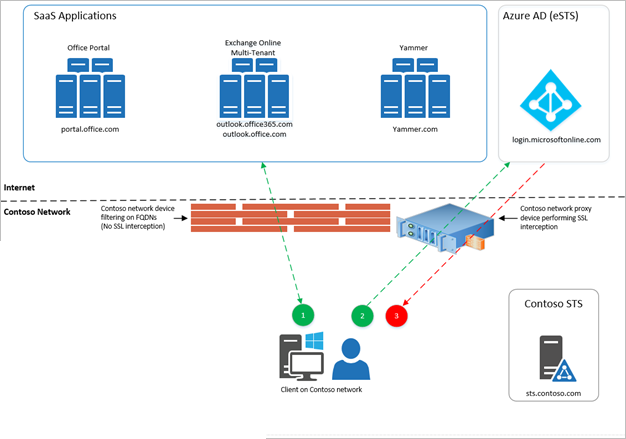

Large organizations that emphasize security want to move to cloud services like Microsoft 365, but they need to know that their users only can access approved resources. Traditionally, companies restrict domain names or IP addresses when they want to manage access. This approach fails in a world where software-as-a-service (or SaaS) apps are hosted in a public cloud, running on shared domain names like [outlook.office.com](https://outlook.office.com/) and [login.microsoftonline.com](https://login.microsoftonline.com/). Blocking these addresses would keep users from accessing Outlook on the web entirely, instead of merely restricting them to approved identities and resources.

The Azure AD solution to this challenge is a feature called tenant restrictions. With tenant restrictions, organizations can control access to SaaS cloud applications, based on the Azure AD tenant the applications use for single sign-on. For example, you may want to allow access to your organization’s Microsoft 365 applications, while preventing access to other organizations’ instances of these same applications.  

With tenant restrictions, organizations can specify the list of tenants that their users are permitted to access. Azure AD then only grants access to these permitted tenants.

This article focuses on tenant restrictions for Microsoft 365, but the feature should work with any SaaS cloud app that uses modern authentication protocols with Azure AD for single sign-on. If you use SaaS apps with a different Azure AD tenant from the tenant used by Microsoft 365, make sure that all required tenants are permitted.

## How it works

The overall solution comprises the following components:

-  **Azure AD**: If the `Restrict-Access-To-Tenants: <permitted tenant list>` header is present, Azure AD only issues security tokens for the permitted tenants.

-  **On-premises proxy server infrastructure**: This infrastructure is a proxy device capable of Transport Layer Security (TLS) inspection. You must configure the proxy to insert the header containing the list of permitted tenants into traffic destined for Azure AD.

-  **Client software**: To support tenant restrictions, client software must request tokens directly from Azure AD, so that the proxy infrastructure can intercept traffic. Browser-based Microsoft 365 applications currently support tenant restrictions, as do Office clients that use modern authentication (like OAuth 2.0).

-  **Modern Authentication**: Cloud services must use modern authentication to use tenant restrictions and block access to all non-permitted tenants. You must configure Microsoft 365 cloud services to use modern authentication protocols by default.

The following diagram illustrates the high-level traffic flow. Tenant restrictions requires TLS inspection only on traffic to Azure AD, not to the Microsoft 365 cloud services. This distinction is important, because the traffic volume for authentication to Azure AD is typically much lower than traffic volume to SaaS applications like Exchange Online and SharePoint Online.

>[!div class="mx-imgBorder"]
>

In the scenario depicted here, a user is trying to access a shared SaaS application via an allowed fully qualified domain name (FQDN) to get access to the Fabrikam application instance, or tenant, while on the Contoso network:

1. The client accesses the allowed FQDN (for example, outlook.office.com) and is redirected to Azure AD.

1. The client tries to use a Fabrikam credential. The Contoso proxy intercepts the traffic and inserts an HTTP header indicating that Contoso is an allowed tenant. Fabrikam's tenant is not allowed.

1. Azure AD does not issue a service token for the Fabrikam user, so the client cannot gain access to the Fabrikam SaaS application instance.

There are two steps to get started with tenant restrictions. First, make sure that your clients can connect to the right addresses. Second, configure your proxy infrastructure.

## URLs and IP addresses

To use tenant restrictions, your clients must be able to connect to the following Azure AD URLs to authenticate: login.microsoftonline.com, login.microsoft.com, and login.windows.net. Additionally, to access Office 365, your clients must be able to connect to the fully qualified domain names (FQDNs), URLs, and IP addresses defined in [Office 365 URLs and IP address ranges](https://support.office.com/article/Office-365-URLs-and-IP-address-ranges-8548a211-3fe7-47cb-abb1-355ea5aa88a2). 

## Proxy configuration and requirements

The following configuration is required to enable tenant restrictions through your proxy infrastructure. This guidance is generic, so you should refer to your proxy vendor’s documentation for specific implementation steps.

### Prerequisites

- The proxy must be able to perform TLS interception, HTTP header insertion, and filter destinations using FQDNs/URLs.

- Clients must trust the certificate chain presented by the proxy for TLS communications. For example, if certificates from an internal public key infrastructure (PKI) are used, the internal issuing root certificate authority certificate must be trusted.

- Azure AD Premium 1 licenses are required for use of Tenant Restrictions.

### Configuration

For each incoming request to login.microsoftonline.com, login.microsoft.com, and login.windows.net, insert two HTTP headers: *Restrict-Access-To-Tenants* and *Restrict-Access-Context*.

> [!NOTE]
> When configuring SSL interception and header injection, ensure that traffic to https://device.login.microsoftonline.com is excluded. This URL is used for device authentication. Performing TLS break-and-inspect may interfere with Client Certificate authentication, which may cause issues with device registration and device-based Conditional Access.

The headers should include the following elements:

- For *Restrict-Access-To-Tenants*, use a value of <permitted tenant list>, which is a comma-separated list of tenants you want to allow users to access. Any domain that is registered with a tenant can be used to identify the tenant in this list, as well as the directory ID itself. For an example of all three ways of describing a tenant, the name/value pair to allow Contoso, Fabrikam, and Microsoft looks like: `Restrict-Access-To-Tenants: contoso.com,fabrikam.onmicrosoft.com,72f988bf-86f1-41af-91ab-2d7cd011db47`

- For *Restrict-Access-Context*, use a value of a single directory ID, declaring which tenant is setting the tenant restrictions. For example, to declare Contoso as the tenant that set the tenant restrictions policy, the name/value pair looks like: `Restrict-Access-Context: 456ff232-35l2-5h23-b3b3-3236w0826f3d`. You **must** use your own directory ID in this spot.

> [!TIP]
> You can find your directory ID in the Azure Active Directory portal. Sign in as an administrator, select Azure Active Directory, then select Properties.
> To validate that a directory ID or domain name refers to the same tenant, use that ID or domain in this URL: https://login.microsoftonline.com/<tenant>/v2.0/.well-known/openid-configuration. If the results with the domain and the ID are the same, they refer to the same tenant.

To prevent users from inserting their own HTTP header with non-approved tenants, the proxy needs to replace the *Restrict-Access-To-Tenants* header if it is already present in the incoming request.

Clients must be forced to use the proxy for all requests to login.microsoftonline.com, login.microsoft.com, and login.windows.net. For example, if PAC files are used to direct clients to use the proxy, end users shouldn't be able to edit or disable the PAC files.

> [!NOTE]
> Do not include subdomains under *.login.microsoftonline.com in your proxy configuration. Doing so will include device.login.microsoftonline.com and may interfere with Client Certificate authentication, which is used in Device Registration and Device-based Conditional Access scenarios. Configure your proxy server to exclude device.login.microsoftonline.com from TLS break-and-inspect and header injection.

## The user experience

This section describes the experience for both end users and admins.

### End-user experience

An example user is on the Contoso network, but is trying to access the Fabrikam instance of a shared SaaS application like Outlook online. If Fabrikam is a non-permitted tenant for the Contoso instance, the user sees an access denial message, which says you're trying to access a resource that belongs to an organization unapproved by your IT department.

### Admin experience

While configuration of tenant restrictions is done on the corporate proxy infrastructure, admins can access the tenant restrictions reports in the Azure portal directly. To view the reports:

1. Sign in to the Azure Active Directory portal. The **Azure Active Directory admin center** dashboard appears.

1. In the left pane, select **Azure Active Directory**. The Azure Active Directory overview page appears.

1. On the Overview page, select **Tenant restrictions**.

The admin for the tenant specified as the Restricted-Access-Context tenant can use this report to see sign-ins blocked because of the tenant restrictions policy, including the identity used and the target directory ID. Sign-ins are included if the tenant setting the restriction is either the user tenant or resource tenant for the sign-in.

> [!NOTE]
> The report may contain limited information, such as target directory ID, when a user who is in a tenant other than the Restricted-Access-Context tenant signs in. In this case, user-identifiable information, such as name and user principal name, is masked to protect user data in other tenants ("00000000-0000-0000-0000-00000000@domain.com").

Like other reports in the Azure portal, you can use filters to specify the scope of your report. You can filter on a specific time interval, user, application, client, or status. If you select the **Columns** button, you can choose to display data with any combination of the following fields:

- **User**

- **Application**

- **Status**

- **Date**

- **Date (UTC)** (where UTC is Coordinated Universal Time)

- **MFA Auth Method** (multifactor authentication method)

- **MFA Auth Detail** (multifactor authentication detail)

- **MFA Result**

- **IP Address**

- **Client**

- **Username**

- **Location**

- **Target tenant ID**

## Microsoft 365 support

Microsoft 365 applications must meet two criteria to fully support tenant restrictions:

-  The client used supports modern authentication.

-  Modern authentication is enabled as the default authentication protocol for the cloud service.

Microsoft 365 browser-based applications (the Office Portal, Yammer, SharePoint sites, Outlook on the Web, and more) currently support tenant restrictions. Thick clients (Outlook, Skype for Business, Word, Excel, PowerPoint, and more) can enforce tenant restrictions only when using modern authentication.

Outlook and Skype for Business clients that support modern authentication may still able to use legacy protocols against tenants where modern authentication isn't enabled, effectively bypassing tenant restrictions. Tenant restrictions may block applications that use legacy protocols if they contact login.microsoftonline.com, login.microsoft.com, or login.windows.net during authentication.

For Outlook on Windows, customers may choose to implement restrictions preventing end users from adding unapproved mail accounts to their profiles. For example, see the Prevent adding non-default Exchange accounts group policy setting.

