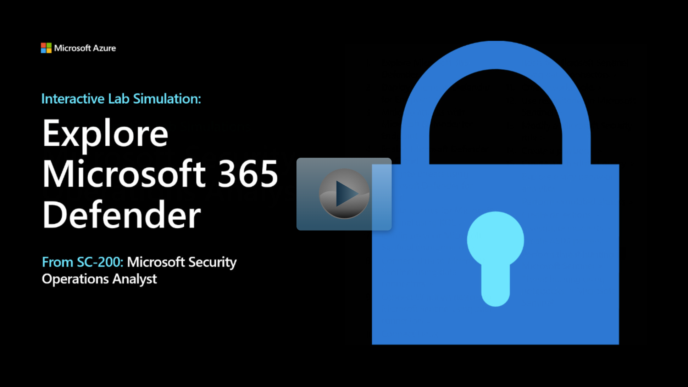

The Microsoft 365 Defender portal ([https://security.microsoft.com/](https://security.microsoft.com/?azure-portal=true)) is a specialized workspace designed to meet the needs of security teams. These solutions are integrated across Microsoft 365 services and provide actionable insights to help reduce risks and safeguard your digital estate.

You can investigate the alerts that affect your network, understand what they mean, and collate evidence associated with the incidents so that you can devise an effective remediation plan.

The Home page shows many of the common cards that security teams need. The composition of cards and data is dependent on the user's role. Because the Microsoft 365 Defender portal uses role-based access control, different roles see cards that are more meaningful to their day-to-day jobs.

This at-a-glance information helps you keep up with the latest activities in your organization. The Microsoft 365 Defender portal brings together signals from different sources to present a holistic view of your Microsoft 365 environment.

The Microsoft 365 Defender portal combines protection, detection, investigation, and response to email, collaboration, identity, device, and app threats, in a central place.

This single pane of glass brings together functionality from existing Microsoft security portals, like the Microsoft 365 Defender portal and the Office 365 Security & compliance portal. The Microsoft 365 Defender portal emphasizes quick access to information, simpler layouts, and bringing related information together for easier use. It includes:

- **Microsoft Defender for Office 365** - Microsoft Defender for Office 365 helps organizations secure their enterprise with a set of prevention, detection, investigation and hunting features to protect email, and Office 365 resources.

- **Microsoft Defender for Endpoint** - delivers preventative protection, post-breach detection, automated investigation, and response for devices in your organization.
- **Microsoft 365 Defender** - is part of Microsoft’s Extended Detection and Response (XDR) solution that uses the Microsoft 365 security portfolio to automatically analyze threat data across domains, and build a picture of an attack on a single dashboard.
- **Microsoft Defender for Cloud Apps** - is a comprehensive cross-SaaS and PaaS solution bringing deep visibility, strong data controls, and enhanced threat protection to your cloud apps.
- **Microsoft Defender for Identity** - is a cloud-based security solution that uses your on-premises Active Directory signals to identify, detect, and investigate advanced threats, compromised identities, and malicious insider actions directed at your organization.
- **Microsoft Defender Vulnerability Management** - delivers continuous asset visibility, intelligent risk-based assessments, and built-in remediation tools to help your security and IT teams prioritize and address critical vulnerabilities and misconfigurations across your organization.

The **More resources** option in the portal provides a list of these related portals:

| Portal| Description|
| :--- | :--- |
| Microsoft Purview compliance portal| Manage your compliance needs across Microsoft 365 services using integrated solutions for information governance, classification, case management, and more.|
| Azure Active Directory| Manage your organization's identities. Set up multi-factor authentication, track user sign-ins, edit company branding, and more.|
| Azure AD Identity Protection| Detect potential vulnerabilities affecting your organization's identities. Investigate suspicious incidents related to your organization's identities and set up automated responses to resolve them.|
| Azure Information Protection| Configure and manage the Azure Information Protection client and scanner to automatically classify and protect your organization's email and docs. Use reports to monitor label usage and identify sensitive info that should be protected.|
| Microsoft Defender for Cloud| Protect your data centers and get advanced threat protection for your Azure and non-Azure workloads in the cloud and on premises. Secure your Azure services fast with autoprovisioned, native protection.|

> [!NOTE]
> Microsoft Defender for Business is a licensing model designed especially for the small and medium-sized business (up to 300 employees). You might find Microsoft 365 Defender portal content in the documentation section of Microsoft Defender for Business. The solutions use the same portal (https://security.microsoft.com) and therefore the documentation applies. 

## Required roles and permissions

The following table outlines the roles and permissions required to access each unified experience in each workload. Roles defined in the table below refer to custom roles in individual portals and aren't connected to global roles in Azure AD, even if similarly named.

> [!NOTE]
> Incident management requires management permissions for all products that are part of the incident.

| One of the following roles is required for Microsoft 365 Defender | One of the following roles is required for Defender for Endpoint | One of the following roles is required for Defender for Office 365 | One of the following roles is required for Defender for Cloud Apps |
| :--- | :--- | :--- | :--- |
| Viewing investigation data:  - Alert page - Alerts queue - Incidents - Incident queue - Action center  | View data-security operations | - View-only Manage alerts - Organization - configuration - Audit logs - View-only audit logs - Security reader - Security admin - View-only recipients | - Global admin - Security admin - Compliance admin - Security operator - Security reader - Global reader |
| Viewing hunting data | View data-security operations | - Security reader - Security admin - View-only recipients | - Global admin - Security admin - Compliance admin - Security operator - Security reader - Global reader |
| Managing alerts and incidents | Alerts investigation | - Manage alerts - Security admin | - Global admin - Security admin - Compliance admin - Security operator - Security reader |
| Action center remediation | Active remediation actions – security operations | Search and purge |  |
| Setting custom detections | Manage security settings | - Manage alerts - Security admin | - Global admin - Security admin - Compliance admin - Security operator - Security reader - Global reader |
| Threat Analytics | Alerts and incidents data:  - View data - security operations   TVM mitigations:  - View data - Threat and vulnerability management | Alerts and incidents data: - View-only Manage alerts - Manage alerts - Organization configuration - Audit logs - View-only audit logs - Security reader - Security admin - View-only recipients  Prevented email attempts: - Security reader - Security admin - View-only recipients | Not available for Defender for Cloud Apps or MDI users |

## Interactive Lab Simulation

> [!NOTE]
> Select the thumbnail image to start the lab simulation. When you're done, be sure to return to this page so you can continue learning.

