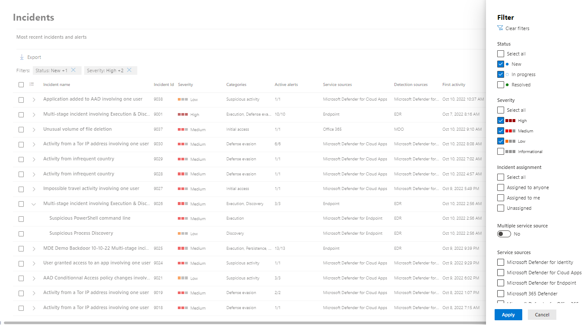
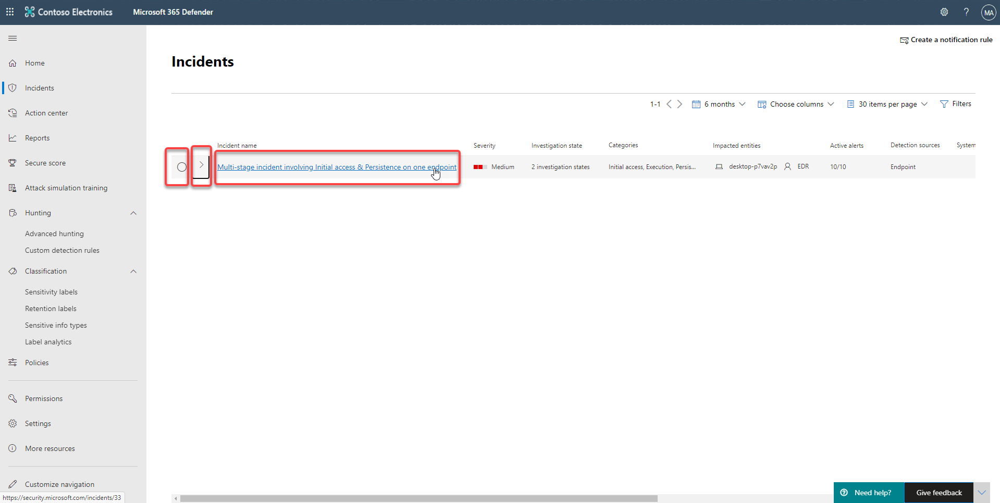
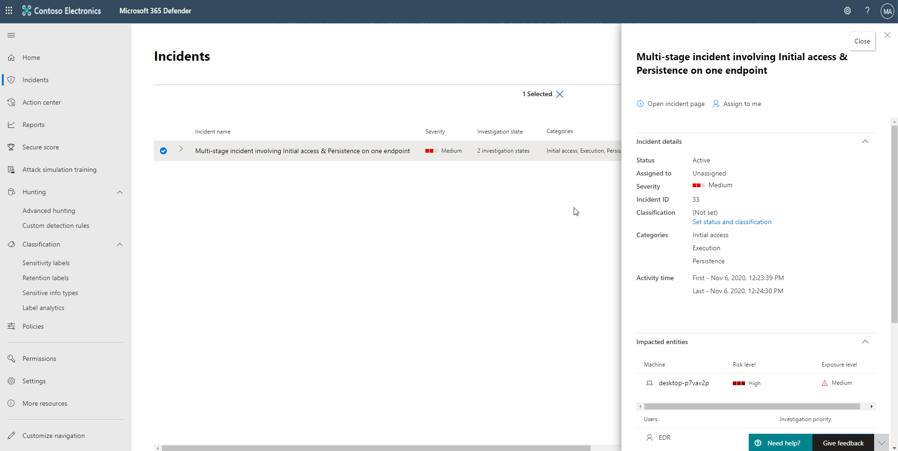
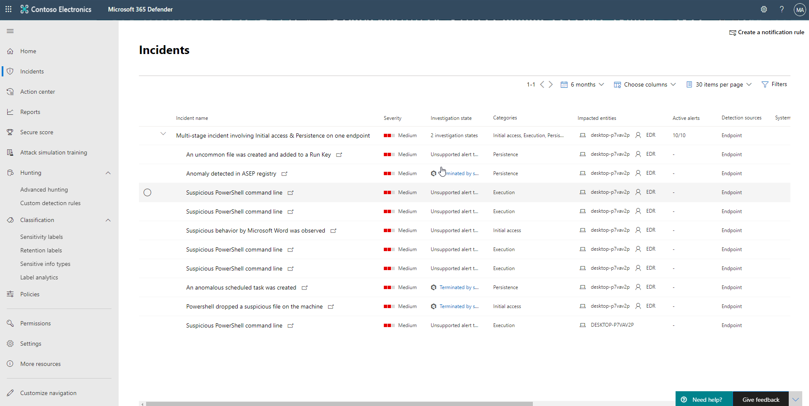

Microsoft 365 Defender provides a cross domain threat correlation and purpose-driven portal to investigate threats.  Incidents are based on related alerts created when a malicious event or activity is seen on your network. Individual alerts provide valuable clues about an on-going attack. However, attacks typically employ various vectors and techniques to carry out a breach. Piecing individual clues together can be challenging and time-consuming.

This short video gives an overview of incidents in Microsoft 365 Defender.

>[!VIDEO https://www.microsoft.com/videoplayer/embed/RE4Bzwz?]

An incident is a collection of correlated alerts that make up the story of an attack. Microsoft 365 Defender automatically aggregates malicious and suspicious events that are found in different device, user, and mailbox entities in the network. Grouping related alerts into an incident gives security defenders a comprehensive view of an attack.

For instance, security defenders can see where the attack started, what tactics were used, and how far the attack has gone into the network. They can also see the scope of the attack, like how many devices, users, and mailboxes were impacted, how severe the impact was, and other details about affected entities.

If enabled, Microsoft 365 Defender can automatically investigate and resolve the individual alerts through automation and artificial intelligence. Security defenders can also perform more remediation steps to resolve the attack straight from the incidents view.

Incidents from the last 30 days are shown in the incident queue. From here, security defenders can see which incidents should be prioritized based on risk level and other factors.

Security defenders can also rename incidents, assign them to individual analysts, classify, and add tags to incidents for a better and more customized incident management experience.

## Prioritize incidents

Microsoft 365 Defender applies correlation analytics and aggregates all related alerts and investigations from different products into one incident. Microsoft 365 Defender also triggers unique alerts on activities that can only be identified as malicious given the end-to-end visibility that Microsoft 365 Defender has across the entire estate and suite of products. This view gives your security operations analyst the broader attack story, which helps them better understand and deal with complex threats across the organization.

The Incidents queue shows a collection of flagged incidents from across devices, users, and mailboxes. It helps you sort through incidents to prioritize and create an informed cybersecurity response decision.

By default, the queue in the Microsoft 365 security center displays incidents seen in the last 30 days. The most recent incident is at the top of the list so that you can see it first.

The incident queue exposes customizable columns that give you visibility into different characteristics of the incident or the contained entities. This helps you make an informed decision regarding the prioritization of incidents to handle.

For more clarity at a glance, automatic incident naming generates incident names based on alert attributes such as the number of endpoints affected, users affected, detection sources, or categories. This allows you to quickly understand the scope of the incident.

### Available filters

**Assigned to**

You can choose to show alerts that are assigned to you or those handled by automation.

**Categories**

Choose categories to focus on specific tactics, techniques, or attack components seen.

**Classification**

Filter incidents based on the set classifications of the related alerts. The values include true alerts, false alerts, or not set.

**Data sensitivity**

Some attacks focus on targeting to exfiltrate sensitive or valuable data. By applying a filter to see if sensitive data is involved in the incident, you can quickly determine if sensitive information has potentially been compromised and prioritize addressing those incidents.  Only applicable if Microsoft Information Protection is turned on.

**Device group**

Filter by defined device groups.

**Investigation state**

Filter incidents by the status of the automated investigation.

**Multiple categories**

You can choose to see only incidents that have mapped to multiple categories and can thus potentially cause more damage.

**Multiple service sources**

Filter to only see incidents that contain alerts from different sources (Microsoft Defender for Endpoint, Microsoft Cloud App Security, Microsoft Defender for Identity, Microsoft Defender for Office 365).

**OS platform**

Limit the incident queue view by operating system.

**Service sources**

By choosing a specific source, you can focus on incidents that contain at least one alert from that chosen source.

**Severity**

The severity of an incident is indicative of the impact it can have on your assets. The higher the severity, the bigger the impact and typically requires the most immediate attention.

**Status**

You can choose to limit the list of incidents shown based on their status to see which ones are active or resolved.

## Preview incidents

The portal pages provide preview information for most list related data.

In this screenshot, the three highlighted areas are the circle, the greater than symbol, and the actual link.

**Circle**

Selecting the circle will open a blade on the right side of the page with a preview of the line item with an option to open the full page of information.

**Greater than symbol**

If there are related records that can be displayed, selecting the greater than sign will display the records below the current record.

**Link**

The link will navigate you to the full page for the line item.

## Manage incidents

Managing incidents is critical in ensuring that threats are contained and addressed. In Microsoft 365 Defender, you have access to managing incidents on devices, users, and mailboxes. You can manage incidents by selecting an incident from the Incidents queue.

You can edit the name of an incident, resolve it, set its classification and determination. You can also assign the incident to yourself, add incident tags and comments.

In cases where you would like to move alerts from one incident to another while investigating, you can also do so from the Alerts tab, thus creating a larger or smaller incident that includes all relevant alerts.

### Edit incident name

Incidents are automatically assigned a name based on alert attributes such as the number of endpoints affected, users affected, detection sources, or categories. This allows you to quickly understand the scope of the incident.  You can modify the incident name to better align with your preferred naming convention.

### Assign incidents

If an incident has not yet been assigned, you can select Assign to me to assign the incident to yourself. Doing so assumes ownership of not just the incident but also all the alerts associated with it.

### Set status and classification

**Incident status**

You can categorize incidents (as Active, or Resolved) by changing their status as your investigation progresses. This helps you organize and manage how your team can respond to incidents.

For example, your SOC analyst can review the urgent Active incidents for the day and decide to assign them to herself for investigation.

Alternatively, your SOC analyst might set the incident as Resolved if the incident has been remediated. Resolving an incident will automatically close all open alerts that are part of the incident.

**Classification and determination**

You can choose not to set a classification or decide to specify whether an incident is true alert or false alert. Doing so helps the team see patterns and learn from them.

### Add comments

You can add comments and view historical events about an incident to see previous changes made to it.

Whenever a change or comment is made to an alert, it is recorded in the Comments and history section.

Added comments instantly appear on the pane.

### Add incident tags

You can add custom tags to an incident, for example, to flag a group of incidents with common characteristics. You can later filter the incidents queue for all incidents that contain a specific tag.

