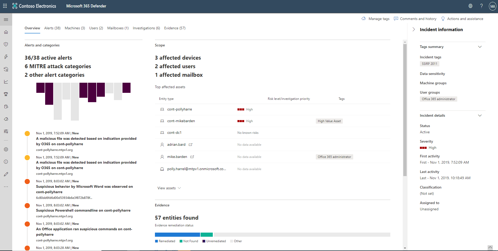

The incident page provides the following information and navigation links.

## Incident overview

The overview page gives you a snapshot glance into the top things to notice about the incident.

The attack categories give you a visual and numeric view of how advanced the attack has progressed against the kill chain. As with other Microsoft security products, Microsoft 365 Defender is aligned to the MITRE ATT&CK™ framework.

The scope section gives you a list of top impacted assets that are part of this incident. If there is specific information regarding this asset, such as risk level, investigation priority, and any tagging on the assets, it will also surface in this section.

The alerts timeline provides a sneak peek into the chronological order in which the alerts occurred and the reasons that these alerts linked to this incident.

And last - the evidence section provides a summary of how many different artifacts were included in the incident and their remediation status, so you can immediately identify if any action is needed on your end.

This overview can help the initial triage of the incident by providing insight into the top characteristics of the incident that you should be aware of.

## Alerts

You can view all the alerts related to the incident and other information about them such as severity, entities that were involved in the alert, the source of the alerts (Microsoft Defender for Identity, Microsoft Defender for Endpoint, Microsoft Defender for Office 365), and the reason they were linked together.

By default, the alerts are ordered chronologically to allow you to first view how the attack played out over time. Clicking on each alert will lead you to the **relevant alert page,** where you can conduct an in-depth investigation of that alert.

## Devices

The devices tab lists all the devices where alerts related to the incident are seen.

Clicking the name of the machine where the attack was conducted navigates you to its Device page, where you can see alerts that were triggered on it and related events provided to ease investigation.

**The Device page is the same page from Defender for Endpoint.**

## Users

See users that have been identified to be part of or related to a given incident.

Clicking the username navigates you to the **user's Cloud App Security page,** where further investigation can be conducted.

## Mailboxes

Investigate mailboxes that have been identified to be part of or related to an incident. To do further investigative work, selecting the mail-related alert will open **Microsoft Defender for Office 365,** where you can take remediation actions.

## Investigations

Select Investigations to see all the automated investigations triggered by alerts in this incident. The investigations will perform remediation actions or wait for analyst approval of actions, depending on how you configured your automated investigations to run in **Microsoft Defender for Endpoint and Defender for Office 365.**

Select an investigation to navigate to its Investigation details page to get full information on the investigation and remediation status. If any actions are pending for approval as part of the investigation, they will appear in the Pending actions tab.

## Evidence

Microsoft 365 Defender automatically investigates all the incidents' supported events and suspicious entities in the alerts, providing you with autoresponse and information about the important files, processes, services, emails, and more. This helps quickly detect and block potential threats in the incident.

Each of the analyzed entities will be marked with a verdict (Malicious, Suspicious, Clean) and a remediation status. This helps you understand the remediation status of the entire incident and the next steps to further remediate.

