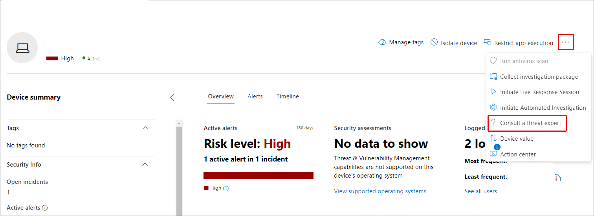

Microsoft Threat Experts - Targeted Attack Notifications is a managed threat hunting service. Once you apply and are accepted, you'll receive targeted attack notifications from Microsoft threat experts, so you won't miss critical threats to your environment. These notifications will help you protect your organization's endpoints, email, and identities. Microsoft Threat Experts – Experts on Demand lets you get expert advice about threats your organization is facing. You can reach out for help on threats your organization is facing. It's available as a subscription service.

### Targeted attack notification

Microsoft Threat Experts provides proactive hunting for the most important threats to your network, including human adversary intrusions, hands-on-keyboard attacks, or advanced attacks like cyberespionage. The managed hunting service includes:

- Threat monitoring and analysis, reducing dwell time and risk to the business

- Hunter-trained artificial intelligence to discover and prioritize both known and unknown attacks

- Identifying the most important risks, helping SOCs maximize time and energy

- Scope of compromise and as much context as can be quickly delivered to enable fast SOC response.

### Collaborate with experts, on demand

Customers can engage our security experts directly from within Microsoft 365 Defender portal for timely and accurate response. Experts provide insights needed to better understand the complex threats affecting your organization, from alert inquiries, potentially compromised devices, root cause of a suspicious network connection, to more threat intelligence regarding ongoing advanced persistent threat campaigns. With this capability, you can:

- Get more clarification on alerts including root cause or scope of the incident

- Gain clarity into suspicious device behavior and next steps if faced with an advanced attacker

- Determine risk and protection regarding threat actors, campaigns, or emerging attacker techniques

- Seamlessly transition to Microsoft Incident Response (IR) or other third-party Incident Response services when necessary

If you already have Microsoft Defender for Endpoint and Microsoft 365 Defender, you can apply for Microsoft Threat Experts – Targeted Attack Notifications through their Microsoft 365 Defender portal. Go to **Settings > Endpoints > General > Advanced features > Microsoft Threat Experts – Targeted Attack Notifications**, and select the **Apply** button.

The option to Consult a threat expert is available in several places in the portal so you can engage with experts in the context of your investigation:

- Help and support menu

- Device page actions menu

- Alerts page actions menu

- File page actions menu

