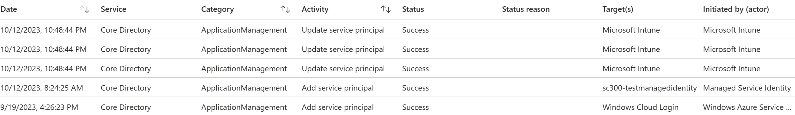
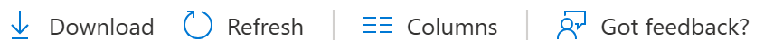
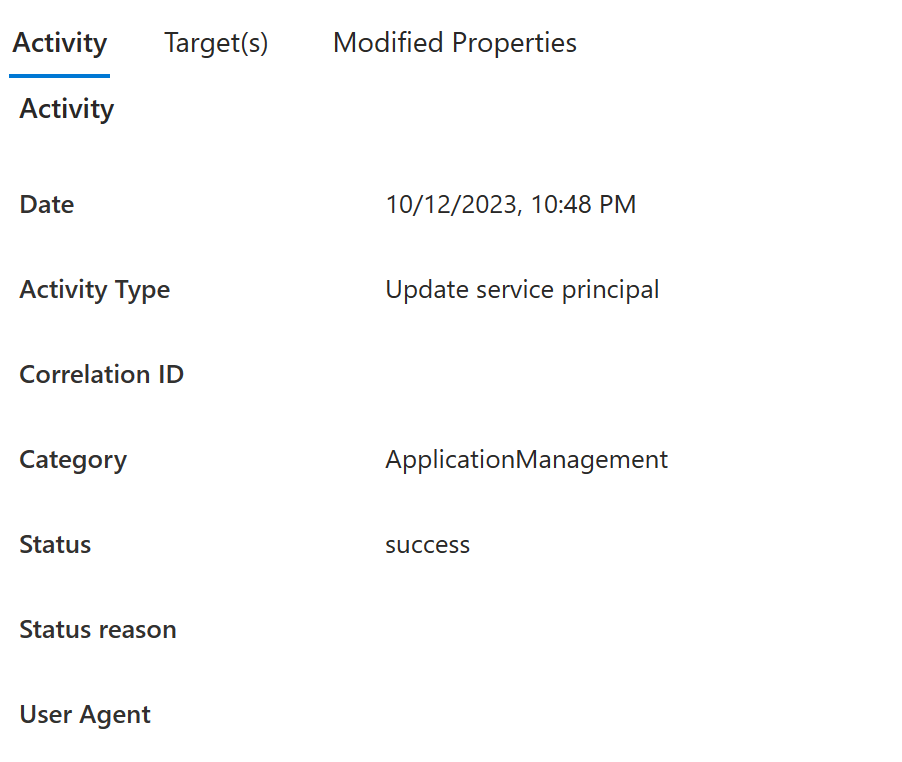
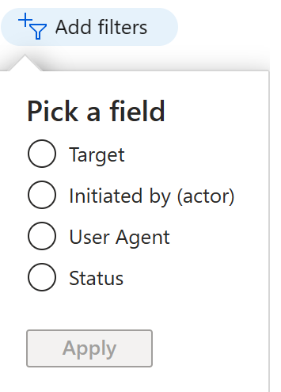
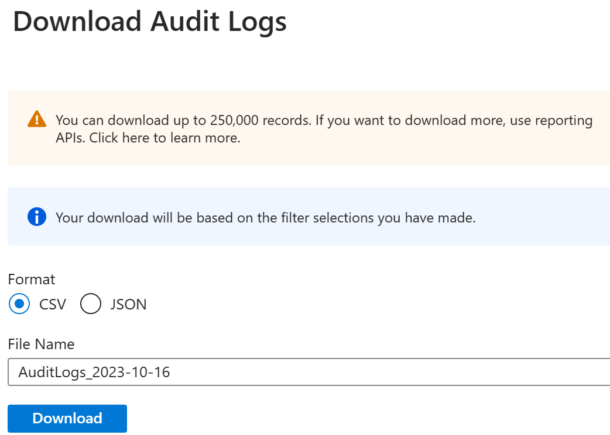
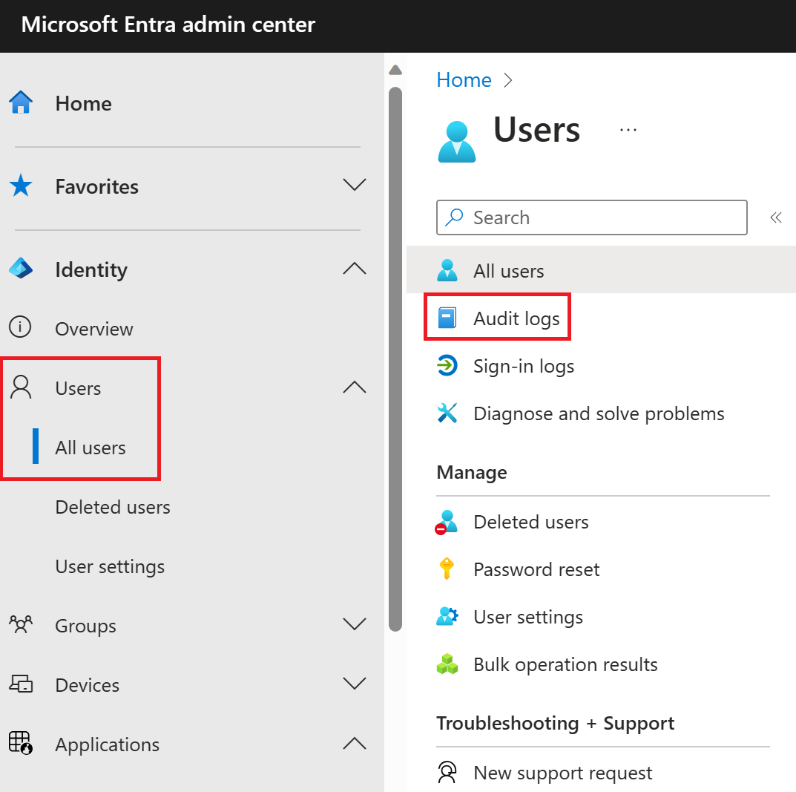
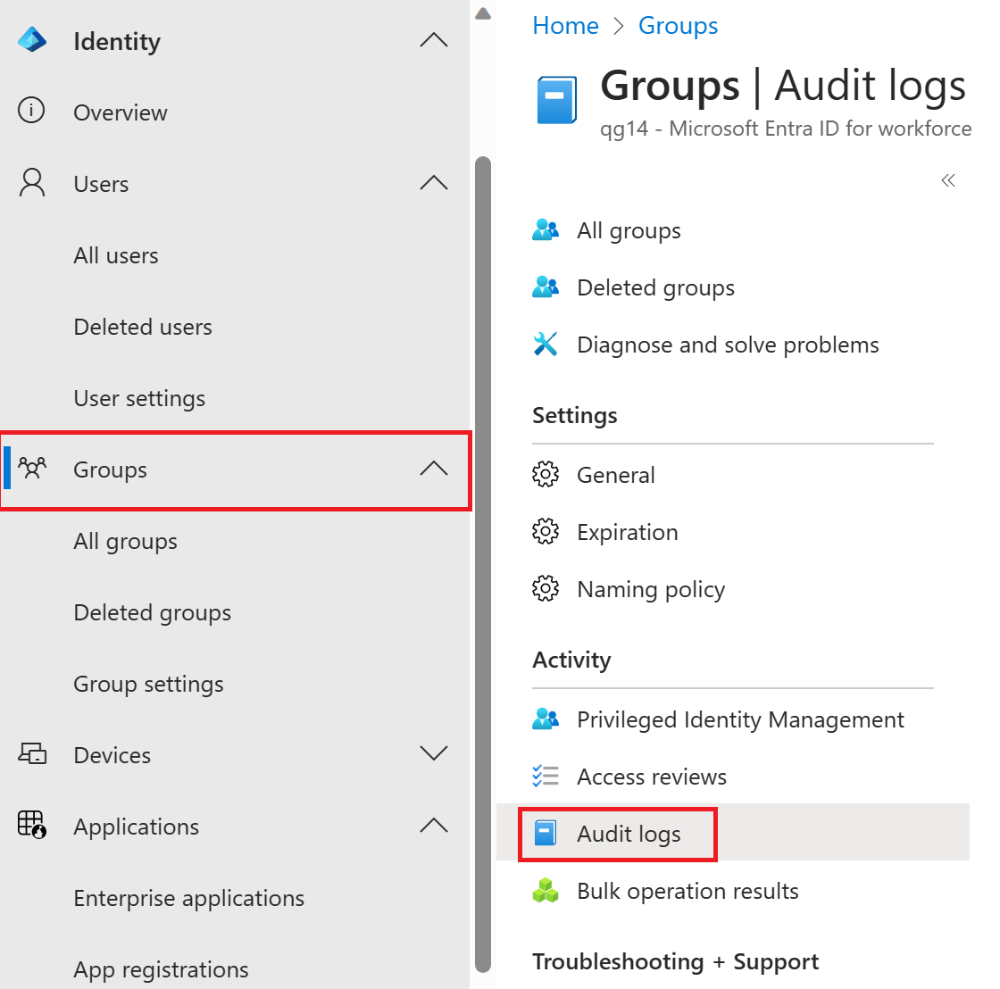
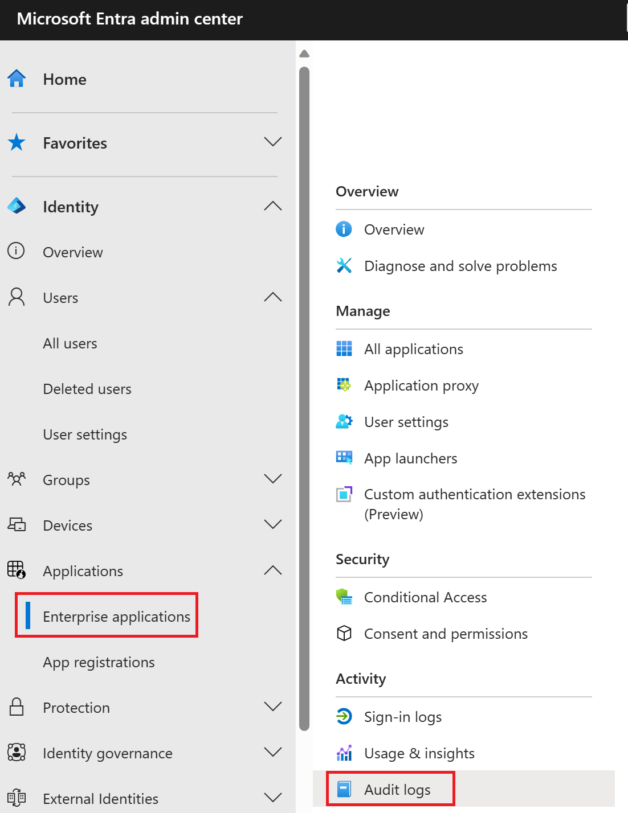

With Azure AD reports, you can get the information you need to determine how your environment is doing.

The reporting architecture consists of the following components:

- **Activity**

  - **Sign-ins** - The sign-ins report provides information about the usage of managed applications and user sign-in activities.

  - **Audit logs** - Provides traceability through logs for all changes made by various features within Azure AD. Examples of audit logs include changes made to any resources within Azure AD, such as adding or removing users, apps, groups, roles and policies.

  - **Provisioning logs** - Provisioning logs allow customers to monitor activity by the provisioning service, such as creating a group in ServiceNow or a user imported from Workday.

- **Security**

  - **Risky sign-ins** - A risky sign-in is an indicator for a sign-in attempt that might have been performed by someone who is not the legitimate owner of a user account.

  - **Users flagged for risk** - A risky user is an indicator for a user account that might have been compromised.

## Who can access the data?

Users in the **Security Administrator**, **Security Reader**, **Report Reader** , **Global Reader,** or **Global Administrator** roles

## Audit logs

The Azure AD audit logs provide records of system activities for compliance. To access the audit report, select **Audit logs** in the **Monitoring** section of **Azure Active Directory**.

An audit log has a default list view that shows the:

- Date and time of the occurrence

- Service that logged the occurrence

- Category and name of the activity (*what*)

- Status of the activity (success or failure)

- Target

- Initiator/actor (who) of an activity

> [!div class="mx-imgBorder"]
> 

You can customize the list view by clicking **Columns** in the toolbar.

> [!div class="mx-imgBorder"]
> 

This enables you to display additional fields or remove fields that are already displayed.

> [!div class="mx-imgBorder"]
> 

Select an item in the list view to get more detailed information.

> [!div class="mx-imgBorder"]
> 

## Filtering audit logs

You can filter the audit data on the following fields:

- Service

- Category

- Activity

- Status

- Target

- Initiated by (Actor)

- Date range

> [!div class="mx-imgBorder"]
> 

The **Service** filter allows you to select from a drop-down list of the following services:

- All

- AAD Management UX

- Access Reviews

- Account Provisioning

- Application Proxy

- Authentication Methods

- B2C

- Conditional Access

- Core Directory

- Entitlement Management

- Hybrid Authentication

- Identity Protection

- Invited Users

- MIM Service

- MyApps

- PIM

- Self-service Group Management

- Self-service Password Management

- Terms of Use

The **Category** filter enables you to select one of the following filters:

- All

- AdministrativeUnit

- ApplicationManagement

- Authentication

- Authorization

- Contact

- Device

- DeviceConfiguration

- DirectoryManagement

- EntitlementManagement

- GroupManagement

- KerberosDomain

- KeyManagement

- Label

- Other

- PermissionGrantPolicy

- Policy

- ResourceManagement

- RoleManagement

- UserManagement

The **Activity** filter is based on the category and activity resource type selection you make. You can select a specific activity you want to see or choose all.

You can get the list of all Audit Activities using the Graph API: `https://graph.windows.net/<tenantdomain>/activities/auditActivityTypesV2?api-version=beta`

The **Status** filter allows you to filter based on the status of an audit operation. The status can be one of the following:

- All

- Success

- Failure

The **Target** filter allows you to search for a particular target by the starting of the name or user principal name (UPN). The target name and UPN are case-sensitive.

The **Initiated by** filter enables you to define what an actor's name or a universal principal name (UPN) starts with. The name and UPN are case-sensitive.

The **Date range** filter enables to you to define a timeframe for the returned data.Possible values are:

- 7 days

- 24 hours

- Custom

When you select a custom timeframe, you can configure a start time and an end time.

You can also choose to download the filtered data, up to 250,000 records, by selecting the **Download** button. You can download the logs in either CSV or JSON format. The number of records you can download is constrained by the Azure AD report retention policies.

> [!div class="mx-imgBorder"]
> 

## Audit logs shortcuts

In addition to **Azure AD**, the Azure portal provides you with two additional entry points to audit data:

- Users and groups

- Enterprise applications

### Users and groups audit logs

With user and group-based audit reports, you can get answers to questions such as:

- What types of updates have been applied to users?

- How many users were changed?

- How many passwords were changed?

- What has an administrator done in a directory?

- What are the groups that have been added?

- Are there groups with membership changes?

- Have the owners of a group been changed?

- What licenses have been assigned to a group or a user?

If you want to review only auditing data that is related to users, you can find a filtered view under **Audit logs** in the **Monitoring** section of the **Users** tab. This entry point has **UserManagement** as preselected category.

> [!div class="mx-imgBorder"]
> 

If you want to review only auditing data that is related to groups, you can find a filtered view under **Audit logs** in the **Monitoring** section of the **Groups** tab. This entry point has **GroupManagement** as preselected category.

> [!div class="mx-imgBorder"]
> 

### Enterprise applications audit logs

With application-based audit reports, you can get answers to questions such as:

- What applications have been added or updated?

- What applications have been removed?

- Has a service principal for an application changed?

- Have the names of applications been changed?

- Who gave consent to an application?

If you want to review audit data related to your applications, you can find a filtered view under **Audit logs** in the **Activity** section of the **Enterprise applications** blade. This entry point has **Enterprise applications** preselected as the **Application Type**.

> [!div class="mx-imgBorder"]
> 

## Microsoft 365 activity logs

You can view Microsoft 365 activity logs from the Microsoft 365 admin center. Even though Microsoft 365 activity and Azure AD activity logs share a lot of the directory resources, only the Microsoft 365 admin center provides a full view of the Microsoft 365 activity logs. You can also access the Microsoft 365 activity logs programmatically by using the Office 365 Management APIs.

