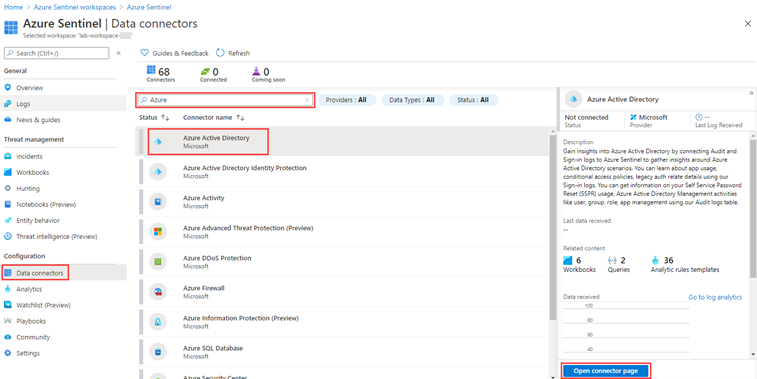
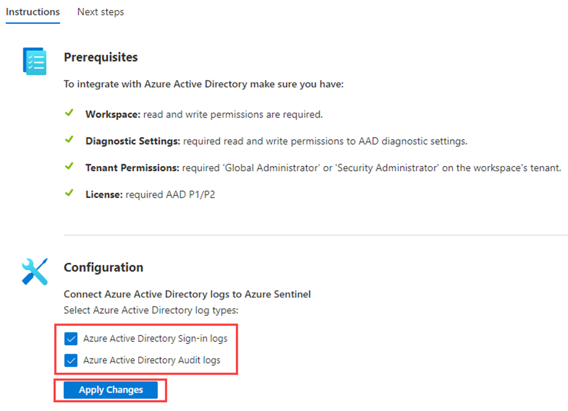

## Prerequisites

- Any Azure AD license (Free/O365/P1/P2) is sufficient to ingest sign-in logs into Azure Sentinel. Additional per-gigabyte charges may apply for Azure Monitor (Log Analytics) and Azure Sentinel.

- Your user must be assigned the Azure Sentinel Contributor role on the workspace.

- Your user must be assigned the Global Administrator or Security Administrator roles on the tenant you want to stream the logs from.

- Your user must have read and write permissions to the Azure AD diagnostic settings to be able to see the connection status.

## Create and add an Azure Sentinel workspace

Use these instructions if you do not already have a workspace available to Azure Sentinel.

1. Sign in to the [Azure portal](https://portal.azure.com/) as a tenant administrator.

2. Search for and select **Azure Sentinel**.

3. In the Azure Sentinel workspaces blade, on the menu, select **+ Add**.

    If you already have an Azure Sentinel workspace, you can select that and continue to the next task.

4. In the Add Azure Sentinel to a workspace blade, select **Create a new workspace**.

5. Use the following information to create a new log analytics workspace:

    | Setting| Value|
    | :--- | :--- |
    | Subscription  | Use your current subscription.|
    | Resource group| Use an existing resource group or create a new one.|
    | Name          | <ul><li>**Lab-workspace-yourinitialsanddate** </li><li>The workspace must be a globally unique value. </li></ul>|
    | Pricing tier  | Pay-as-you-go|

6. When complete, select your new workspace and then select **Add** to add the workspace to Azure Sentinel.

## Connect to Azure Active Directory

You can use Azure Sentinel's built-in connector to collect data from [Azure Active Directory](https://docs.microsoft.com/azure/active-directory/fundamentals/active-directory-whatis) and stream it into Azure Sentinel. The connector allows you to stream [sign-in logs](https://docs.microsoft.com/azure/active-directory/reports-monitoring/concept-sign-ins) and [audit logs](https://docs.microsoft.com/azure/active-directory/reports-monitoring/concept-audit-logs).

1. In Azure Sentinel, in the navigation menu on the left, under **Configuration**, select **Data connectors**.

2. In the **Data connectors** list, select **Azure Active Directory** and then select **Open connector page**.

    > [!div class="mx-imgBorder"]
    > 

3. Under **Configuration**, select the **Azure Active Directory Sign-in logs** and **Audit logs** checkboxes and then select **Apply changes**.

    > [!div class="mx-imgBorder"]
    > 

4. Close the Azure Active Directory connector page.

