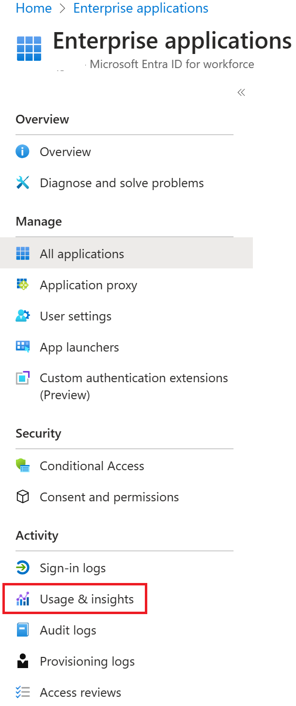
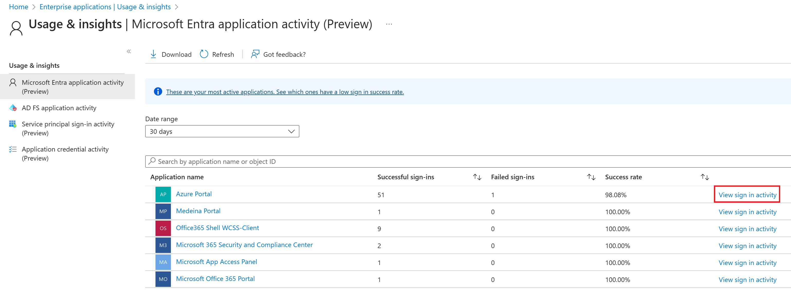

With the usage and insights report, you can get an application-centric view of your sign-in data. You can find answers to the following questions:

- What are the most used applications in my organization?

- What applications have the most failed sign-ins?

- What are the top sign-in errors for each application?

## Prerequisites

To access the data from the usage and insights report, you need:

- An Azure AD tenant.

- An Azure AD premium (P1/P2) license to view the sign-in data.

- A user in the Global Administrator, Security Administrator, Security Reader or Report Reader roles. In addition, any user (non-admins) can access their own sign-ins.

## Access the usage and insights report

1. Navigate to the Azure portal.

1. Select the right directory, then select **Azure Active Directory** and choose **Enterprise applications**.

1. From the **Activity** section, select **Usage & insights** to open the report.

   > [!div class="mx-imgBorder"]
   > 

## Use the report

The usage and insights report shows the list of applications with one or more sign-in attempts, and allows you to sort by the number of successful sign-ins, failed sign-ins, and the success rate.

Clicking **load more** at the bottom of the list allows you to view additional applications on the page. You can select the date range to view all applications that have been used within the range.

You can also set the focus on a specific application. Select **view sign-in activity** to see the sign-in activity over time for the application, as well as the top errors.

When you select a day in the application usage graph, you get a detailed list of the sign-in activities for the application.

> [!div class="mx-imgBorder"]
> 

