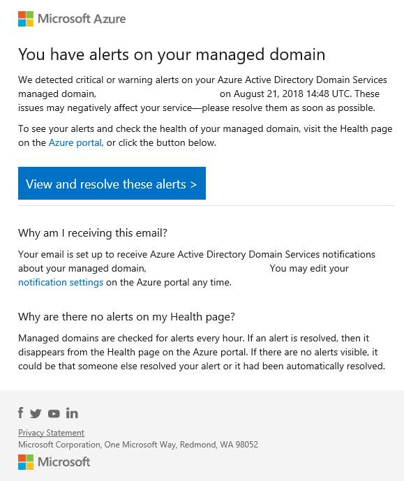

The health of an Azure Active Directory Domain Services (Azure AD DS) managed domain is monitored by the Azure platform. The health status page in the Azure portal shows any alerts for the managed domain. To ensure issues are responded to in a timely manner, email notifications can be configured to report on health alerts as soon as they're detected in the Azure AD DS managed domain.

## Email notification overview

To alert you of issues with a managed domain, you can configure email notifications. These email notifications specify the managed domain that the alert is present on, and they provide the time of detection and a link to the health page in the Azure portal. You can then follow the provided troubleshooting advice to resolve the issues.

The following example email notification indicates a critical warning or alert was generated on the managed domain:

> [!div class="mx-imgBorder"]
> 

> [!WARNING]
> Always make sure that the email comes from a verified Microsoft sender before you click the links in the message. The email notifications always come from the azure-noreply@microsoft.com address.

### Why would I receive email notifications?

Azure AD DS sends email notifications for important updates about the managed domain. These notifications are only for urgent issues that impact the service and should be addressed immediately. Each email notification is triggered by an alert on the managed domain. The alerts also appear in the Azure portal and can be viewed on the [Azure AD DS health page](https://docs.microsoft.com/azure/active-directory-domain-services/check-health).

Azure AD DS doesn't send emails for advertisement, updates, or sales purposes.

### When will I receive email notifications?

A notification is sent immediately when a [new alert](https://docs.microsoft.com/azure/active-directory-domain-services/troubleshoot-alerts) is found on a managed domain. If the alert isn't resolved, additional email notifications are sent as a reminder every four days.

### Who should receive the email notifications?

The list of email recipients for Azure AD DS should be composed of people who are able to administer and make changes to the managed domain. This email list should be thought of as your "first responders" to any alerts and issues.

You can add up to five additional recipients for email notifications. If you want more than five recipients, create a distribution list and add that to the notification list instead.

You can also choose to have all *Global Administrators* of the Azure AD directory and every member of the *AAD DC Administrators* group receive email notifications. Azure AD DS only sends notification to up to 100 email addresses, including the list of Global Administrators and AAD DC Administrators.

## Configure email notifications

To review the existing email notification recipients or add additional recipients, complete the following steps:

1. In the Azure portal, search for and select **Azure AD Domain Services**.

2. Select your managed domain, such as *aaddscontoso.com*.

3. On the left-hand side of the Azure AD DS resource window, select **Notification settings**. The existing recipients for email notifications are shown.

4. To add an email recipient, enter the email address in the additional recipients table.

5. When done, select **Save** on the top-hand navigation.

   > [!WARNING]
   > When you change the notification settings, the notification settings for the entire managed domain—not just for you—are updated.

## Frequently asked questions

### I received an email notification for an alert, but when I logged on to the Azure portal there was no alert. What happened?

If an alert is resolved, the alert is cleared from the Azure portal. The most likely reasons are someone else who receives email notifications resolved the alert on the managed domain or the alert was autoresolved by Azure platform.

### Why can't I edit the notification settings?

If you're unable to access the notification settings page in the Azure portal, you don't have the permissions to edit the managed domain. Contact a Global Administrator to either get permissions to edit Azure AD DS resources or be removed from the recipient list.

### I don't seem to be receiving email notifications even though I provided my email address. Why?

Check your spam or junk folder in your email for the notification and make sure to allow the sender `azure-noreply@microsoft.com`.

