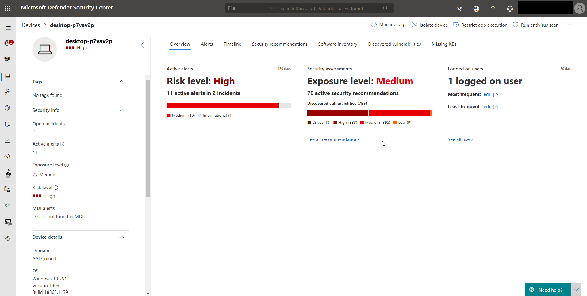

The Device page

Investigate the details of an alert raised on a specific device to identify other behaviors or events that might be related to the alert or the potential scope of the breach.

You can select affected devices whenever you see them in the portal to open a detailed report about that device. Affected devices are identified in the following areas:

- Devices list

- Alerts queue

- Security operations dashboard

- Any individual alert

- Any individual file details view

- Any IP address or domain details view

When you investigate a specific device, you'll see:

- Device details

- Response actions

- Tabs (overview, alerts, timeline, security recommendations, software inventory, discovered vulnerabilities, missing KBs)

- Cards (active alerts, logged on users, security assessment)

## Device details

The device details section provides information such as the device's domain, OS, and health state. If there's an investigation package available on the device, you'll see a link that allows you to download the package.

## Response actions

Response actions run along the top of a specific device page and include:

- Manage tags

- Isolate device

- Restrict app execution

- Run antivirus scan

- Collect investigation package

- Initiate Live Response Session

- Initiate automated investigation

- Consult a threat expert

- Action center

You can take response actions in the Action center, on a specific device page, or on a specific file page.

## Tabs

### Overview

The Overview tab displays the cards for active alerts, logged on users, and security assessment.

**Active alerts**

The Azure Advanced Threat Protection card will display a high-level overview of active alerts related to the device and their risk level if you have enabled the Azure ATP feature. More information is available in the "Alerts" drill-down.

**Logged on users**

The Logged on users card shows how many users have logged on in the past 30 days, and the most and least frequent users. Selecting the "See all users" link opens the details pane, which displays user type, sign-in type, and when the user was first and last seen.

**Security assessments**

The Security assessments card shows the overall exposure level, security recommendations, installed software, and discovered vulnerabilities. A device's exposure level is determined by the cumulative impact of its pending security recommendations.

### Alerts

The Alerts tab provides a list of alerts that are associated with the device. This list is a filtered version of the Alerts queue, and shows a short description of the alert, severity (high, medium, low, informational), status in the queue (new, in progress, resolved), classification (not set, false alert, true alert), investigation state, category of alert, who is addressing the alert, and last activity. You can also filter the alerts.

### Timeline

The Timeline tab provides a chronological view of the events and associated alerts that have been observed on the device. This can help you correlate any events, files, and IP addresses related to the device.

The timeline also enables you to selectively drill down into events that occurred within a given time period. You can view the temporal sequence of events that occurred on a device over a selected time period. To further control your view, you can filter by event groups or customize the columns.

Some of the functionality includes:

- Search for specific events

  - Use the search bar to look for specific timeline events.

- Filter events from a specific date

  - Select the calendar icon in the upper left of the table to display events in the past day, week, 30 days, or a custom range. By default, the device timeline is set to display the events from the past 30 days.

  - Use the timeline to jump to a specific moment in time by highlighting the section. The arrows on the timeline pinpoint automated investigations

- Export detailed device timeline events

  - Export the device timeline for the current date or a specified date range up to seven days.

More details about certain events are provided and vary depending on the type of event, for example:

- Contained by Application Guard - the web browser event was restricted by an isolated container

- Active threat detected - the threat detection occurred while the threat was running

- Remediation unsuccessful - an attempt to remediate the detected threat was invoked but failed

- Remediation successful - the detected threat was stopped and cleaned

- Warning bypassed by user - the Windows Defender SmartScreen warning was dismissed and overridden by a user

- Suspicious script detected - a potentially malicious script was found running

- The alert category - if the event led to the generation of an alert, the alert category ("Lateral Movement", for example) is provided

**Flag an event**

While navigating the device timeline, you can search and filter for specific events. You can set event flags by:

- Highlighting the most important events

- Marking events that require a deep dive

- Building a clean breach timeline

Find the event that you want to flag.  Select the flag icon in the Flag column.

**View flagged events**

In the timeline Filters section, enable Flagged events.  Select Apply. Only flagged events are displayed. You can apply more filters by clicking the time bar. This will only show events prior to the flagged event.

### Event details

Select an event to view relevant details about that event. A panel displays to show general event information. When applicable and data is available, a graph showing related entities and their relationships are also shown.

To further inspect the event and related events, you can quickly run an advanced hunting query by selecting Hunt for related events. The query will return the selected event and the list of other events that occurred around the same time on the same endpoint.

### Security recommendations

Security recommendations are generated from Microsoft Defender for Endpoint's Threat & Vulnerability Management capability. Selecting a recommendation will show a panel where you can view relevant details such as the description of the recommendation and the potential risks associated with not enacting it.

### Software inventory

The Software inventory tab lets you view software on the device, along with any weaknesses or threats. Selecting the name of the software will take you to the software details page, where you can view security recommendations, discovered vulnerabilities, installed devices, and version distribution.

### Discovered vulnerabilities

The Discovered vulnerabilities tab shows the name, severity, and threat insights of discovered vulnerabilities on the device. Selecting specific vulnerabilities will show a description and details.

### Missing KBs

The Missing KBs tab lists the missing security updates for the device.

