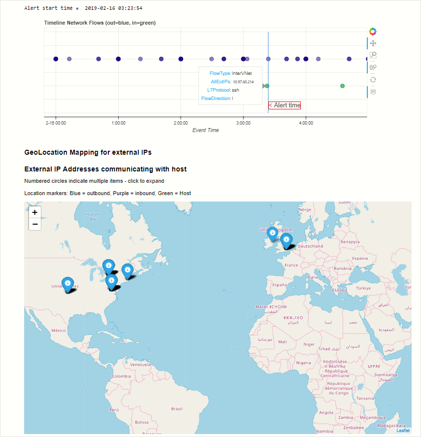

A Jupyter Notebook allows you to create and share documents that contain live code, equations, visualizations, and explanatory text. Uses include data cleaning and transformation, numerical simulation, statistical modeling, machine learning, and much more.  Jupyter extends the scope of what you can do with Azure Sentinel data. It combines full programmability with a vast library collection for machine learning, visualization, and data analysis. These attributes make Jupyter a useful tool for security investigation and hunting.

Several notebooks, developed by some of Microsoft's security analysts, are packaged with Azure Sentinel. Some of these notebooks are built for a specific scenario and can be used as-is. Others are samples intended to illustrate techniques and features that you can copy or adapt for use in your own notebooks. Other notebooks may also be imported from the Azure Sentinel Community GitHub.

Notebooks have two components:

- The browser-based interface where you enter and run queries and code and where the execution results are displayed.

- The kernel is responsible for parsing and executing the code itself.

The Azure Sentinel notebook's kernel runs on an Azure virtual machine (VM). Several licensing options exist to use more powerful virtual machines if your notebooks include complex machine learning models.

The Azure Sentinel notebooks use many popular Python libraries such as pandas, matplotlib, bokeh, etc. There are a great many other Python packages for you to choose from, covering areas such as:

- Visualizations and graphics

- Data processing and analysis

- Statistics and numerical computing

- Machine learning and deep learning

The msticpy package is used in many of the included notebooks. Msticpy tools are explicitly designed to help with creating notebooks for hunting and investigation.

