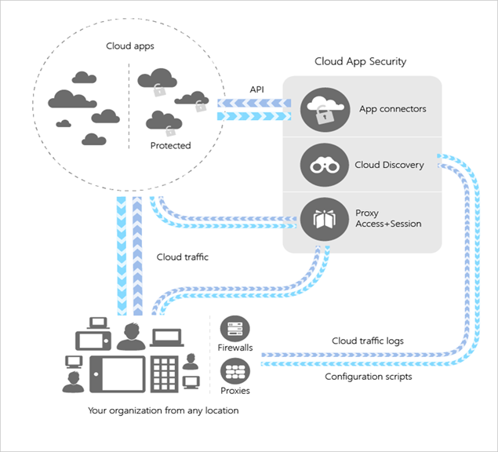
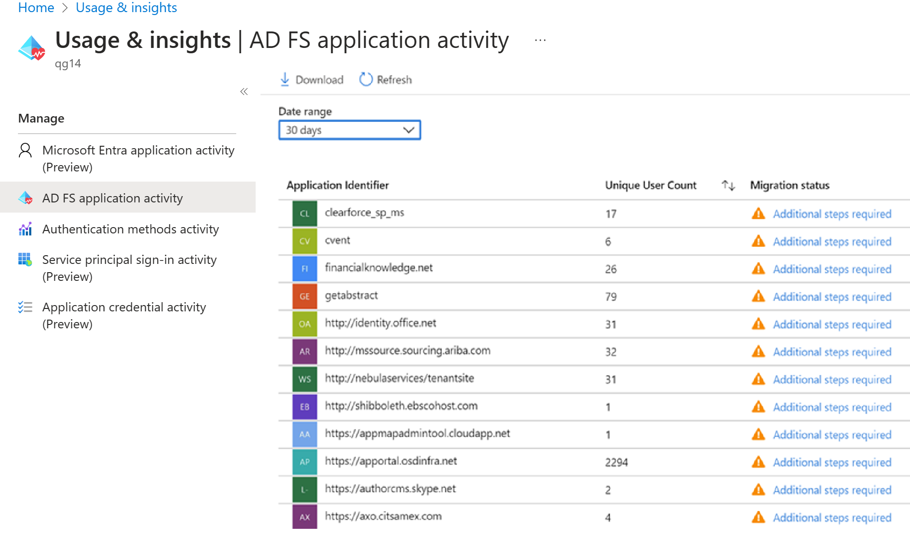

## Microsoft Cloud App Security

Moving to the cloud increases flexibility for employees and IT alike. However, it also introduces new challenges and complexities for keeping your organization secure. To get the full benefit of cloud apps and services, an IT team must find the right balance of supporting access while maintaining control to protect critical data. Microsoft Cloud App Security is a Cloud Access Security Broker (CASB) that supports various deployment modes, including log collection, API connectors, and reverse proxy. It provides rich visibility, control over data travel, and sophisticated analytics to identify and combat cyberthreats across all your Microsoft and third-party cloud services. Microsoft Cloud App Security natively integrates with leading Microsoft solutions and is designed with security professionals in mind. It provides simple deployment, centralized management, and innovative automation capabilities. Microsoft Cloud App Security is a comprehensive cross-SaaS solution bringing deep visibility, strong data controls, and enhanced threat protection to your cloud apps. Cloud Discovery, a feature of Cloud App Security, enables you to gain visibility into Shadow IT by discovering cloud apps in use.

### Architecture

Cloud App Security integrates visibility with your cloud by:

- Using Cloud Discovery to map and identify your cloud environment and the cloud apps your organization is using.

- Sanctioning and de-authorizing apps in your cloud.

- Using easy-to-deploy app connectors that take advantage of provider APIs, for visibility and governance of apps that you connect to.

- Using Conditional Access App Control protection to get real-time visibility and control over access and activities within your cloud apps.

- Helping you have continuous control by setting and continually fine-tuning policies.

### Cloud Discovery

Cloud Discovery uses your traffic logs to dynamically discover and analyze the cloud apps your organization is using. To create a snapshot report of your organization's cloud use, manually upload log files from your firewalls or proxies for analysis. To set up continuous reports, use Cloud App Security log collectors to periodically forward your logs.

### Sanctioning and unsanctioning an app

You can use Cloud App Security to sanction or unsanction apps in your organization by using the *Cloud app catalog*. The Microsoft team of analysts has an extensive and continuously growing catalog of more than 16,000 cloud apps that are ranked and scored based on industry standards. Use the Cloud app catalog to rate the risk for your cloud apps based on regulatory certifications, industry standards, and best practices. Then, customize the scores and weights of various parameters to your organization's needs. Based on these scores, Cloud App Security lets you know how risky an app is. Scoring is based on more than 80 risk factors that might affect your environment.

## Active Directory Federation Services

If you have an on-premises directory that contains user accounts, you likely have many applications to which users authenticate. Each of these apps is configured for users to access using their identities. Users may also authenticate directly with your on-premises Active Directory. Active Directory Federation Services (AD FS) is a standards-based on-premises identity service. AD FS extends the ability to use single sign-on (SSO) functionality between trusted business partners without requiring users to sign in separately to each application. This is known as federation. Many organizations have software as a service (SaaS) or custom line-of-business (LOB) apps federated directly to AD FS, alongside Microsoft 365 and Azure AD-based apps.

To increase application security, your goal is to have a single set of access controls and policies across your on-premises and cloud environments.

Many organizations use AD FS to provide SSO to cloud applications. Moving your AD FS applications to Azure AD for authentication provides significant benefits, especially in terms of cost management, risk management, productivity, compliance, and governance. But understanding which applications are compatible with Azure AD and identifying specific migration steps can be time consuming.

Sometimes the organization may be using alternate on-premises or cloud identity providers, such as SiteMinder, Oracle Access Manager, PingFederate, etc. Most of them are on-premises installations. Some cloud providers, such as Okta and OneLogin, offer similar services.

The AD FS application activity report in the Azure portal enables you to quickly identify which applications you can migrate to Azure AD. It assesses all AD FS applications for compatibility with Azure AD, checks for any issues, and gives guidance on preparing individual applications for migration. With the AD FS application activity report, you can discover AD FS applications and scope your migration. The AD FS application activity report lists all AD FS applications in your organization that have had an active user login in the last 30 days. The activity data is available to users who are assigned any of these admin roles: global administrator, report reader, security reader, application administrator, or cloud application administrator.

## Types of apps to migrate

Migrating all your application authentication to Azure AD is optimal, as it gives you a single control plane for identity and access management.

There are two types of applications to migrate:

1. SaaS applications, which are generally procured by the organization.****

2. Line-of-business applications, which are developed by the organization and not meant to be used by other companies.

Your applications may use modern or legacy protocols for authentication. Most SaaS applications use modern authentication protocols and provide guidance on how to enable SSO. Consider first migrating applications that use modern authentication protocols (such as SAML and Open ID Connect). These apps can be reconfigured to authenticate with Azure AD via either a built-in connector in our App Gallery, or by registering the application in Azure AD. Integrate apps using older protocols by using [Application Proxy](https://docs.microsoft.com/azure/active-directory/manage-apps/what-is-application-proxy) and/or Azure AD Domain Services.

## Discover AD FS applications that can be migrated

The AD FS application activity report is available in the Azure portal under Azure AD **Usage & insights** reporting. The AD FS application activity report analyzes each AD FS application to determine whether it can be migrated as-is or additional review is needed.

1. Sign in to the Azure portal with an admin role that has access to AD FS application activity data (global administrator, report reader, security reader, application administrator, or cloud application administrator).

2. Select **Azure Active Directory**, and then select **Enterprise applications**.

3. Under **Activity**, select **Usage & insights (Preview)**, and then select **AD FS application activity** to open a list of all AD FS applications in your organization.

    >[!div class="mx-imgBorder"]
    >

4. For each application in the AD FS application activity list, view the **Migration status**:

    - **Ready to migrate** means the AD FS application configuration is fully supported in Azure AD and can be migrated as-is.

    - **Needs review** means some of the application's settings can be migrated to Azure AD, but you'll need to review the settings that can't be migrated as-is.

    - **Additional steps required** means Azure AD doesn't support some of the application's settings, so the application can’t be migrated in its current state.

