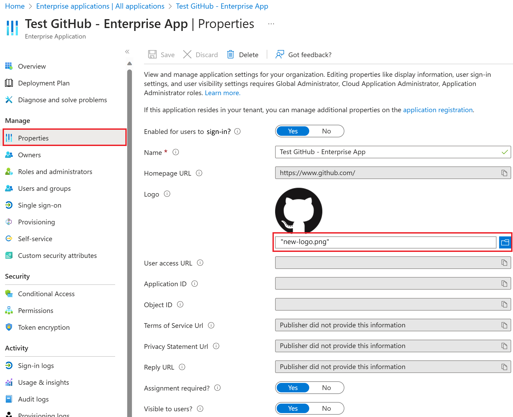

As you know, Azure AD has a gallery that contains thousands of pre-integrated applications. Many of the applications your organization uses are probably already in the gallery. If an app is added to your Azure AD tenant, you can configure properties for the app, manage user access to the app, and configure SSO so users can sign in to the app with their Azure AD credentials. This unit will show you how to configure properties for the app.

## Configure app properties

To edit the application properties:

1. In the Azure AD portal, select **Enterprise applications**. Then find and select the application you want to configure.

2. In the **Manage** section, select **Properties** to open the **Properties** pane for editing.

3. Take a moment to understand the options available. The options available will depend on how the app is integrated with Azure AD. For example, an app that uses SAML-based SSO will have fields such as *User access URL* whereas an app that uses OIDC-based SSO will not. Note that apps added through **Azure Active Directory > App registrations** are by default OIDC-based apps, while apps added **through Azure Active Directory > Enterprise applications** might use any of a number of SSO standards. All apps will have fields for configuring when an app appears and can be used. These fields are:

    - **Enabled for users to sign in?** determines whether users assigned to the application can sign in.

    - **User assignment required?** determines whether users who aren't assigned to the application can sign in.

    - **Visible to users?** determines whether users assigned to an app can see it in [My Apps](https://myapps.microsoft.com/) and Microsoft 365 app launcher. (See the waffle menu in the upper-left corner of a Microsoft 365 website.)

    > [!TIP]
    > Assigning users happens on the Users and groups section of navigation.

    The three options can be toggled independently of each other, and the resulting behavior is not always obvious. This table might help:

    :::row:::
    :::column span="4":::
    :::column-end:::
    :::row-end:::
    :::row:::
    :::column:::

    **Enabled for users to sign in?**

    :::column-end:::
    :::column:::

    **User assignment required?**

    :::column-end:::
    :::column:::

    **Visible to users?**

    :::column-end:::
    :::column:::

    **Behavior for users who have either been assigned to the app or not.**

    :::column-end:::
    :::row-end:::
    :::row:::
    :::column:::

    Yes

    :::column-end:::
    :::column:::

    Yes

    :::column-end:::
    :::column:::

    Yes

    :::column-end:::
    :::column:::

    Assigned users can see the app and sign in.Unassigned users cannot see the app and cannot sign in.

    :::column-end:::
    :::row-end:::
    :::row:::
    :::column:::

    Yes

    :::column-end:::
    :::column:::

    Yes

    :::column-end:::
    :::column:::

    No

    :::column-end:::
    :::column:::

    Assigned uses cannot see the app but they can sign in.Unassigned users cannot see the app and cannot sign in.

    :::column-end:::
    :::row-end:::
    :::row:::
    :::column:::

    Yes

    :::column-end:::
    :::column:::

    No

    :::column-end:::
    :::column:::

    Yes

    :::column-end:::
    :::column:::

    Assigned users can see the app and sign in.Unassigned users cannot see the app but can sign in.

    :::column-end:::
    :::row-end:::
    :::row:::
    :::column:::

    Yes

    :::column-end:::
    :::column:::

    No

    :::column-end:::
    :::column:::

    No

    :::column-end:::
    :::column:::

    Assigned users cannot see the app but can sign in.Unassigned users cannot see the app but can sign in.

    :::column-end:::
    :::row-end:::
    :::row:::
    :::column:::

    No

    :::column-end:::
    :::column:::

    Yes

    :::column-end:::
    :::column:::

    Yes

    :::column-end:::
    :::column:::

    Assigned users cannot see the app and cannot sign in.Unassigned users cannot see the app and cannot sign in.

    :::column-end:::
    :::row-end:::
    :::row:::
    :::column:::

    No

    :::column-end:::
    :::column:::

    Yes

    :::column-end:::
    :::column:::

    No

    :::column-end:::
    :::column:::

    Assigned users cannot see the app and cannot sign in.Unassigned users cannot see the app and cannot sign in.

    :::column-end:::
    :::row-end:::
    :::row:::
    :::column:::

    No

    :::column-end:::
    :::column:::

    No

    :::column-end:::
    :::column:::

    Yes

    :::column-end:::
    :::column:::

    Assigned users cannot see the app and cannot sign in.Unassigned users cannot see the app and cannot sign in.

    :::column-end:::
    :::row-end:::
    :::row:::
    :::column:::

    No

    :::column-end:::
    :::column:::

    No

    :::column-end:::
    :::column:::

    No

    :::column-end:::
    :::column:::

    Assigned users cannot see the app and cannot sign in.Unassigned users cannot see the app and cannot sign in.

    :::column-end:::
    :::row-end:::

4. When you're finished, select **Save**.

## Use a custom logo

1. To use a custom logo:

1. Create a logo that's 215 by 215 pixels and save it in .png format.

1. In the Azure AD portal, select **Enterprise applications**. Then find and select the application you want to configure.

1. In the **Manage** section, select **Properties** to open the **Properties** pane for editing.

1. Select the icon to upload the logo.

1. When you're finished, select **Save**.

>[!div class="mx-imgBorder"]
>

> [!NOTE]
> The thumbnail displayed on this Properties pane doesn't update right away. You can close and reopen the Properties pane to see the updated icon.

## Add notes

You can use the notes field to add any information that is relevant for the management of the application.

1. In the Azure AD portal, select **Enterprise applications**. Then find and select the application you want to configure.

1. In the **Manage** section, select **Properties** to open the **Properties** pane for editing.

1. Update the Notes field, select **Save**.

>[!div class="mx-imgBorder"]
>

