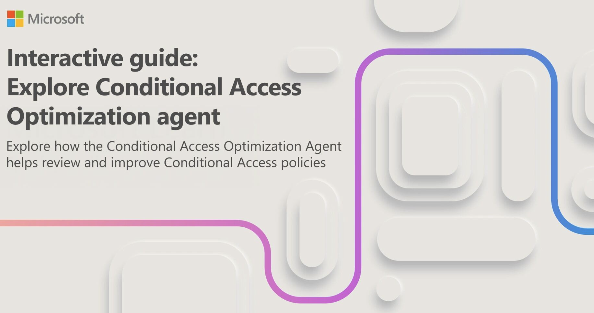

The Conditional Access optimization agent helps you ensure all users are protected by policy. It recommends policies and changes based on best practices aligned with Zero Trust and Microsoft learning.

The Conditional Access optimization agent evaluates policies such as requiring multifactor authentication (MFA). The agent enforces device based controls (device compliance, app protection policies, and domain-joined devices). Finally, the agent can help block legacy authentication and device code flow.

The agent also evaluates all existing enabled policies to propose potential consolidation of similar policies.

### Requirement to use the Conditional Access optimization agent

- You must have at least the **Microsoft Entra ID P1 license**.
- You must have available **Security Compute Units (SCU)**.
- To activate the agent the first time, you need the Security Administrator or higher role.
- You can assign Conditional Access Administrators with Security Copilot access.
  - For more information, see Assign Security Copilot access
- Device-based controls require **Microsoft Intune licenses**.

### Conditional Access optimization agent key features

The Conditional Access optimization agent scans your tenant for new users and applications and determines if Conditional Access policies are applicable. The key features include:

| Feature | Description |
| :---  | :--- |
| Require MFA | The agent identifies users who aren't covered by a Conditional Access policy that requires MFA and can update the policy. |
| Require device-based controls | The agent can enforce device-based controls, such as device compliance, app protection policies, and domain-joined devices. |
| Block legacy authentication | User accounts with legacy authentication are blocked from signing in. |
| Policy consolidation | The agent scans your policy and identifies overlapping settings. For example, if you have more than one policy that has the same grant controls, the agent suggests consolidating those policies into one. |
| Block device code flow | The agent looks for a policy blocking device code flow authentication. |
| One-click remediation | When the agent identifies a suggestion, you can select Apply suggestion to have the agent update the associated policy with one press of a button. |

## Give the Conditional Access optimization agent a try

