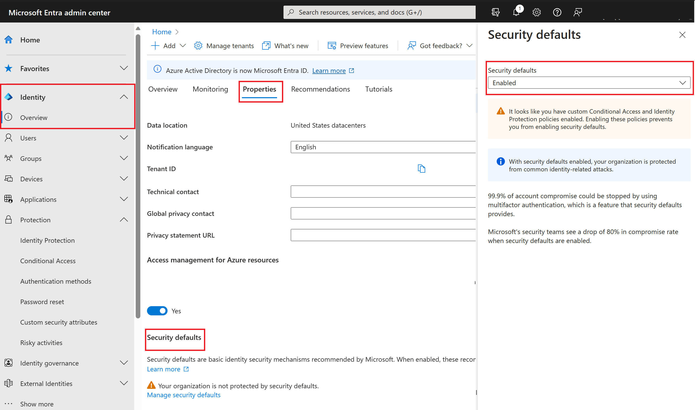

## Enabling security defaults

To enable security defaults in your directory:

1. Browse to the [Azure portal](https://portal.azure.com/) and sign in using a Global administrator account for the directory.

2. Select the Show portal menu hamburger icon and then select Azure Active Directory.

   > [!div class="mx-imgBorder"]
   > 

3. In the left navigation, in the Manage section, select Properties.

4. At the bottom of the Properties blade, select **Manage Security defaults**.

5. Set the **Enable security defaults** toggle to **Yes**.

   This may already be enabled.

6. Select **Save**.

### Disabling security defaults

Organizations that choose to implement Conditional Access policies that replace security defaults must disable security defaults.

To disable security defaults in your directory:

1. Browse to the [Azure portal](https://portal.azure.com/) and sign in using a Global administrator account for the directory.

2. Select the Show portal menu hamburger icon and then select Azure Active Directory.

3. At the bottom of the Properties blade, select **Manage Security defaults**.

4. Set the **Enable security defaults** toggle to **No**.

   > [!div class="mx-imgBorder"]
   > 

5. Select **Save**.

