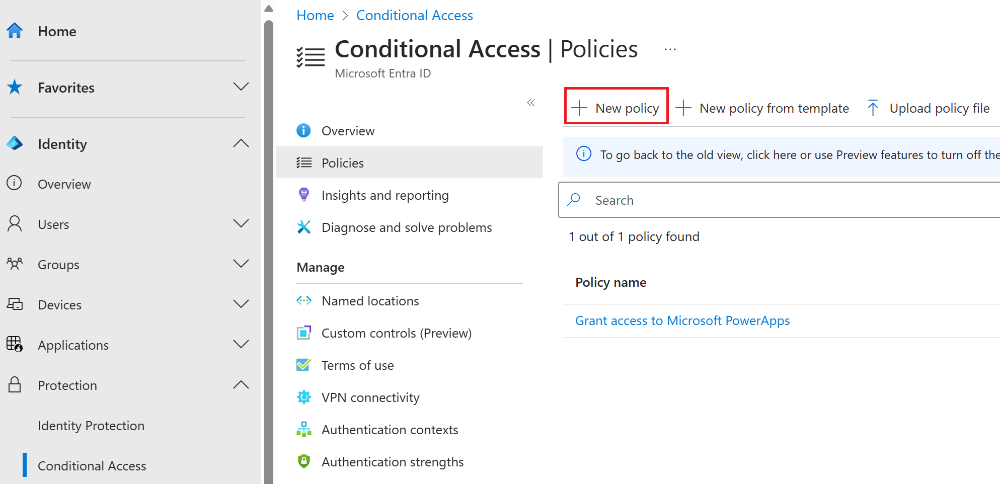
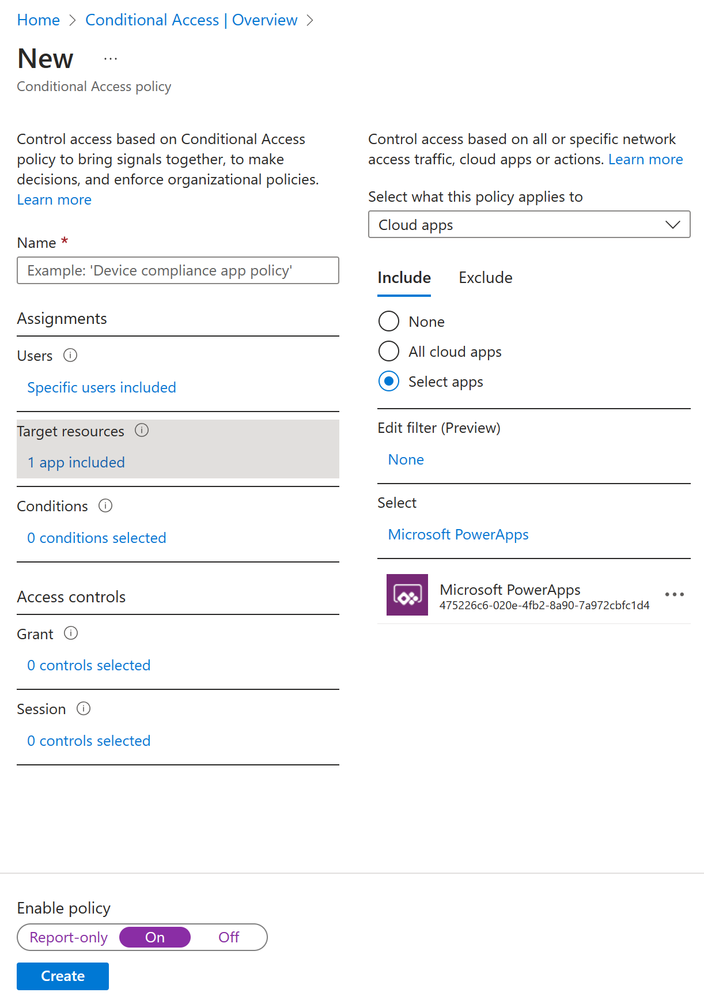

Visual Studio App Center supports Azure AD Conditional Access, an advanced feature of Azure AD that enables you to specify detailed policies that control who can access your resources. Using Conditional Access, you can protect your applications by limiting users' access based on things like group, device type, location, and role.

## Setting up Conditional Access

This is an abbreviated guide to setting up Conditional Access. Full documentation is available at [https://docs.microsoft.com/azure/active-directory/conditional-access/overview](https://docs.microsoft.com/en-us/azure/active-directory/conditional-access/overview).

In the Azure portal, open your Active Directory tenant, then open the **Security** settings, and click on **Conditional Access**.

In **Conditional Access** settings, click **New policy** to create a policy.

> [!div class="mx-imgBorder"]
> 

In **New policy** settings, click on **Cloud apps or actions** and select **Visual Studio App Center** as the target of the policy. Then select the other conditions that you want to apply, enable the policy, and click **Create** to save it.

> [!div class="mx-imgBorder"]
> 

## Sign-in risk-based Conditional Access

Most users have a normal behavior that can be tracked. When they fall outside of this norm, it could be risky to allow them to just sign in. You may want to block that user or maybe just ask them to perform multifactor authentication to prove that they are really who they say they are.

A sign-in risk represents the probability that a given authentication request isn't authorized by the identity owner. Organizations with Azure AD Premium P2 licenses can create Conditional Access policies incorporating Azure AD Identity Protection sign-in risk detections.

This policy can be assigned either through Conditional Access itself or through Azure AD Identity Protection. Organizations should choose one of two options to enable a sign-in risk-based Conditional Access policy requiring a secure password change.

## User risk-based Conditional Access

Microsoft works with researchers, law enforcement, various security teams at Microsoft, and other trusted sources to find leaked username and password pairs. Organizations with Azure AD Premium P2 licenses can create Conditional Access policies incorporating Azure AD Identity Protection user risk detections.

Like sign-in risk-based Conditional Access, this policy can be assigned either through Conditional Access itself or through Azure AD Identity Protection.

## Securing security info registration

Securing when and how users register for Azure AD Multi-Factor Authentication and self-service password reset is now possible with user actions in Conditional Access policy. This preview feature is available to organizations that have enabled the combined registration preview. This functionality may be enabled in organizations where they want to use conditions like trusted network location to restrict access to register for Azure AD Multi-Factor Authentication and self-service password reset (SSPR).

### Create a policy to require registration from a trusted location

The following policy applies to all selected users who attempt to register using the combined registration experience, and it blocks access unless they are connecting from a location marked as a trusted network.

1. In the **Azure portal**, browse to **Azure Active Directory** > **Security** > **Conditional Access**.

2. Select **New policy**.

3. In **Name**, Enter a Name for this policy. For example, **Combined Security Info Registration on Trusted Networks**.

4. Under **Assignments**, select **Users and groups**, and select the users and groups you want this policy to apply to.

> [!WARNING]
> Users must be enabled for the combined registration.

   1. Under **Exclude**, select **Users and groups** and choose your organization's emergency access or break-glass accounts.

   1. Select **Done**.

5. Under **Cloud apps or actions**, select **User actions**, check **Register security information**.

6. Under **Conditions** > **Locations**.

   1. Configure **Yes**.

   1. Include **Any location**.

   1. Exclude **All trusted locations**.

   1. Select **Done** on the **Locations** blade.

   1. Select **Done** on the **Conditions** blade.

7. Under **Conditions** > **Client apps (Preview)**, set **Configure** to **Yes**, and select **Done**.

8. Under **Access controls** > **Grant**.

   1. Select **Block access**.

   1. Then click **Select**.

9. Set **Enable policy** to **On**.

10. Then select **Save**.

At step 6 in this policy, organizations have choices they can make. The policy above requires registration from a trusted network location. Organizations can choose to utilize any available conditions in place of **Locations**. Remember that this policy is a block policy, so anything included is blocked and anything that does not match the include is allowed.

Some may choose to use device state instead of location in step 6 above:

6. Under **Conditions** > **Device state (Preview)**.

   1. Configure **Yes**.

   1. Include **All device state**.

   1. Exclude **Device Hybrid Azure AD joined** and/or **Device marked as compliant.**

   1. Select **Done** on the **Locations** blade.

   1. Select **Done** on the **Conditions** blade.

> [!WARNING]
> If you use device state as a condition in your policy, this may impact guest users in the directory. Report-only mode can help determine the impact of policy decisions. Note that report-only mode is not applicable for Conditional Access policies with "User Actions" scope.

## Block access by location

With the location condition in Conditional Access, you can control access to your cloud apps based on the network location of a user. The location condition is commonly used to block access from countries/regions where your organization knows traffic should not come from.

### Define locations

1. Sign in to the **Azure portal** as a Global Administrator, Security Administrator, or Conditional Access Administrator.

1. Browse to **Azure Active Directory** > **Security** > **Conditional Access** > **Named locations**.

1. Choose **New location**.

1. Give your location a name.

1. Choose **IP ranges** if you know the specific externally accessible IPv4 address ranges that make up that location or **Countries/Regions**.

   1. Provide the **IP ranges** or select the **Countries/Regions** for the location you are specifying.

    - If you choose Countries/Regions, you can optionally choose to include unknown areas.

1. Choose **Save.**

### Create a Conditional Access policy

1. Sign in to the **Azure portal** as a Global Administrator, Security Administrator, or Conditional Access Administrator.

1. Browse to **Azure Active Directory** > **Security** > **Conditional Access**.

1. Select **New policy**.

1. Give your policy a name. We recommend that organizations create a meaningful standard for the names of their policies.

1. Under **Assignments**, select **Users and groups.**

   1. Under **Include**, select **All users**.

   1. Under **Exclude**, select **Users and groups** and choose your organization's emergency access or break-glass accounts.

   1. Select **Done**.

1. Under **Cloud apps or actions** > **Include**, and select **All cloud apps**.

1. Under **Conditions** > **Location**.

   1. Set **Configure** to **Yes.**

   1. Under **Include**, select **Selected locations.**

   1. Select the blocked location you created for your organization.

   1. Click **Select**.

1. Under **Access controls** > select **Block Access**, and select **Select**.

1. Confirm your settings and set **Enable policy** to **On**.

1. Select **Create** to create Conditional Access Policy.

## Require compliant devices

Organizations that have deployed Microsoft Intune can use the information returned from their devices to identify devices that meet compliance requirements, such as:

- Requiring a PIN to unlock.

- Requiring device encryption.

- Requiring a minimum or maximum operating system version.

- Requiring a device is not jailbroken or rooted.

This policy compliance information is forwarded to Azure AD where Conditional Access can make decisions to grant or block access to resources.

## Create a Conditional Access policy

The following steps will help create a Conditional Access policy to require devices accessing resources be marked as compliant with your organization's Intune compliance policies.

1. Sign in to the **Azure portal** as a Global Administrator, Security Administrator, or Conditional Access Administrator.

1. Browse to **Azure Active Directory** > **Security** > **Conditional Access**.

1. Select **New policy**.

1. Give your policy a name. We recommend that organizations create a meaningful standard for the names of their policies.

1. Under **Assignments**, select **Users and groups.**

   1. Under **Include**, select **All users**.

   1. Under **Exclude**, select **Users and groups** and choose your organization's emergency access or break-glass accounts.

   1. Select **Done**.

1. Under **Cloud apps or actions** > **Include**, select **All cloud apps**.

   1. If you must exclude specific applications from your policy, you can choose them from the **Exclude** tab under **Select excluded cloud apps** and choose **Select**.

   1. Select **Done**.

1. Under **Conditions** > **Client apps (Preview)** > **Select the client apps this policy will apply to**, leave all defaults selected and select **Done**.

1. Under **Access controls** > **Grant**, select **Require device to be marked as compliant**.

   1. Select **Select**.

1. Confirm your settings and set **Enable policy** to **On**.

1. Select **Create** to create to enable your policy.

> [!NOTE]
> You can enroll your new devices to Intune even if you select Require device to be marked as compliant for All users and All cloud apps using the steps above. Require device to be marked as compliant control does not block Intune enrollment.

### Known behavior

On Windows 7, iOS, Android, macOS, and some third-party web browsers, Azure AD identifies the device using a client certificate that is provisioned when the device is registered with Azure AD. When a user first signs in through the browser, the user is prompted to select the certificate. The end user must select this certificate before they can continue to use the browser.

## Block access

For organizations with a conservative cloud migration approach, the block all policy is an option that can be used.

> [!WARNING]
> Misconfiguration of a block policy can lead to organizations being locked out of the Azure portal.

Policies like these can have unintended side effects. Proper testing and validation are vital before enabling. When making changes, administrators should utilize tools such as Conditional Access report-only mode and the What If tool in Conditional Access.

### User exclusions

Conditional Access policies are powerful tools. We recommend excluding the following accounts from your policy:

- **Emergency access** or **break-glass** accounts to prevent tenant-wide account lockout. In the unlikely scenario that all administrators are locked out of your tenant, your emergency-access administrative account can be used to log in to the tenant and take steps to recover access.

- **Service accounts** and **service principals**, such as the Azure AD Connect Sync Account. Service accounts are non-interactive accounts that are not tied to any particular user. They are normally used by back-end services allowing programmatic access to applications, but they are also used to sign in to systems for administrative purposes. Service accounts like these should be excluded since MFA can't be completed programmatically. Calls made by service principals are not blocked by Conditional Access.

  - If your organization has these accounts in use in scripts or code, consider replacing them with managed identities. As a temporary workaround, you can exclude these specific accounts from the baseline policy.

### Create a Conditional Access policy

The following steps will help create Conditional Access policies to block access to all apps except for Office 365 if users are not on a trusted network. These policies are put in to Report-only mode to start so administrators can determine the impact they will have on existing users. When administrators are comfortable that the policies apply as they intend, they can switch them to **On**.

The first policy blocks access to all apps except for Microsoft 365 applications if not on a trusted location.

1. Sign in to the **Azure portal** as a Global Administrator, Security Administrator, or Conditional Access Administrator.

1. Browse to **Azure Active Directory** > **Security** > **Conditional Access**.

1. Select **New policy**.

1. Give your policy a name. We recommend that organizations create a meaningful standard for the names of their policies.

1. Under **Assignments**, select **Users and groups**.

   1. Under **Include**, select **All users**.

   1. Under **Exclude**, select **Users and groups** and choose your organization's emergency access or break-glass accounts.

   1. Select **Done**.

1. Under **Cloud apps or actions**, select the following options:

   1. Under **Include**, select **All cloud apps**.

   1. Under **Exclude**, select **Office 365**, select **Select**, then select **Done**.

1. Under **Conditions**:

   1. Under **Conditions** > **Location**.

      1. Set **Configure** to **Yes.**

      1. Under **Include**, select **Any location**.

      1. Under **Exclude**, select **All trusted locations**.

      1. Select **Done**.

   1. Under **Client apps (Preview)**, set **Configure** to **Yes**, and select **Done**, then **Done**.

1. Under **Access controls** > **Grant**, select **Block access**, then select **Select**.

1. Confirm your settings and set **Enable policy** to **Report-only**.

1. Select **Create** to create to enable your policy.

A second policy is created below to require multifactor authentication or a compliant device for users of Microsoft 365.

1. Select **New policy**.

1. Give your policy a name. We recommend that organizations create a meaningful standard for the names of their policies.

1. Under **Assignments**, select **Users and groups**.

   1. Under **Include**, select **All users**.

   1. Under **Exclude**, select **Users and groups** and choose your organization's emergency access or break-glass accounts.

   1. Select **Done**.

1. Under **Cloud apps or actions** > **Include**, select **Select apps**, choose **Office 365**, and select **Select**, then **Done**.

1. Under **Access controls** > **Grant**, select **Grant access**.

   1. Select **Require multi-factor authentication** and **Require device to be marked as compliant** select **Select**.

   1. Ensure **Require all the selected controls** is selected.

   1. Select **Select**.

1. Confirm your settings and set **Enable policy** to **Report-only**.

1. Select **Create** to create to enable your policy.

