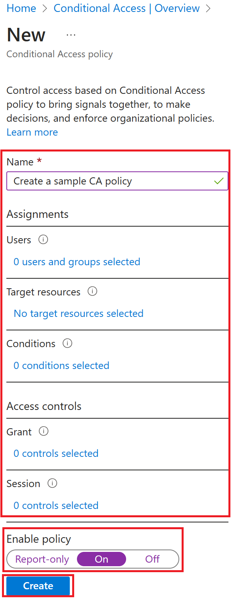

## Create a conditional access policy

Azure Active Directory Conditional Access is an advanced feature of Azure AD that allows you to specify detailed policies that control who can access your resources. Using Conditional Access, you can protect your applications by limiting users' access based on things like groups, device type, location, and role.

1. Sign in to the [Azure portal](https://portal.azure.com/) using a Global administrator account.

2. Open the portal menu and then select **Azure Active Directory**.

3. On the Azure Active Directory blade, under **Manage**, select **Security**.

4. On the Security blade, in the left navigation, select **Conditional access**.

5. On the top menu, select **New policy**.

   > [!div class="mx-imgBorder"]
   > 

6. In the **Name** box, enter **Test app conditional access**.

   This is the name being using for this exercise, you may choose another name if you wish.

7. Under **Assignments**, select **Users and groups**.

8. On the Include tab, select the **Users and groups** check box.

9. In the Select pane, select your administrator account and then select **Select**.

10. Select **Cloud apps or actions**.

11. Verify **Cloud apps** is selected and then select **Select apps**.

12. In the Select pane, select **My apps** and then select **Select**.

13. Select **Conditions** and then select **Conditions**.

14. Under **Configure**, select **Yes** and then select **Any location**.

15. Under **Access controls**, select **Grant**.

16. In the Grant pane, select **Block access** and then select **Select**.

> [!IMPORTANT]
> This policy is being configured for the exercise only and is being used to quickly demonstrate a conditional access policy.

17. Under **Enable policy**, select **On**, and then select **Create**.

   > [!div class="mx-imgBorder"]
   > 

## Test the conditional access policy

You should test your conditional access policies to ensure they working as expected.

1. Open a new browser tab and then browse to **https://myapps.microsoft.com**.

2. Your credentials should be passed through.

3. Verify you are prevented from successfully accessing your My Apps page.

   > [!div class="mx-imgBorder"]
   > 

   If you are signed in, close the tab, wait 1-2 minutes, and then retry.

4. Close the tab and return to the Conditional Access blade.

5. Select the **Test app conditional access** policy.

6. Under **Enable policy**, select **Off** and then select **Save**.

