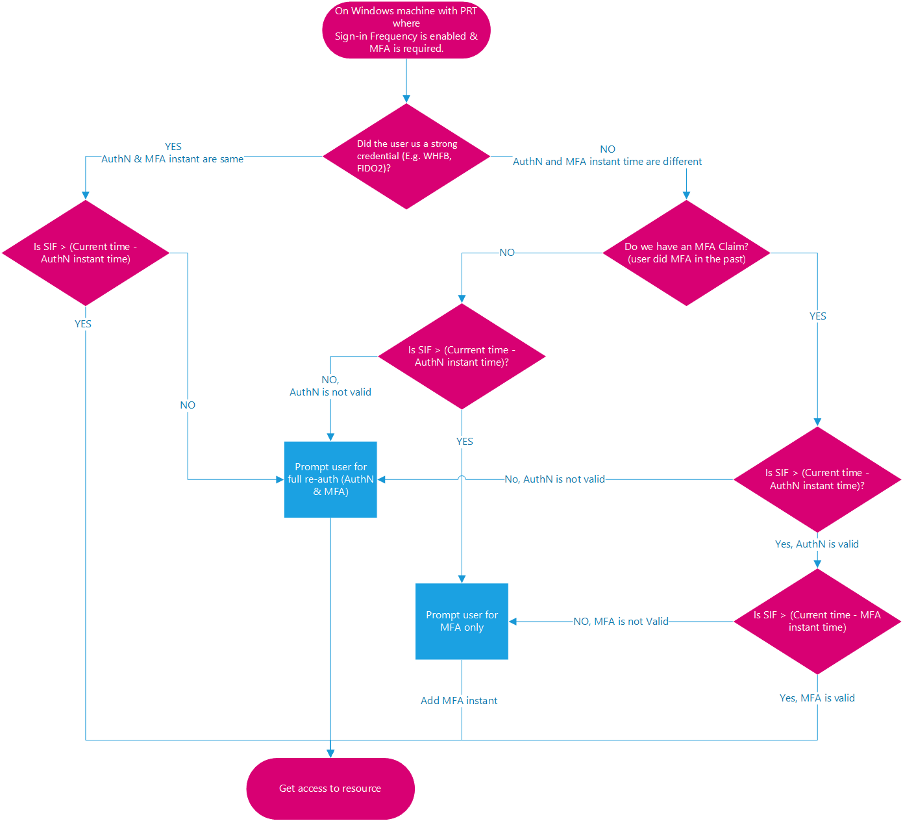
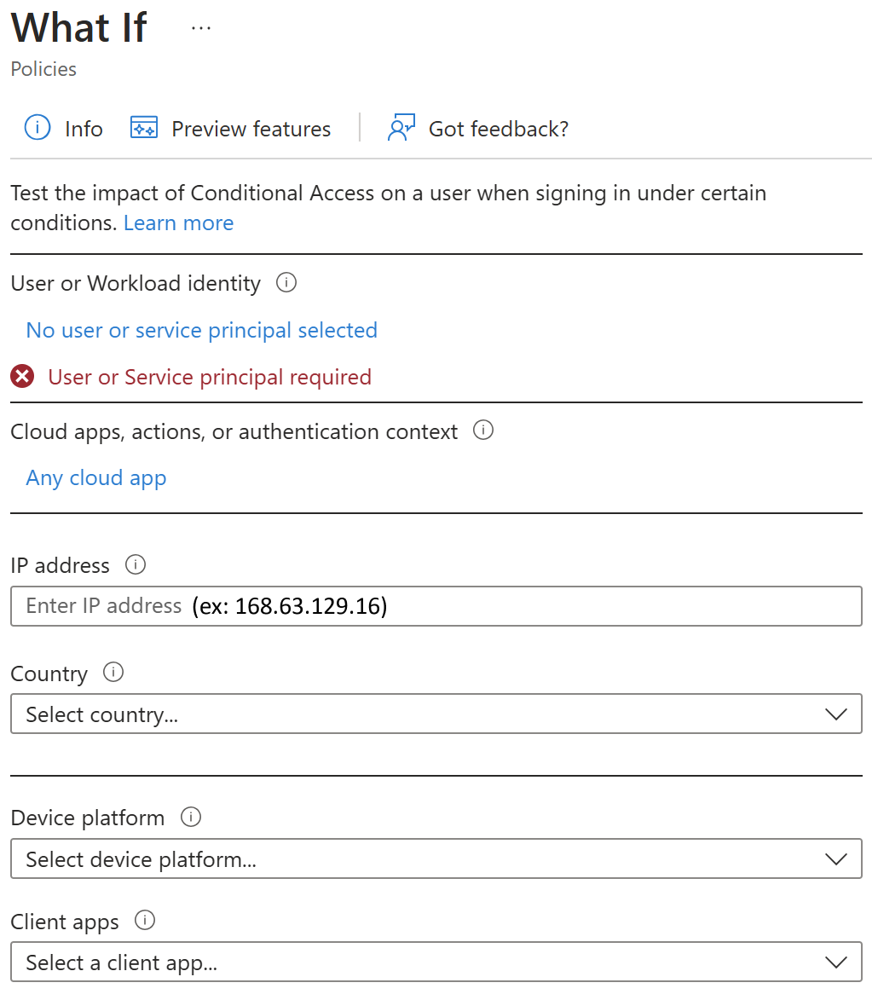

---

**#COMMENT**

From [https://docs.microsoft.com/azure/active-directory/conditional-access/howto-conditional-access-session-lifetime](https://docs.microsoft.com/azure/active-directory/conditional-access/howto-conditional-access-session-lifetime)

---

In complex deployments, organizations might have a need to restrict authentication sessions. Some scenarios might include:

- Resource access from an unmanaged or shared device.

- Access to sensitive information from an external network.

- High impact users.

- Critical business applications.

Conditional Access controls allow you to create policies that target specific use cases within your organization without affecting all users.

Before diving into details on how to configure the policy, let’s examine the default configuration.

## User sign-in frequency

Sign-in frequency defines the time period before a user is asked to sign in again when attempting to access a resource.

The Azure AD default configuration for user sign-in frequency is a rolling window of 90 days. Asking users for credentials often seems like a sensible thing to do, but it can backfire: Users who are trained to enter their credentials without thinking can unintentionally supply them to a malicious credential prompt.

It might sound alarming to not ask for a user to sign back in; in reality any violation of IT policies will revoke the session. Some examples include a password change, an incompliant device, or an account disable. You can also explicitly revoke users’ sessions using PowerShell. The Azure AD default configuration comes down to “don’t ask users to provide their credentials if the security posture of their sessions has not changed.”

The sign-in frequency setting works with apps that have implemented OAUTH2 or OIDC protocols according to the standards. Most Microsoft native apps for Windows, Mac, and mobile, including the following web applications, comply with the setting.

- Word, Excel, PowerPoint Online

- OneNote Online

- Office.com

- Microsoft 365 Admin portal

- Exchange Online

- SharePoint and OneDrive

- Teams web client

- Dynamics CRM Online

- Azure portal

The sign-in frequency setting works with SAML applications as well, as long as they do not drop their own cookies and are redirected back to Azure AD for authentication on a regular basis.

### User sign-in frequency and multifactor authentication

Sign-in frequency previously applied only to the first factor authentication on devices that were Azure AD joined, Hybrid Azure AD joined, and Azure AD registered. There was no easy way for our customers to re-enforce multifactor authentication (MFA) on those devices. Based on customer feedback, sign-in frequency will apply for MFA as well.

### User sign-in frequency and device identities

If you have Azure AD joined, hybrid Azure AD joined, or Azure AD registered devices, when a user unlocks their device or signs in interactively, this event will satisfy the sign-in frequency policy as well. In the following two examples user sign-in frequency is set to one hour:

Example 1:

- At 00:00, a user signs in to their Windows 10 Azure AD joined device and starts work on a document stored on SharePoint Online.

- The user continues working on the same document on their device for an hour.

- At 01:00, the user is prompted to sign in again based on the sign-in frequency requirement in the Conditional Access policy configured by their administrator.

Example 2:

- At 00:00, a user signs in to their Windows 10 Azure AD joined device and starts work on a document stored on SharePoint Online.

- At 00:30, the user gets up and takes a break, locking their device.

- At 00:45, the user returns from their break and unlocks the device.

- At 01:45, the user is prompted to sign in again based on the sign-in frequency requirement in the Conditional Access policy configured by their administrator since the last sign-in happened at 00:45.

## Persistence of browsing sessions

A persistent browser session allows users to remain signed in after closing and reopening their browser window. The Azure AD default for browser session persistence allows users on personal devices to choose whether to persist the session by showing a “Stay signed in?” prompt after successful authentication.

## Validation

Use the What-If tool to simulate a login from the user to the target application and other conditions based on how you configured your policy. The authentication session management controls show up in the result of the tool.

## Policy deployment

To make sure that your policy works as expected, the recommended best practice is to test it before rolling it out into production. Ideally, use a test tenant to verify whether your new policy works as intended.

