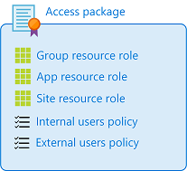
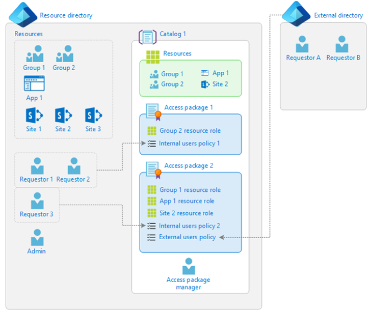

## Why use entitlement management?

Enterprise organizations often face challenges when managing employee access to resources such as:

- Users may not know what access they should have, and even if they do, they may have difficulty locating the right individuals to approve their access

- Once users find and receive access to a resource, they may hold on to access longer than is required for business purposes

These problems are compounded for users who need access from another organization, such as external users who are from supply chain organizations or other business partners. For example, Azure AD entitlement management can help organizations ensure that everyone has access to the correct directories and that all user access is managed consistently.

This video provides an overview of entitlement management and its value:

| | Watch this video to learn more about Azure Active Directory entitlement management|
| :--- | :--- |

>[!VIDEO https://www.microsoft.com/videoplayer/embed/RE4MFIb]

## What can I do with entitlement management?

Capabilities of entitlement management include:

| Delegate to non-administrators the ability to create access packages.| These access packages contain resources that users can request, and the delegated access package managers can define policies with rules for which users can request, who must approve their access, and when access expires.|
| :--- | :--- |
| Select connected organizations whose users can request access.| When a user who is not yet in your directory requests access and is approved, they are automatically invited into your directory and assigned access. When their access expires, if they have no other access package assignments, their B2B account in your directory can be automatically removed.|

## Summary of terminology

Before exploring entitlement management and its documentation in depth, you should know the terms below. Feel free to reference back to this list at any time during this course.

| Term                   | Description                                                                                                                                                                                                                                                                                                                                    |
| ---------------------- | ---------------------------------------------------------------------------------------------------------------------------------------------------------------------------------------------------------------------------------------------------------------------------------------------------------------------------------------------- |
| access package         | A bundle of resources that a team or project needs and is governed with policies. An access package is always contained in a catalog. You would create a new access package for a scenario in which users need to request access.                                                                                                              |
| access request         | A request to access the resources in an access package. A request typically goes through an approval workflow. If approved, the requesting user receives an access package assignment.                                                                                                                                                         |
| assignment             | An assignment of an access package to a user ensures the user has all the resource roles of that access package. Access package assignments typically have a time limit before they expire.                                                                                                                                                    |
| catalog                | A container of related resources and access packages. Catalogs are used for delegation so non-administrators can create their own access packages. Catalog owners can add resources they own to a catalog.                                                                                                                                     |
| catalog creator        | A collection of users who are authorized to create new catalogs. When a non-administrator user who is authorized to be a catalog creator creates a new catalog, they automatically become the owner of that catalog.                                                                                                                           |
| connected organization | An external Azure AD directory or domain that you have a relationship with. The users from a connected organization can be specified in a policy as being allowed to request access.                                                                                                                                                           |
| policy                 | A set of rules that defines the access lifecycle, such as how users get access, who can approve, and how long users have access through an assignment. A policy is linked to an access package. For example, an access package could have two policies: one for employees to request access and a second for external users to request access. |
| resource               | An asset, such as an Office group, a security group, an application, or a SharePoint Online site, with a role that a user can be granted permissions to.                                                                                                                                                                                       |
| resource directory     | A directory that has one or more resources to share.                                                                                                                                                                                                                                                                                           |
| resource role          | A collection of permissions associated with and defined by a resource. A group has two roles: member and owner. SharePoint sites typically have three roles but may have additional custom roles. Applications can have custom roles.                                                                                                          |

## What are access packages and what resources can I manage with them?

Entitlement management introduces to Azure AD the concept of an *access package*. An access package is a bundle of all the resources with the access a user needs to work on a project or perform their task. Access packages are used to govern access for your internal employees and users outside your organization. You can manage user access to the following resources with entitlement management:

- Membership of Azure AD security groups.

- Membership of Microsoft 365 Groups and Teams.

- Assignment to Azure AD enterprise applications, including SaaS applications and custom-integrated applications that support federation/single sign-on and/or provisioning.

- Membership of SharePoint Online sites.

You can also control access to other resources that rely upon Azure AD security groups or Microsoft 365 Groups. For example, you can provide:

- Licenses for Microsoft 365 by using an Azure AD security group in an access package and configuring group-based licensing for that group.

- Access to manage Azure resources by using an Azure AD security group in an access package and creating an Azure role assignment for that group.

- Access to manage Azure AD roles by using groups assignable to Azure AD roles in an access package and assigning an Azure AD role to that group.

## How do I control who gets access?

With an **access package**, an administrator or delegated access package manager lists the resources (groups, apps, and sites) and the roles the users need for those resources.

Access packages also include one or more *policies*. A policy defines the rules or guardrails for assignment to access package. Each policy can be used to ensure that only the appropriate users are able to request access, that there are approvers for their request, and that their access to those resources is time-limited and will expire if not renewed.

> [!div class="mx-imgBorder"]
> 

Within each policy, an administrator or access package manager defines the already existing users who are eligible to request access, the process to approve or deny access, and the duration of a user's access.

## When should I use access packages?

Access packages do not replace other mechanisms for access assignment. They are most appropriate in situations such as when:

- Employees need time-limited access for a particular task. For example, you might use group-based licensing and a dynamic group to ensure all employees have an Exchange Online mailbox, and then use access packages for situations in which employees need additional access, such as to read departmental resources from another department.

- Access requires the approval of an employee's manager or other designated individuals.

- Departments wish to manage their own access policies for their resources without IT involvement.

- Two or more organizations are collaborating on a project, and as a result, multiple users from one organization will need to be brought in via Azure AD B2B to access another organization's resources.

The following diagram shows an example of the elements in entitlement management:

> [!div class="mx-imgBorder"]
> 

In **Access package 1**, there is only one single group as a resource. Access is defined with a policy that enables a set of users in the directory to request access. **Access package 2** includes a group, an application, and a SharePoint Online site as resources. Access is defined with two different policies. The first policy enables a set of users in the directory to request access. The second policy enables users in an external directory to request access.

