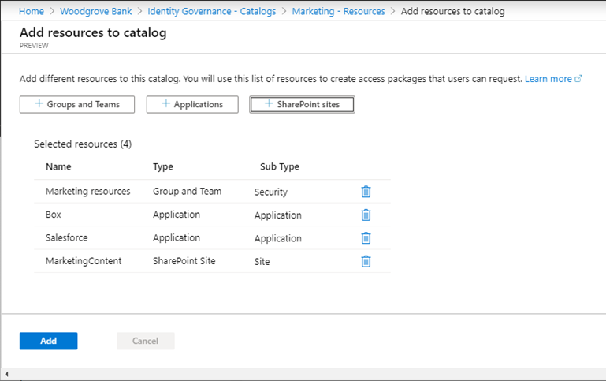

## Create an Azure account and add Azure Active Directory Premium P2 trial licenses

The tasks in this exercise and the exercises in this learning path require you to already have and Azure subscription that you can use or to sign up for an Azure trial account. If you already have your own Azure subscription, you may skip this task and continue to the next.

1. In a web browser, go to [Azure portal](https://azure.microsoft.com/free/).

2. Scroll down through the page to learn more about the benefits and free services available.

3. Select **Start free**.

4. Use the wizard to sign up for your Azure trial subscription.

5. You will need to an Azure AD P2 license to complete some of the exercises. In the organization you created, search for and then select **Azure Active Directory**.

6. In the left navigation menu, select **Getting started**.

7. Under Getting started with Azure AD, select **Get a free trial for Azure AD Premium**.

8. In the Activate pane, under **AZURE AD PREMIUM P2**, select **Free trial** and then select **Activate**.

9. In the navigation menu on the left, select **Overview**.

10. Refresh the browser until you see Azure AD Premium P2 under the organization name. It may take a couple of minutes.

11. You may need to sign out and sign back into Microsoft Azure if you encounter any problems with expected features not being available.

## Create a catalog

A catalog is a container of resources and access packages. You create a catalog when you want to group related resources and access packages. Whoever creates the catalog becomes the first catalog owner. A catalog owner can add additional catalog owners.

1. Sign in to the [Azure portal](https://portal.azure.com/) as a Global administrator.

> [!IMPORTANT]
> To use and configure Azure AD terms of use, you must have:
>  - Azure AD Premium P1, P2, EMS E3, or EMS E5 subscription.
>    - If you don't have one of these subscriptions, you can get Azure AD Premium or enable Azure AD Premium trial.
>  - One of the following administrator accounts for the directory you want to configure:
>    - Global Administrator
>    - Security Administrator
>    - Conditional Access Administrator
2. Open **Azure Active Directory** and the select **Identity Governance**.

3. In the left menu, under **Entitlement management**, select **Catalogs**.

4. On the top menu, select **+New Catalog**.

> [!div class="mx-imgBorder"]
> 

5. In the New catalog pane, in the **Name** box, enter **Marketing**.

6. In the **Description** box, enter **For marketing department users**.Users will see this information in an access package's details.

7. **Enabled for external users** allows users in selected external directories to be able to request access packages in this catalog. No changes will be made to this setting.

8. Under **Enabled, select No**.

 You may choose to enable the catalog for immediate use or disable if you intend to stage it or keep it unavailable until you intend to use it. For this exercise, the catalog does not need to be enabled.

> [!div class="mx-imgBorder"]
> 

9. Select Create.

## Add resources to a catalog

To include resources in an access package, the resources must exist in a catalog. The types of resources you can add are groups, applications, and SharePoint Online sites. The groups can be cloud-created Microsoft 365 Groups or cloud-created Azure AD security groups. The applications can be Azure AD enterprise applications, including both SaaS applications and your own applications federated to Azure AD. The sites can be SharePoint Online sites or SharePoint Online site collections.

1. On the Identity Governance blade, if necessary, select **Catalogs**.

2. In the **Catalogs** list, select **Marketing**.

3. In the left navigation, under **Manage**, select **Resources**.

4. On the menu, select + **Add resources**.

5. In the Add resources to catalog blade, review the available options.

6. You may not have any resources in Groups and Teams, Applications, or SharePoint sites. Select any resource category and then select a resource from that category.

 For this exercise, it is okay to choose any resource you may have available.

> [!div class="mx-imgBorder"]
> 

7. When finished, click **Add**.

 These resources can now be included in access packages within the catalog.

## Add additional catalog owners

The user that created a catalog becomes the first catalog owner. To delegate management of a catalog, you add users to the catalog owner role. This helps share the catalog management responsibilities.

1. In the Marketing catalog blade, in the left navigation menu, select Roles and administrators.

 If necessary, in the Azure portal, browse to **Azure Active Directory** > **Identity Governance > Catalogs** and then select **Marketing**.

> [!div class="mx-imgBorder"]
> 

2. On the top menu, review the available roles and then select **+ Add owner**.

3. In the Select members pane, select your administrator account and then select **Select**.

4. Review the newly added role in the Roles and administrators list.

## Edit a catalog

You can edit the name and description for a catalog. Users see this information in an access package's details.

1. In the Marketing blade, in the left navigation, select **Overview**.

2. On the top menu, select **Edit**.

3. Review the setting and, under **Properties** > **Enabled**, select **Yes**.

> [!div class="mx-imgBorder"]
> 

4. Select **Save**.

## Delete a catalog

You can delete a catalog, but only if it does not have any access packages.

1. In the Marketing catalog’s Overview page, on the top menu, select Delete.

2. In the Delete dialog box, review the information and then select **Yes**.

