Access to groups and applications for employees and guests changes over time. To reduce the risk associated with stale access assignments, administrators can use Azure Active Directory (Azure AD) to create access reviews for group members or application access. If you need to routinely review access, you can also create recurring access reviews.

|||
| :--- | :--- |
| | Watch this video to learn more about ....|

>[!VIDEO https://www.microsoft.com/videoplayer/embed/RE4MAkF]

## Prerequisites

- Azure AD Premium P2

- Global Administrator or User Administrator

## Create one or more access reviews

1. Sign in to the Azure portal and open the Identity Governance page.

2. In the left menu, click **Access reviews**.

3. Click **New access review** to create a new access review.

> [!div class="mx-imgBorder"]
> 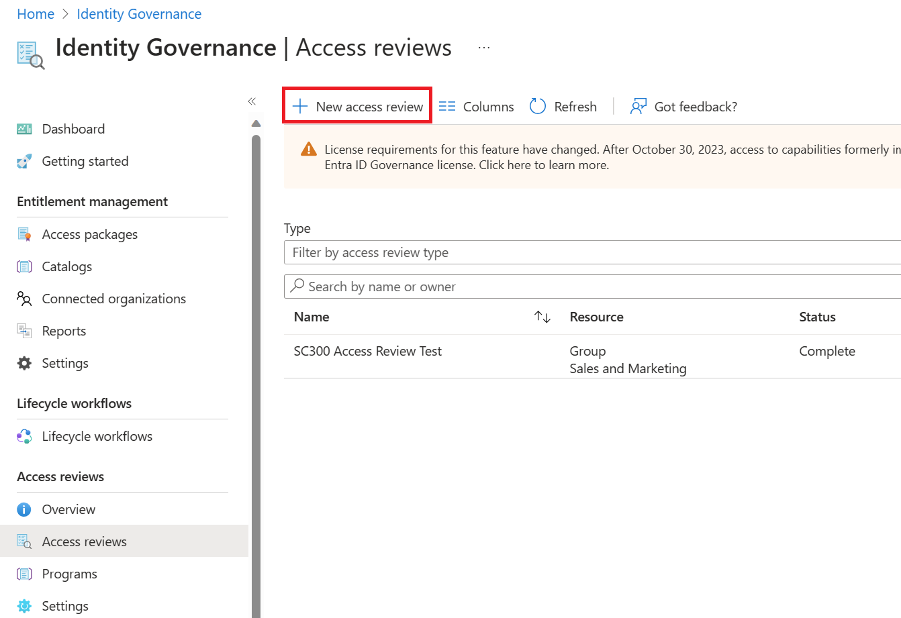

4. In **Step 1: Select what to review** select the resource you would like to review.

> [!div class="mx-imgBorder"]
> 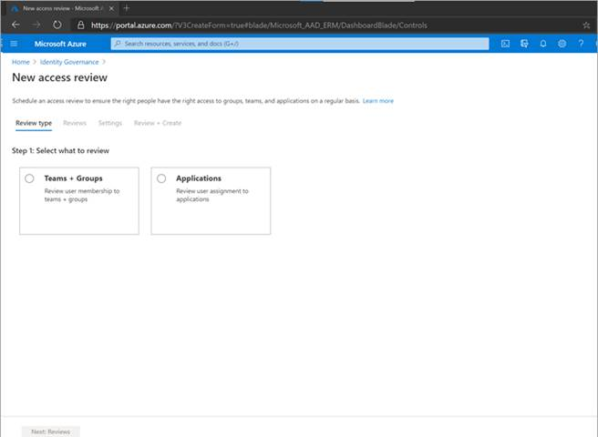

5. If you selected **Teams + Groups** in Step 1, you have two options in Step 2:

  - **All Microsoft 365 groups with guest users.** Select this option if you would like to create recurring reviews on all your guest users across all your Microsoft Teams and M365 groups in your organization. You can choose to exclude certain groups by clicking on "Select group(s) to exclude."

  - **Select teams + groups.** Select this option if you would like to specify a finite set of teams and/or groups to review. After clicking on this option, you will see a list of groups to the right to pick from.

> [!div class="mx-imgBorder"]
> 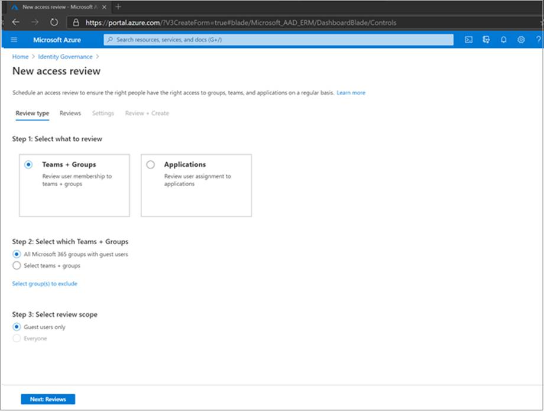

> [!div class="mx-imgBorder"]
> 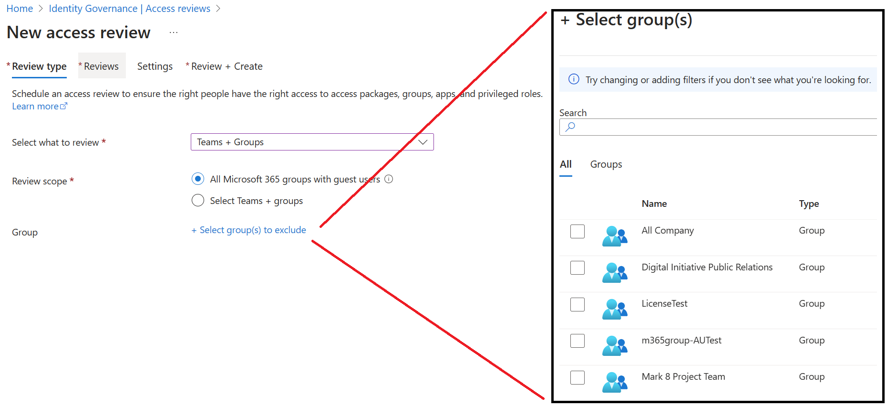

6. If you selected **Applications** in Step 1, you can then select one or more applications in Step 2.

> [!NOTE]
> Selecting multiple groups and/or applications will result in multiple access reviews created. For example, if you select five groups to review, that will result in five separate access reviews

> [!div class="mx-imgBorder"]
> 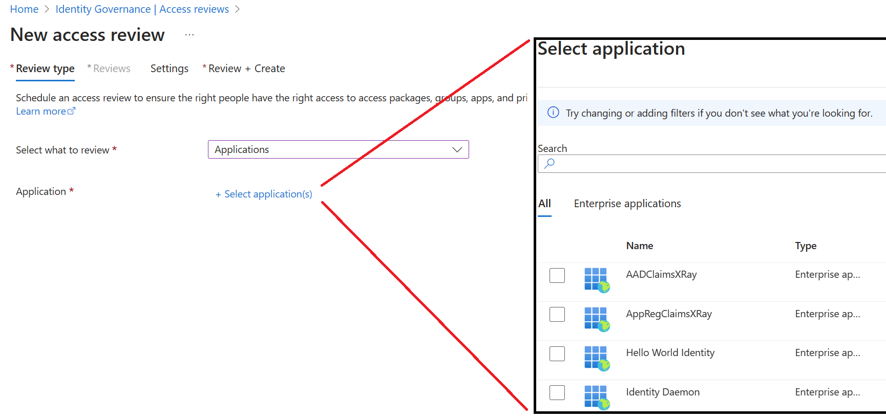

7. Next, in Step 3 you can select a scope for the review. Your options are:

  - **Guest users only.** Selecting this option limits the access review to just the Azure AD B2B guest users in your directory.

  - **Everyone.** Selecting this option scopes the access review to all user objects associated with the resource.

> [!NOTE]
> If you selected All Microsoft 365 groups with guest users in Step 2, then your only option is to review Guest users in Step 3.

8. Click on Next: Reviews

9. In the **Select reviewers** section, select one or more people to perform the access reviews. You can choose from:

  - **Group owner(s)** (Only available when performing a review on a team or group)

  - **Selected user(s) or groups(s)**

  - **Users review own access**

  - **(Preview) Managers of users.** If you choose either **Managers of users** or **Group owners,** you also have the option to specify a fallback reviewer. Fallback reviewers are asked to do a review when the user has no manager specified in the directory or the group does not have an owner.

> [!div class="mx-imgBorder"]
> 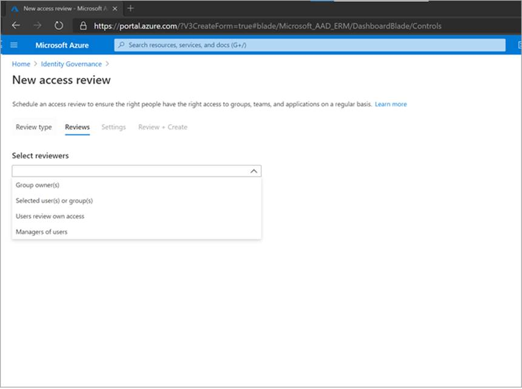

10. In the **Specify recurrence of review** section, you can specify a frequency such as **Weekly, Monthly, Quarterly, Semi-annually, Annually**. You then specify a **Duration**, which defines how long a review will be open for input from reviewers. For example, the maximum duration that you can set for a monthly review is 27 days to avoid overlapping reviews. You might want to shorten the duration to ensure that your reviewers input is applied earlier. Next, you can select a **Start date** and **End date**.

> [!div class="mx-imgBorder"]
> 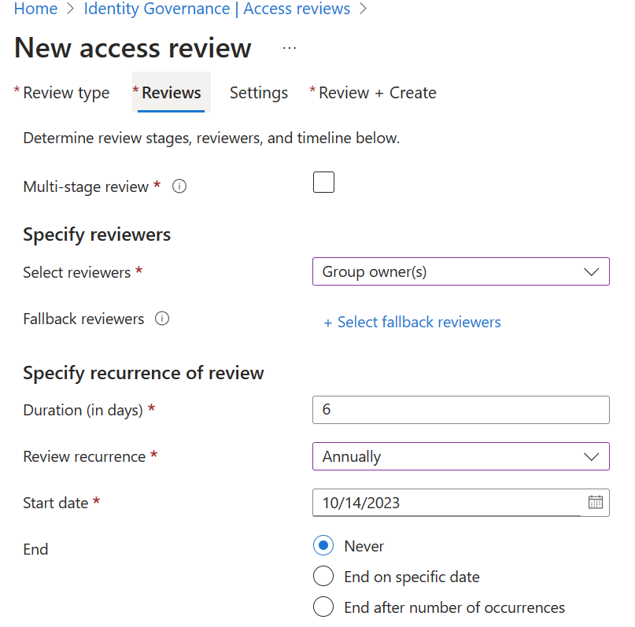

11. Click the **Next: Settings** button at the bottom of the page.

12. In the **Upon completion settings,** you can specify what happens after the review completes.

> [!div class="mx-imgBorder"]
> 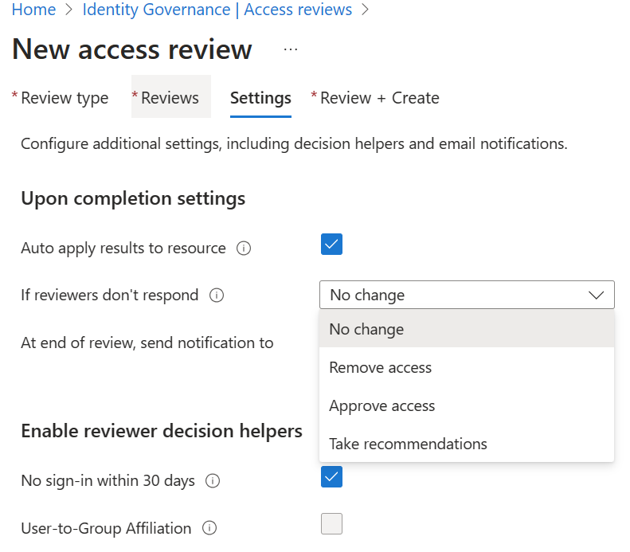

If you want to automatically remove access for denied users, set **Auto apply results to resource** to **Enable**. If you want to manually apply the results when the review completes, set the switch to **Disable**. Use the **If reviewers don't respond** list to specify what happens for users that are not reviewed by the reviewer within the review period. This setting does not impact users who have been reviewed by the reviewers manually. If the final reviewer's decision is Deny, then the user's access will be removed.

  - **No change** - Leave user's access unchanged

  - **Remove access** - Remove user's access

  - **Approve access** - Approve user's access

  - **Take recommendations** - Take the system's recommendation on denying or approving the user's continued access

> [!div class="mx-imgBorder"]
> 

Use the Action to apply on denied **guest** users to specify what happens to guest users if they are denied.

  - **Remove user’s membership from the resource** will remove denied user’s access to the group or application being reviewed, they will still be able to sign-in to the tenant.

  - **Block user from signing in for 30 days, then remove user from the tenant** will block the denied users from signing in to the tenant, regardless if they have access to other resources. If there was a mistake or if an admin decides to re-enable one’s access, they can do so within 30 days after the user has been disabled. If there is no action taken on the disabled users, they will be deleted from the tenant.

> [!NOTE]
> Action to apply on denied guest users is not configurable on reviews scoped to more than guest users. It is also not configurable for reviews of all M365 groups with guest users. When not configurable, the default option of removing user's membership from the resource is used on denied users.

13. In **Enable review decision helpers** choose whether you would like your reviewer to receive recommendations during the review process.

> [!div class="mx-imgBorder"]
> 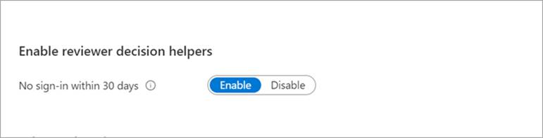

14. In the **Advanced settings** section, you can choose the following

  - Set **Justification required** to **Enable** to require the reviewer to supply a reason for approval.

  - Set **email notifications** to **Enable** to have Azure AD send email notifications to reviewers when an access review starts, and to administrators when a review completes.

  - Set **Reminders** to **Enable** to have Azure AD send reminders of access reviews in progress to reviewers who have not completed their review. These reminders will be half-way through the duration of the review.

  - The content of the email sent to reviewers is autogenerated based on the review details, such as review name, resource name, due date, etc. If you need a way to communicate additional information, such as additional instructions or contact information, you can specify these details in the **Additional content for reviewer email** section. The information that you enter is included in the invitation and reminder emails sent to assigned reviewers. The section highlighted in the image below shows where this information is displayed.

> [!div class="mx-imgBorder"]
> 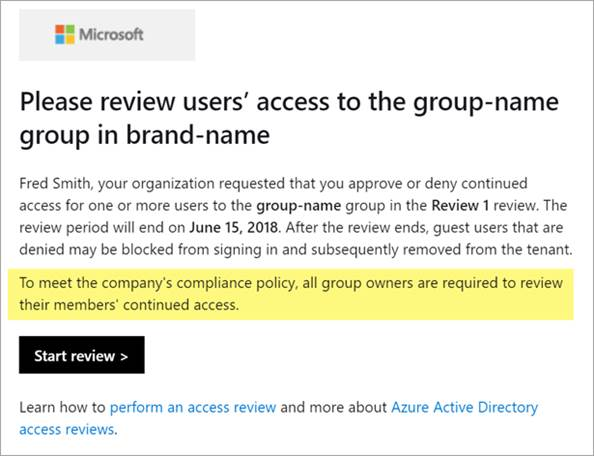

15. Click on **Next: Review + Create** to move to the next page.

16. Name the access review. Optionally, give the review a description. The name and description are shown to the reviewers.

17. Review the information and select **Create.**

> [!div class="mx-imgBorder"]
> 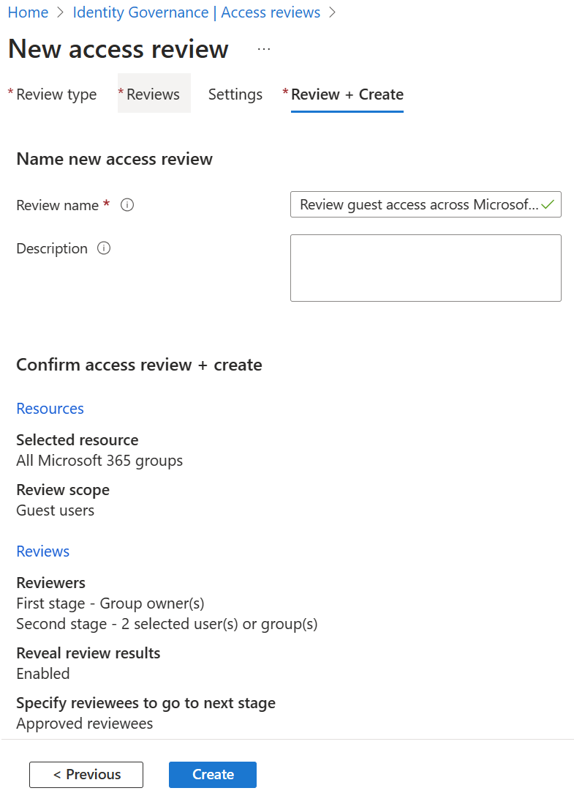

## Start the access review

Once you have specified the settings for an access review, click **Start**. The access review will appear in your list with an indicator of its status.

> [!div class="mx-imgBorder"]
> 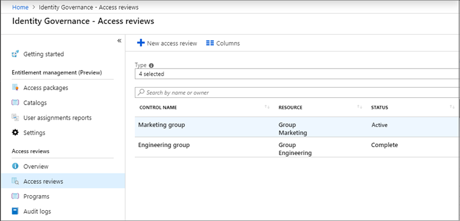

By default, Azure AD sends an email to reviewers shortly after the review starts. If you choose not to have Azure AD send the email, be sure to inform the reviewers that an access review is waiting for them to complete. You can show them the instructions for how to review access to groups or applications. If your review is for guests to review their own access, show them the instructions for how to review access for yourself to groups or applications.

If you have assigned guests as reviewers and they have not accepted the invite, they will not receive an email from access reviews because they must first accept the invitation prior to reviewing.

## Access review status table

|     Status            |     Definition                                                                                                                                                    |
|-----------------------|-------------------------------------------------------------------------------------------------------------------------------------------------------------------|
|     NotStarted        |     Review was created, user discovery is waiting to start.                                                                                                       |
|     Initializing      |     User discovery is in progress to identify all users who are part of the review.                                                                               |
|     Starting          |     Review is starting. If email notifications are enabled, emails are being sent to reviewers.                                                                   |
|     InProgress        |     Review has started. If email notifications are enabled, emails have been sent to reviewers. Reviewers can submit decisions until the due date.                |
|     Completing        |     Review is being completed, and emails are being sent to the review owner.                                                                                     |
|     Auto-Reviewing    |     Review is in a system reviewing stage. The system is recording decisions for users who were not reviewed based on recommendations or preconfigured decisions. |
|     Auto-Reviewed     |     Decisions have been recorded by the system for all users who were not reviewed. Review is ready to proceed to **Applying** if Auto-Apply is enabled.          |
|     Applying          |     There will be no change in access for users who were approved.                                                                                                |
|     Applied           |     Denied users, if any, have been removed from the resource or directory.                                                                                       |
|     Failed            |     Review could not progress. This error could be related to the deletion of the tenant, a change in licenses, or other internal tenant changes.                 |

## Create reviews via APIs

You can also create access reviews using APIs. What you do to manage access reviews of groups and application users in the Azure portal can also be done using Microsoft Graph APIs.

