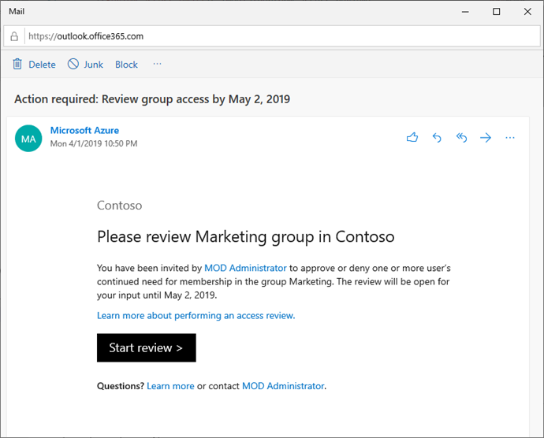

Azure AD simplifies how enterprises manage access to groups and applications in Azure AD and other Microsoft Online Services with a feature called Azure AD access reviews.

## Perform access review using My Apps

You can start the Access Review process from the notification email or by going directly to the site.

1. **Email**:

    > [!IMPORTANT]
    > There could be delays in receiving email. In some cases it could take up to 24 hours. Add azure-noreply@microsoft.com to your safe recipients list to make sure that you are receiving all emails.

    a. Look for an email from Microsoft asking you to review access. Here is an example email to review the access for a group.

    >[!div class="mx-imgBorder"]
    >

    b. Click the **Start review** link to open the access review.

2. **If you don't have the email**, you can find your pending access reviews by following these steps:

    a. Sign in to the My Apps portal at [https://myapps.microsoft.com](https://myapps.microsoft.com/).

    b. In the upper-right corner of the page, click the user next to your name and default organization. If more than one organization is listed, select the organization that requested an access review.

    c. Click the **Access reviews** tile to see a list of pending access reviews.

    > [!IMPORTANT]
    > If the Access reviews tile isn't visible, there are no access reviews to perform for that organization and no action is needed at this time.

    d. Click the **Begin review** link for the access review you want to perform.

Once you have opened the access review, you see the names of users who need to have their access reviewed.

There are two ways that you can approve or deny access:

- You can approve or deny access for one or more users 'manually' by choosing the appropriate action for each user request.

- You can accept the system recommendations.

### Approve or deny access for one or more users

1. Review the list of users and decide whether to approve or deny their continued access.

    - To approve or deny access for a single user, click the row to open a window to specify the action to take.

    - To approve or deny access for multiple users, add check marks next to the users and then click the **Review X user(s)** button to open a window to specify the action to take.

2. Click **Approve** or **Deny**.

    > [!NOTE]
    > If you are unsure, you can click "Don't know" and the user gets to keep their access and your choice is recorded in the audit logs.

3. The administrator of the access review may require that you supply a reason in the **Reason** box for your decision. Even when a reason is not required. You can still provide a reason for your decision and the information that you include will be available to other reviewers.

4. Once you have specified the action to take, click **Save**.

    > [!NOTE]
    > You can change your response at any time before the access review has ends. If you want to change your response, select the row and update the response. For example, you can approve a previously denied user or deny a previously approved user.

- If a user is denied access, they aren't removed immediately. They are removed when the review period has ended or when an administrator stops the review if [Auto apply](https://docs.microsoft.com/azure/active-directory/governance/complete-access-review) is enabled.

- If there are multiple reviewers, the last submitted response is recorded. Consider an example where an administrator designates two reviewers – Alice and Bob. Alice opens the access review first and approves a user's access request. Before the review period ends, Bob opens the access review and denies access on the same request previously approved by Alice. The last decision denying the access is the response that gets recorded.

### Approve or deny access based on recommendations

To make access reviews easier and faster for you, we also provide recommendations that you can accept with a single click. The recommendations are generated based on the user's sign-in activity.

1. In the blue bar at the bottom of the page, click **Accept recommendations**.

    You see a summary of the recommended actions.

2. Click **Ok** to accept the recommendations.

