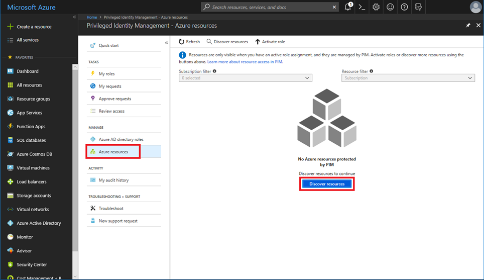

Using Azure AD PIM, you can improve the protection of your Azure resources. This is helpful to:

- Organizations that already use PIM to protect Azure AD roles.

- Management group and subscription owners who are trying to secure production resources.

When you first set up PIM for Azure resources, you need to discover and select the resources to protect with PIM. There's no limit to the number of resources that you can manage with PIM. However, we recommend starting with your most critical production resources.

## Discover resources

1. Sign in to the Azure portal.

2. Open **Azure AD Privileged Identity Management**.

3. Select **Azure resources**.If this is your first time using PIM for Azure resources, you'll see a **Discover resources** page.

> [!div class="mx-imgBorder"]
> 

4. If another administrator in your organization is already managing Azure resources in PIM, you'll see a list of the resources that are currently being managed.

> [!div class="mx-imgBorder"]
> 

5. Select **Discover resources** to launch the discovery experience.

> [!div class="mx-imgBorder"]
> 

6. On the **Discovery** page, use **Resource state filter** and Select resource type to filter the management groups or subscriptions you have write permission to. It's probably easiest to start with **All** initially.You can search for and select management group or subscription resources to manage in PIM. When you manage a management group or a subscription in PIM, you can also manage its child resources.

> [!NOTE]
> When you add a new child Azure resource to a PIM-managed management group, you can bring the child resource under management by searching for it in PIM.

7. Select any unmanaged resources that you want to manage.

8. Select **Manage resource** to start managing the selected resources.

> [!NOTE]
> Once a management group or subscription is managed, it can't be unmanaged. This prevents another resource administrator from removing Privileged Identity Management settings.

> [!div class="mx-imgBorder"]
> 

9. If you see a message to confirm the onboarding of the selected resource for management, select **Yes**.

> [!div class="mx-imgBorder"]
> 

