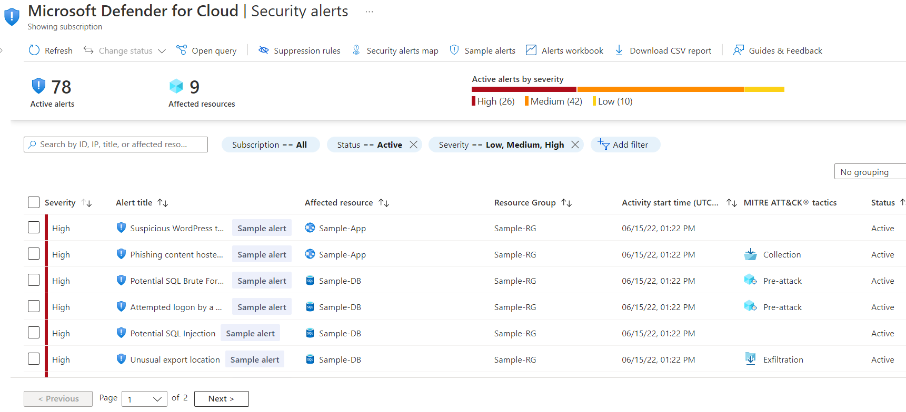
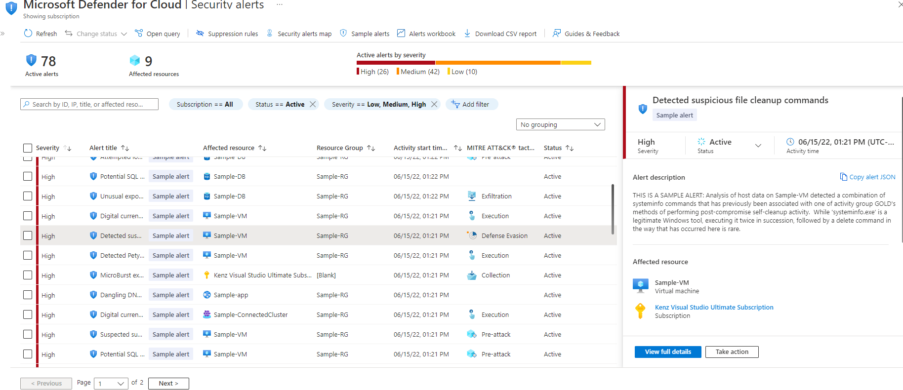
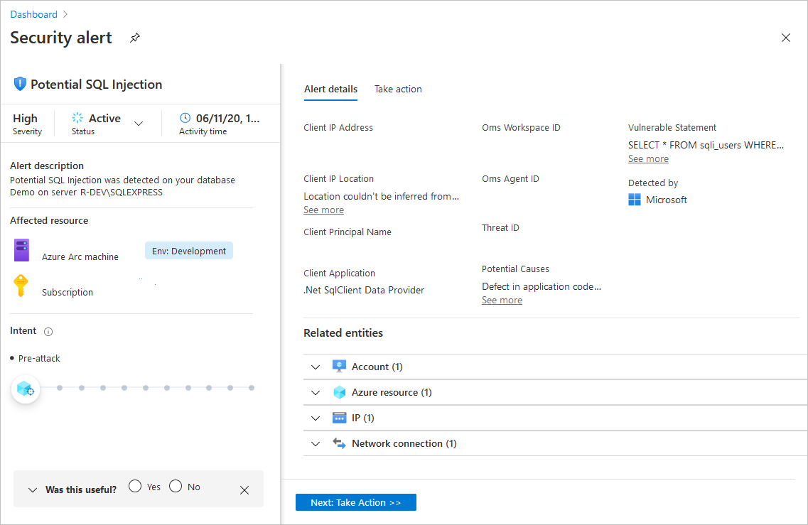
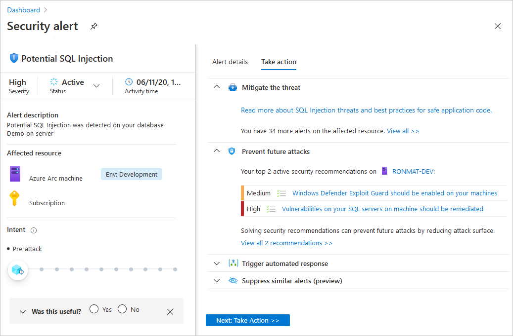
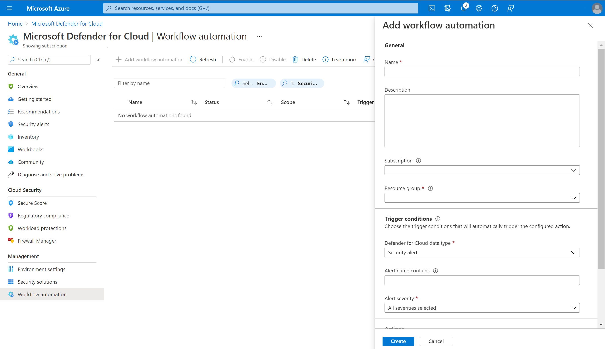

From Security Center's overview page, select the Security alerts tile at the top of the page or the link on the sidebar.

>[!div class="mx-imgBorder"]
>

From the Security alerts list, select an alert. A side pane opens and shows a description of the alert and all the affected resources.

>[!div class="mx-imgBorder"]
>

For further information, select View full details.

The left pane of the security alert page shows high-level information regarding the security alert: title, severity, status, activity time, description of the suspicious activity, and the affected resource. Alongside the affected resource are the Azure tags relevant to the resource. Use these to infer the organizational context of the resource when investigating the alert.

The right pane includes the Alert details tab containing further details of the alert to help you investigate the issue: IP addresses, files, processes, and more.

Also in the right pane is the Take action tab. Use this tab to take further actions regarding the security alert. Actions such as:

- Mitigate the threat - provides manual remediation steps for this security alert

- Prevent future attacks - provides security recommendations to help reduce the attack surface, increase security posture, and thus prevent future attacks

- Trigger automated response - provides the option to trigger a logic app as a response to this security alert

- Suppress similar alerts - provides the option to suppress future alerts with similar characteristics if the alert isn’t relevant for your organization

## Automate responses

Every security program includes multiple workflows for incident response. These processes might include notifying relevant stakeholders, launching a change management process, and applying specific remediation steps. Security experts recommend that you automate as many steps of those procedures as you can. Automation reduces overhead. It can also improve your security by ensuring the process steps are done quickly, consistently, and according to your predefined requirements.

This feature can trigger Logic Apps on security alerts and recommendations. For example, you might want Security Center to email a specific user when an alert occurs.

## Create a logic app and define when it should automatically run

From Security Center's sidebar, select Workflow automation.

From this page, you can create new automation rules as well as enable, disable, or delete existing ones.

To define a new workflow, select Add workflow automation.

A pane appears with the options for your new automation. Here you can enter:

- A name and description for the automation.

- The triggers that will initiate this automatic workflow. For example, you might want your Logic App to run when a security alert that contains "SQL" is generated.

- The Logic App that will run when your trigger conditions are met.

>[!div class="mx-imgBorder"]
>

From the Actions section, select Create a new one to begin the Logic App creation process.

You'll be taken to Azure Logic Apps.

- Enter a name, resource group, and location, and select Create.

- In your new logic app, you can choose from built-in, predefined templates from the security category. Or you can define a custom flow of events to occur when this process is triggered.

The logic app designer supports the following Security Center triggers:

- When an Azure Security Center Recommendation is created or triggered - If your logic app relies on a recommendation that gets deprecated or replaced, your automation will stop working. You'll then need to update the trigger. To track changes to recommendations, see Azure Security Center release notes.

- When an Azure Security Center Alert is created or triggered - You can customize the trigger so that it relates only to alerts with the severity levels that interest you.

After you've defined your logic app, return to the workflow automation definition pane ("Add workflow automation"). Click Refresh to ensure your new Logic App is available for selection.

Select your logic app and save the automation. The Logic App dropdown only shows Logic Apps with supporting Security Center connectors mentioned above.

## Manually trigger a logic app

You can also run Logic Apps manually when viewing any security alert or recommendation.

To manually run a Logic App, open an alert or a recommendation and select Trigger Logic App

