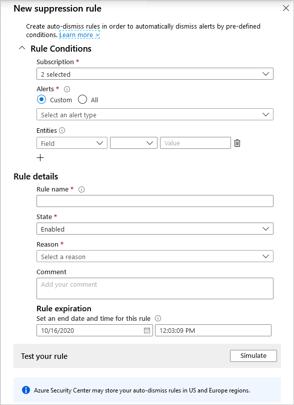

The various Azure Defender plans detect threats in any area of your environment and generate security alerts.  When a single alert isn't interesting or relevant, you can manually dismiss it. Alternatively, use the suppression rules feature to automatically dismiss similar alerts in the future. Typically, you'd use a suppression rule to:

- Suppress alerts that you've identified as false positives

- Suppress alerts that are being triggered too often to be useful

Your suppression rules define the criteria for which alerts should be automatically dismissed.  Suppression rules can only dismiss alerts that have already been triggered on the selected subscriptions.

## Create a suppression rule

To create a rule directly in the Azure portal:

From Security Center's security alerts page:

- Locate the specific alert you don't want to see anymore, and from the ellipsis menu (...) for the alert, select Create suppression rule:

OR

- select the suppression rules link at the top of the page, and from the suppression rules page select Create new suppression rule:

In the new suppression rule pane, enter the details of your new rule.

- Your rule can dismiss the alert on all resources so you don't get any alerts like this one in the future.

- Your rule can dismiss the alert on specific criteria - when it relates to a specific IP address, process name, user account, Azure resource, or location.

Enter details of the rule:

- Name - A name for the rule. Rule names must begin with a letter or a number, be between 2 and 50 characters, and contain no symbols other than dashes (-) or underscores (_).

- State - Enabled or disabled.

- Reason - Select one of the built-in reasons or 'other' if they don't meet your needs.

- Expiration date - An end date and time for the rule. Rules can run for up to six months.

Optionally, test the rule using the Simulate button to see how many alerts would have been dismissed if this rule had been active.

Save the rule.

## View suppressed alerts

Alerts that match your enabled suppression rules will still be generated, but their state will be set to dismissed. You can see the state in the Azure portal or however you access your Security Center security alerts.

Use Security Center's filter to view alerts that have been dismissed by your rules.

- From Security Center's security alerts page, open the filter options, and select Dismissed.

