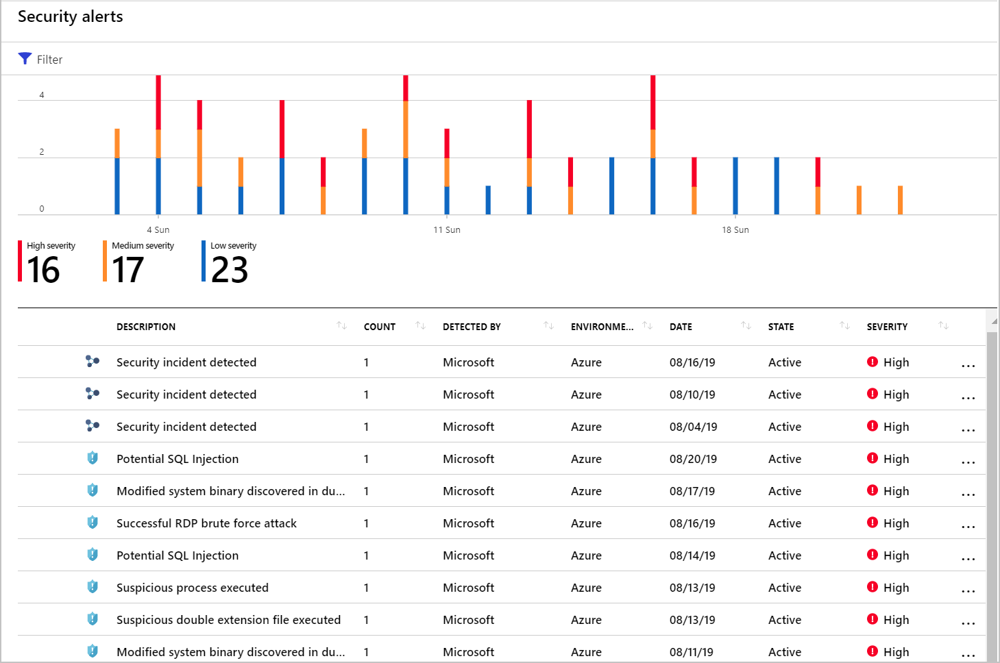
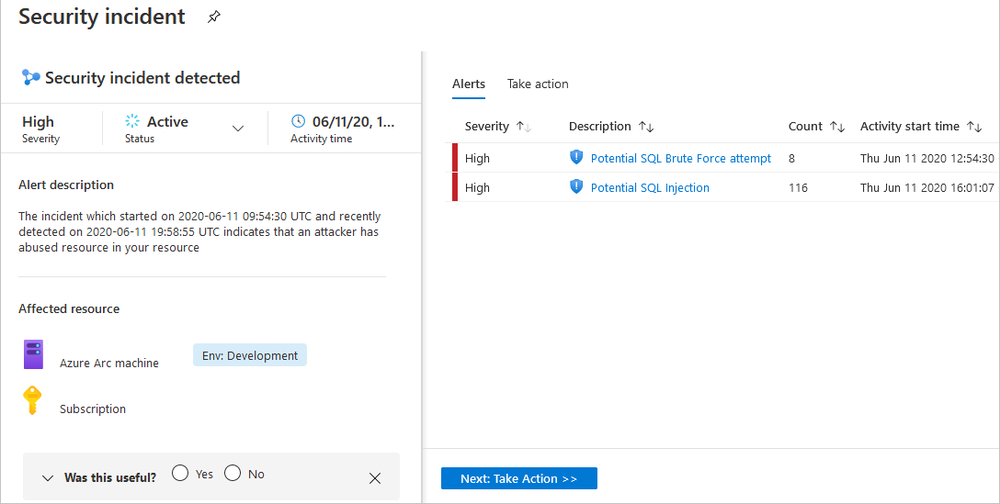
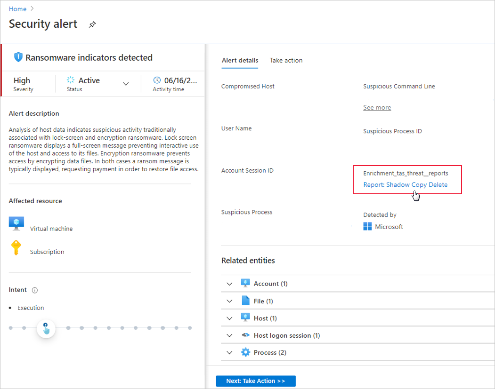

Triaging and investigating security alerts can be time consuming for even the most skilled security analysts. For many, it's hard to know where to begin.

Security Center uses analytics to connect the information between distinct security alerts. Using these connections, Security Center can provide a single view of an attack campaign and its related alerts to help you understand the attacker's actions and the affected resources.

Incidents appear on the Security alerts page. Select an incident to view the related alerts and get more information.

On the Security Center overview page, select the Security alerts tile. The incidents and alerts are listed. Notice that security incidents have a different icon to security alerts.

To view details, select an incident. The Security incident page shows more details.

The left pane of the security incident page shows high-level information about the security incident: title, severity, status, activity time, description, and the affected resource. Next to the affected resource, you can see the relevant Azure tags. Use these tags to infer the organizational context of the resource when investigating the alert.

The right pane includes the Alerts tab with the security alerts that were correlated as part of this incident.

To switch to the Take action tab, select the tab or the button at the bottom of the right pane. Use this tab to take further actions such as:

- Mitigate the threat - provides manual remediation steps for this security incident

- Prevent future attacks - provides security recommendations to help reduce the attack surface, increase security posture, and prevent future attacks

- Trigger automated response - provides the option to trigger a Logic App as a response to this security incident

- Suppress similar alerts - provides the option to suppress future alerts with similar characteristics if the alert isn’t relevant for your organization

To remediate the threats in the incident, follow the remediation steps provided with each alert.

## Generate threat intelligence reports

Security Center threat protection works by monitoring security information from your Azure resources, the network, and connected partner solutions. It analyzes this information, often correlating information from multiple sources, to identify threats.

When Security Center identifies a threat, it triggers a security alert containing detailed information regarding the event, including suggestions for remediation. Security Center provides threat intelligence reports containing information about detected threats to help incident response teams investigate and remediate threats. The report includes information such as:

- Attacker’s identity or associations (if this information is available)

- Attackers’ objectives

- Current and historical attack campaigns (if this information is available)

- Attackers’ tactics, tools, and procedures

- Associated indicators of compromise (IoC) such as URLs and file hashes

- Victimology, which is the industry and geographic prevalence to assist you in determining if your Azure resources are at risk

- Mitigation and remediation information

Security Center has three types of threat reports, which can vary according to the attack. The reports available are:

- Activity Group Report: provides deep dives into attackers, their objectives, and tactics.

- Campaign Report: focuses on details of specific attack campaigns.

- Threat Summary Report: covers all of the items in the previous two reports.

This type of information is useful during the incident response process, where there's an ongoing investigation to understand the source of the attack, the attacker’s motivations, and what to do to mitigate this issue in the future.

## To access the threat intelligence report

To generate the report:

From Security Center's sidebar, open the Security alerts page.

Select an alert. The alerts details page opens with more details about the alert. Below is the Ransomware indicators detected alert details page.

Select the link to the report, and a PDF will open in your default browser.

