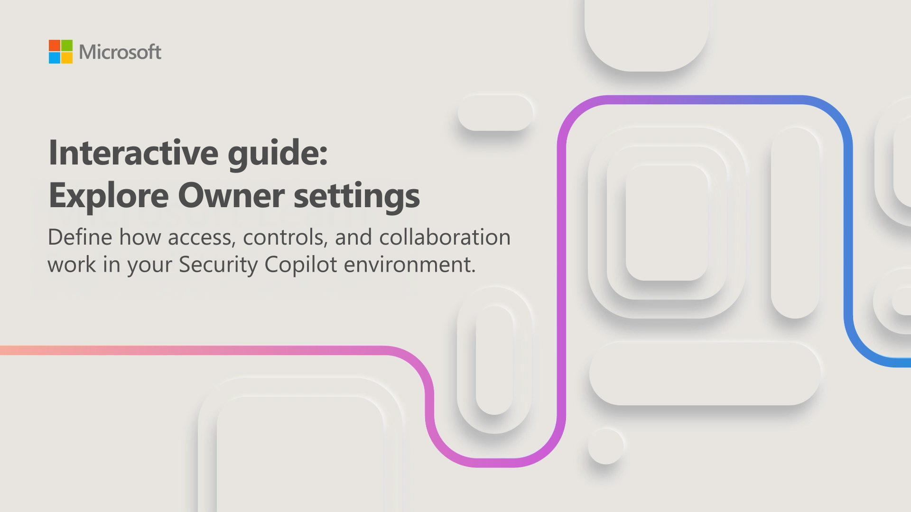

As a Security Copilot owner, you're responsible for configuring the settings that control how your team accesses and uses the environment. The owner settings define how access controls, integrations, and collaboration work across your Security Copilot workspace. Before your team begins using Security Copilot, you need to review and understand these configuration areas.

In this interactive guide, which takes approximately 10 minutes to complete, you navigate the Owner menu in Security Copilot and explore the key configuration areas. You review settings related to workspace management, access controls, and integrations that shape how Security Copilot operates across your environment. Every action you take as an owner applies to a specific workspace, so you also learn the importance of confirming you're in the correct workspace before making changes.

