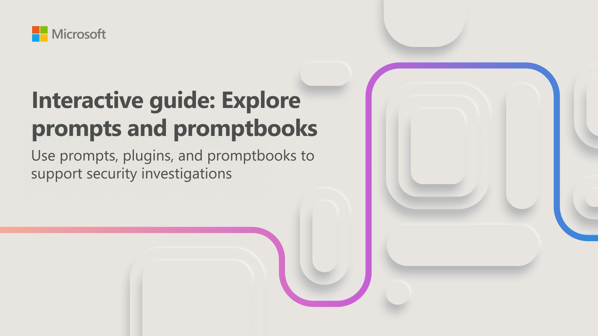

Prompts, plugins, and promptbooks are the core tools you use to interact with Security Copilot. A prompt is a natural language input—a question or instruction—that you enter in Security Copilot to perform a task. A promptbook is a curated collection of reusable prompts designed for common security scenarios, where each prompt builds on the previous one to automate investigation workflows. Plugins extend Security Copilot's capabilities by integrating with both Microsoft and non-Microsoft security solutions.

Your interactions with Security Copilot support three key areas: threat investigation, troubleshooting and remediation, and security posture management. As a Copilot contributor, you create sessions and use prompts and promptbooks to investigate and analyze security incidents. While the Copilot contributor role and enabled plugins allow integration with security solutions, they don't grant you additional permissions to view security data. Your Microsoft Entra and Azure role-based access control (RBAC) roles determine what security data you can access in Security Copilot.

In this interactive guide, which takes approximately 10 minutes to complete, you complete three tasks:

- **Explore the prompt bar and manage sources**: Navigate the prompt bar options and configure the sources Security Copilot uses.
- **Run prompts and review Copilot responses**: Enter prompts and review the insights Security Copilot provides.
- **Run promptbooks and review or share results**: Execute a promptbook and learn how to review and share the investigation results.

