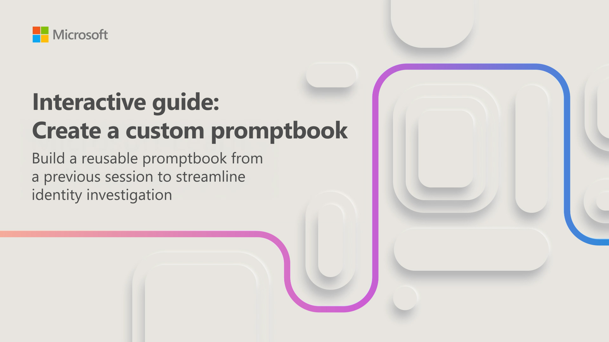

When you repeatedly run the same prompts to investigate similar scenarios, you can save time by creating a custom promptbook. A custom promptbook lets you reuse prompts from a previous session, turning a one-time investigation into a repeatable workflow.

In this interactive guide, you create a custom promptbook in Security Copilot by reusing prompts from an earlier identity investigation session. The scenario involves a security analyst who regularly reviews failed sign-in attempts and authentication activity in Microsoft Entra. Rather than manually entering the same prompts each time, you save those prompts as a custom promptbook allowing you to reuse the workflow in future investigations.

This interactive guide, which takes approximately 10 minutes to complete, walks you through the process of selecting prompts from a previous session, organizing them into a promptbook, and saving the promptbook for future use.

Select the image below to get started.

