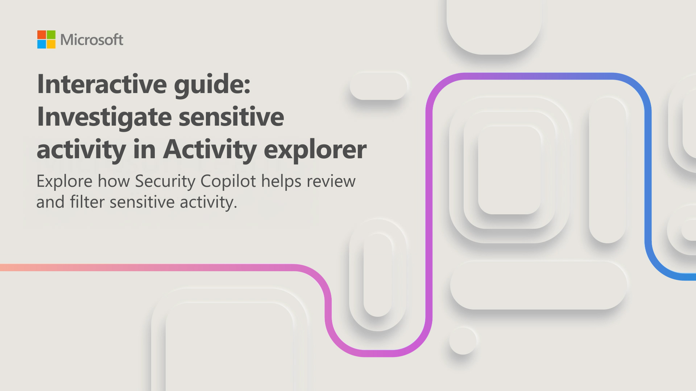
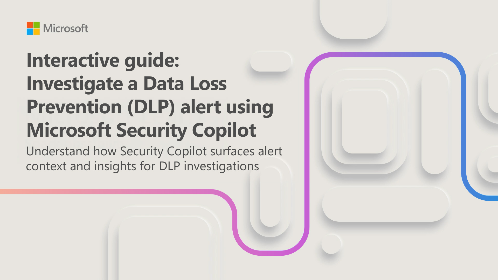

Security Copilot integrates with Microsoft Purview to help you investigate data protection activity. In this unit, you work through two interactive guides that demonstrate how Security Copilot assists with monitoring sensitive data activity and investigating data loss prevention (DLP) alerts.

## Investigate sensitive activity in Activity explorer

Activity explorer in Microsoft Purview provides visibility into activity involving sensitive information across services such as SharePoint, OneDrive, and Exchange. When a data loss prevention policy detects activity that may involve sensitive content, you need to review the activity signals to identify potential policy matches or high-risk activity.

In this interactive guide, which takes approximately 10 minutes to complete, you investigate sensitive activity in Activity explorer. You review activity signals, apply filters to narrow the results, and use Security Copilot to analyze and summarize the activity data so you can focus on the most relevant events.

Select the image below to get started.

## Investigate a DLP alert

When a DLP alert is triggered—for example, after a file containing sensitive financial data is accessed and modified—you need to quickly understand the context and determine the appropriate response. Security Copilot surfaces alert context and insights to help you focus on what matters during a DLP investigation.

In this interactive guide, which takes approximately 5 minutes to complete, you use Security Copilot to investigate a DLP alert and review the activity details associated with a flagged file.

Select the image below to get started.

