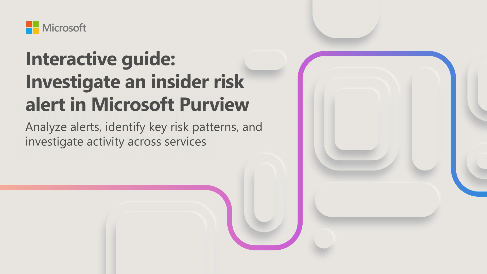
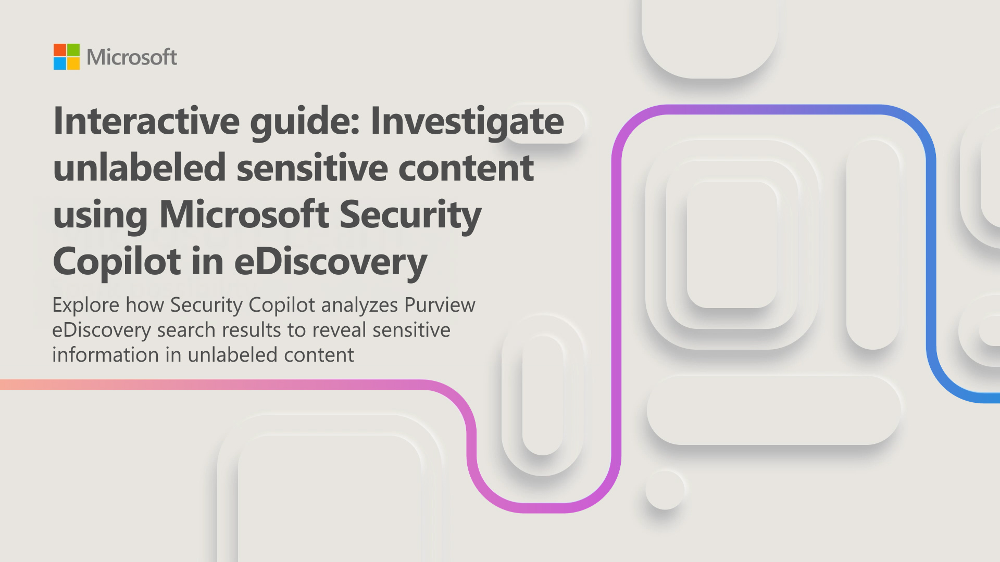

Security Copilot also assists with investigating insider risks and compliance-related scenarios within Microsoft Purview. In this unit, you work through two interactive guides that cover insider risk alert investigation and the analysis of unlabeled sensitive content using eDiscovery.

## Investigate an insider risk alert

Insider Risk Management in Microsoft Purview helps detect and investigate potentially risky user activity within your organization. When an alert is triggered—for example, suspicious activity involving the copying of sensitive data to a USB device—you need to investigate the user's activity and determine whether sensitive data was shared outside the organization.

In this interactive guide, which takes approximately 5 minutes to complete, you investigate an insider risk alert. You use Security Copilot to summarize the user's activity, identify key risk patterns, and assess the potential impact across services.

## Investigate unlabeled sensitive content using eDiscovery

Organizations preparing for cloud migrations or regulatory audits often need to identify documents that lack sensitivity labels. An eDiscovery content search can surface thousands of unlabeled documents, making it challenging to assess the scope of compliance risk.

In this interactive guide, which takes approximately 5 minutes to complete, you use Security Copilot in eDiscovery to analyze search results from an unlabeled content investigation. You summarize findings, identify sensitive information types present in the unlabeled content, and review how the content is distributed across workloads.

