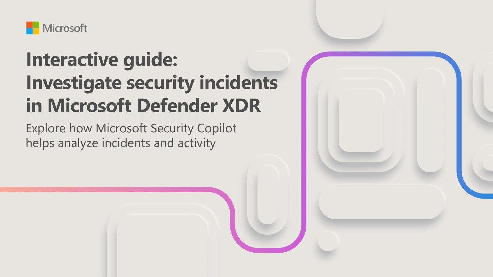
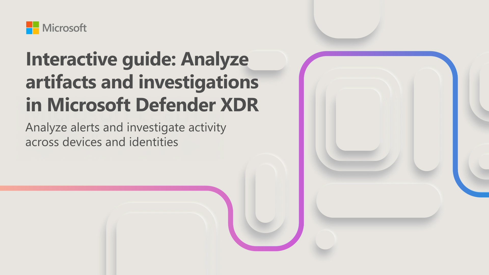

Security Copilot integrates with Microsoft Defender XDR to help you investigate and respond to security incidents. In this unit, you work through two interactive guides that take you through a complete incident investigation workflow—from understanding incident context to analyzing specific artifacts and performing advanced investigation.

## Investigate incident context and activity

When a complex incident is identified in Microsoft Defender XDR—involving a compromised asset and dozens of alerts—it can be difficult to determine where the attack started and how it progressed. Security Copilot summarizes incident activity, connects related events, and provides guided responses to help you focus on what matters.

In this interactive guide, which takes approximately 10 minutes to complete, you investigate a security incident in Microsoft Defender XDR. You review incident and alert summaries, analyze related entities, and use Security Copilot insights to guide your investigation.

## Analyze artifacts and pivot to advanced investigation

After you understand the overall incident context, the next step is to analyze individual alerts and investigate specific artifacts. Security Copilot helps you examine alert details, review device and user context, and identify risks with recommended actions.

In this interactive guide, which guide takes approximately 10 minutes to complete, you continue your investigation by analyzing alerts in Microsoft Defender XDR. You review alert details, examine device and user context, and use Security Copilot to support advanced investigation.

