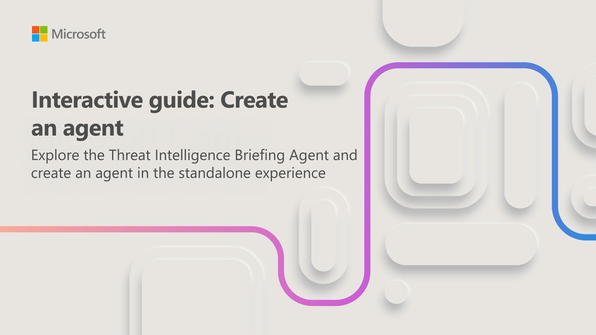

Agents in Microsoft Security Copilot automate security tasks by integrating with Microsoft Security solutions and partner services. They can run automatically based on configured triggers or be run on demand with selected parameters. Agents exist for both the standalone and embedded experiences.

In this interactive guide, which takes approximately 10 minutes to complete, you complete two tasks:

- **Explore the Threat Intelligence Briefing Agent**: Review the agent's details, activity, and reports, and run it on demand to generate a threat intelligence briefing.
- **Create an agent in the standalone experience**: Build a new agent in Security Copilot's standalone experience to automate a security operations task.

This interactive guide helps you understand how agents work and how to create one tailored to your organization's security needs.

