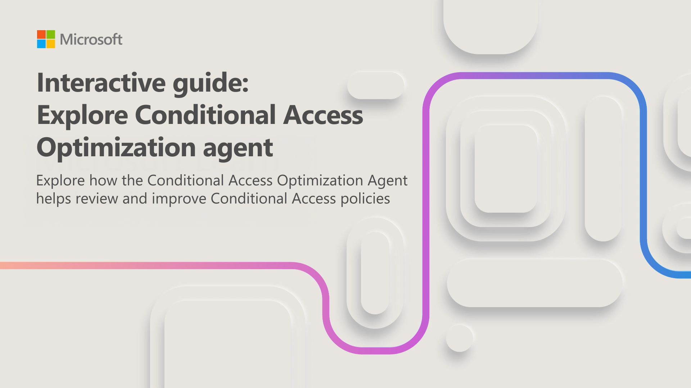

The Conditional Access Optimization Agent in Microsoft Security Copilot helps identity security teams analyze Conditional Access policies and recommend improvements. When new applications or user accounts are added to your environment, existing policies may not cover them effectively. The agent identifies these gaps and suggests optimizations.

In this interactive guide, which takes approximately 10 minutes to complete, you complete two tasks:

- **Navigate to the Conditional Access Optimization Agent and review its details**: Access the agent in the Microsoft Entra admin center and explore its configuration.
- **Review agent activity and suggestions**: Examine the agent's activity feed, review its suggestions, and analyze how Conditional Access policies apply to newly added users and applications.

