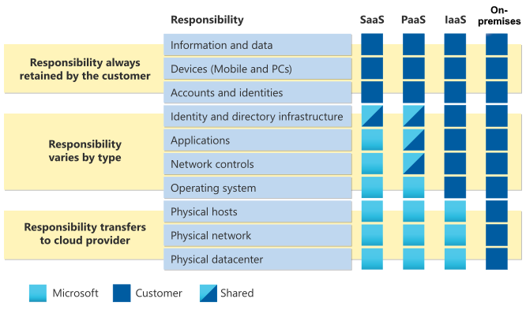

This module provides an overview of specifying security requirements for Software as a Service (SaaS), Infrastructure as a Service (IaaS) and Platform as a Service (PaaS) security. The module highlights Microsoft cloud security baselines for IoT Hub, App Service, Azure Kubernetes Service (AKS), and guidelines for securing Microsoft Azure OpenAI.

Imagine you're a security engineer at a large multinational corporation. Your company has recently migrated its infrastructure to Azure and is using a mix of IaaS and PaaS services. You're tasked with ensuring the security of these services, but you're unsure where to start. You need to understand the best practices for securing IaaS and PaaS, as well as how to apply Azure's security baselines for IoT Hub, App Service, and AKS. Additionally, your company is exploring the use of Azure OpenAI, and you need to know how to secure it effectively.

## Learning objectives

In this module, you learn how to:

* Specify security baselines for SaaS, PaaS, and IaaS services
* Specify security requirements for web workloads
* Specify security requirements for containers and container orchestration

The content in the module helps you prepare for the certification exam SC-100: Microsoft Cybersecurity Architect.

## Prerequisites

- Advanced experience and knowledge in identity and access, platform protection, security operations, securing data, and securing applications.
- Experience with hybrid and cloud implementations.

## Shared responsibility in the cloud

As you consider and evaluate public cloud services, it’s critical to understand the shared responsibility model and which security tasks are handled by the cloud provider and which tasks are handled by you. The workload responsibilities vary depending on whether the workload is hosted on Software as a Service (SaaS), Platform as a Service (PaaS), Infrastructure as a Service (IaaS), or in an on-premises datacenter

## Division of responsibility

In an on-premises datacenter, you own the whole stack. As you move to the cloud some responsibilities transfer to Microsoft. The following diagram illustrates the areas of responsibility between you and Microsoft, according to the type of deployment of your stack.

For all cloud deployment types, you own your data and identities. You're responsible for protecting the security of your data and identities, on-premises resources, and the cloud components you control (which varies by service type).

Regardless of the type of deployment, the following responsibilities are always retained by you:

-   Data
-   Endpoints
-   Account
-   Access management