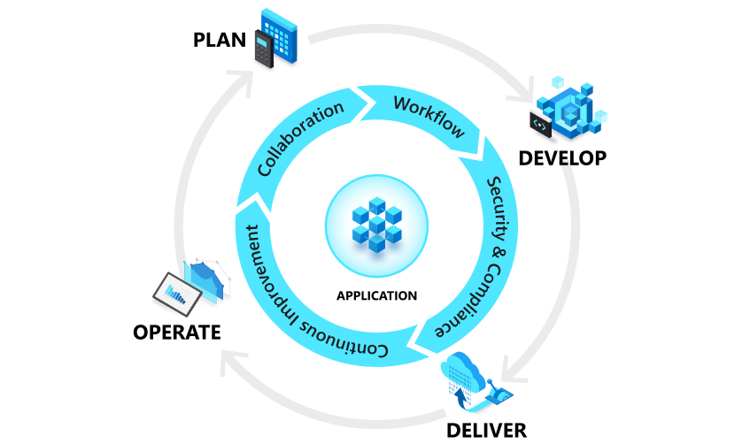

### Specify a security strategy for applications and APIs

Organizations should shift from a 'Waterfall' development cycle to the
DevOps lifecycle of continuous integration, continuous delivery (CI/CD)
for applications, and API development as quickly as possible. DevOps is
the union of people, processes, and tools that enable continuous
delivery of value to end users. The contraction of Dev and Ops refers to
combining the development and operations disciplines into
multidisciplinary teams that work together with shared and efficient
practices and tools.

The DevOps model increases the organization's ability to rapidly
address security concerns without waiting for a waterfall model's
longer planning and testing cycle.

#### Deploy the DevOps and the application lifecycle

 

DevOps influences the application and API lifecycle throughout
its plan, develop, deliver, and operate phases. Each phase relies on the
others, and the phases are not role-specific. In a true DevOps culture,
each role is involved in each phase to some extent.

| Phase | Activities |
| :--- | :--- |
| Plan | DevOps teams ideate, define and describe features and capabilities of the applications and systems they're building. They track progress at low and high levels of granularity from single-product tasks to tasks that span portfolios of multiple products. Some of the ways DevOps teams plan with agility and visibility are creating backlogs, tracking bugs, managing agile software development with Scrum, using Kanban boards, and visualizing progress with dashboards. |
| Develop | Includes all aspects of coding writing, testing, reviewing, and integrating code by team members as well as building that code into build artifacts that can be deployed into various environments. Teams use version control, usually Git, to collaborate on code and work in parallel. They also seek to innovate rapidly without sacrificing quality, stability, and productivity. To do that, they use highly productive tools, automate mundane and manual steps, and iterate in small increments through automated testing and continuous integration |
| Deliver | The process of deploying applications into production environments consistently and reliably, ideally via continuous delivery. The deliver phase also includes deploying and configuring the fully governed foundational Infrastructure that makes up those environments. These environments often use technologies like Infrastructure as Code (IaC), containers, and microservices. |
| Operate | Involves maintaining, monitoring, and troubleshooting applications in production environments, usually hosted in public and hybrid clouds. In adopting DevOps practices, teams work to ensure system reliability, high availability and aim for zero downtime while reinforcing security and governance. |

#### Enforcing Security for DevOps

Teams that don't have a formal DevSecOps strategy are encouraged to begin the planning as soon as possible. At first, there may be some resistance from team members who don't fully appreciate the existing threats. Others may not feel that the team is equipped to face the problem and that any special investment would be a wasteful distraction from shipping features. However, it's necessary to begin the conversation to build consensus on the nature of the risks, how the team can mitigate them, and whether the team needs resources, they don't currently have.

Expect skeptics to bring some common arguments, such as:

-   **How real is the threat?** Teams often don't appreciate the
    potential value of the services and data they're charged with
    protecting.

-   **Our team is good, right?** A security discussion may be perceived
    as doubt about the team's ability to build a secure system.

-   **I don't think that's possible.** This is a common argument from
    junior engineers. Those with experience usually know better.

-   **We've never been breached.** But how do you know? How *would* you
    know?

-   **Endless debates about value.** DevSecOps is a serious commitment
    that may be perceived as a distraction from core feature work. While
    the security investment should be balanced with other needs, it
    can't be ignored.
