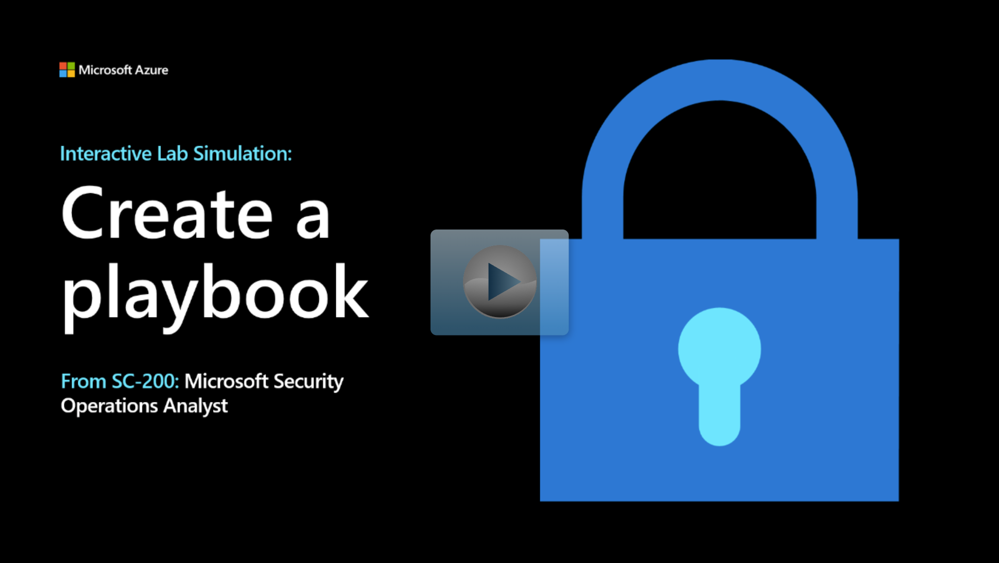

A Microsoft Sentinel playbook is a collection of security procedures that you can run in response to alerts.

Contoso, Ltd. is a midsize financial services company in London with a New York branch office. Contoso uses several Microsoft products and services to implement data security and threat protection for its resources. These products are:

- Microsoft Office 365

- Azure Active Directory (Azure AD)

- Azure AD Identity Protection

- Defender for Cloud Apps

- Microsoft Defender for Identity

- Microsoft Defender for Endpoint

- Microsoft Defender for Office 365

- System Center Endpoint Protection

- Microsoft Azure Information Protection

Contoso provides threat protection for its Azure-based and on-premises resources by using the paid version of Microsoft Defender for Cloud. The company also monitors and protects other non-Microsoft assets.

The Contoso Security Operations (SecOps) team didn't respond quickly enough to the organization's latest security incident. Contoso's IT director wants to implement Microsoft Sentinel playbooks to help the SecOps team identify and stop potential security threats. As Contoso's lead security engineer and Azure administrator, you've been tasked with setting up a Microsoft Sentinel playbook to respond to security incidents.

In this module, you'll learn about the Security Orchestration and the Automation and Response (SOAR) capabilities within Microsoft Sentinel. You'll examine how to create and edit Microsoft Sentinel playbooks, configure their workflow, and manage them.

By the end of this module, you'll be able to set up security playbooks in Microsoft Sentinel to help the SecOps team respond to alerts effectively.

## Learning objectives

- Explain Microsoft Sentinel SOAR capabilities.

- Explore the Microsoft Sentinel Logic Apps connector.

- Create a playbook to automate an incident response.

- Run a playbook on demand in response to an incident.

## Prerequisites

- Automation and monitoring

- Azure Monitor and its Log Analytics workspace

- Azure Logic Apps

## Interactive Lab Simulation

> [!NOTE]
> Select the thumbnail image to start the lab simulation. When you're done, be sure to return to this page so you can continue learning.

